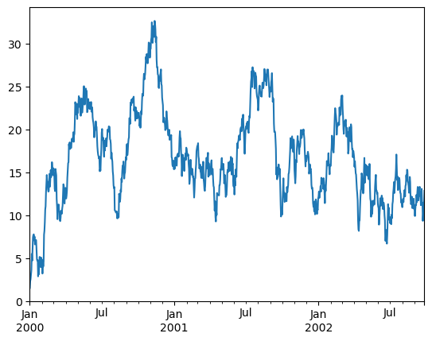
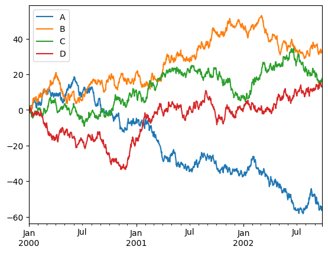

# 写在前面

> 尹老师作为lcpandas最佳题解最多的人竟然数据库暴雷，令人感叹

# 正片开始


```python
import numpy as np
import pandas as pd
import matplotlib.pylab as plt

```


## 基本结构


```python
# 列表生成 Series
s=pd.Series([1,3,4,5,np.nan,6])
s
```


    0    1.0
    1    3.0
    2    4.0
    3    5.0
    4    NaN
    5    6.0
    dtype: float64


```python
# 用series 字典 对象生成DataFrame

# 创建一个DataFrame
df2 = pd.DataFrame({
    'A': 1,  # 列'A'的值全部为1
    'B': pd.Timestamp('20210609'),  # 列'B'的值为一个时间戳
    'C': pd.Series(1, index=list(range(4)), dtype='float32'),  # 列'C'的值为一个Pandas Series，索引为[0, 1, 2, 3]，值全部为1，数据类型为float32
    'D': np.array([3]*4, dtype='float32'),  # 列'D'的值为一个NumPy数组，元素全部为3，数据类型为float32
    'E': pd.Categorical(['test', 'train', 'test', 'train']),  # 列'E'的值为一个分类变量，包含四个类别'test'、'train'，数据类型为Categorical
    'F': 'SilveryZz'  # 列'F'的值全部为'foo'
})
df2
```


<div>
<style scoped>
    .dataframe tbody tr th:only-of-type {
        vertical-align: middle;
    }

    .dataframe tbody tr th {
        vertical-align: top;
    }
    
    .dataframe thead th {
        text-align: right;
    }
</style>
<table border="1" class="dataframe">
  <thead>
    <tr style="text-align: right;">
      <th></th>
      <th>A</th>
      <th>B</th>
      <th>C</th>
      <th>D</th>
      <th>E</th>
      <th>F</th>
    </tr>
  </thead>
  <tbody>
    <tr>
      <th>0</th>
      <td>1</td>
      <td>2021-06-09</td>
      <td>1.0</td>
      <td>3.0</td>
      <td>test</td>
      <td>SilveryZz</td>
    </tr>
    <tr>
      <th>1</th>
      <td>1</td>
      <td>2021-06-09</td>
      <td>1.0</td>
      <td>3.0</td>
      <td>train</td>
      <td>SilveryZz</td>
    </tr>
    <tr>
      <th>2</th>
      <td>1</td>
      <td>2021-06-09</td>
      <td>1.0</td>
      <td>3.0</td>
      <td>test</td>
      <td>SilveryZz</td>
    </tr>
    <tr>
      <th>3</th>
      <td>1</td>
      <td>2021-06-09</td>
      <td>1.0</td>
      <td>3.0</td>
      <td>train</td>
      <td>SilveryZz</td>
    </tr>
  </tbody>
</table>
</div>


```python
#用日期
d =pd.date_range('20121213',periods=6)
d
```


    DatetimeIndex(['2012-12-13', '2012-12-14', '2012-12-15', '2012-12-16',
                   '2012-12-17', '2012-12-18'],
                  dtype='datetime64[ns]', freq='D')


```python
df=pd.DataFrame(np.random.rand(6,4),index=d,columns=list('ABCD'))
df#结合图细品
```


<div>
<style scoped>
    .dataframe tbody tr th:only-of-type {
        vertical-align: middle;
    }

    .dataframe tbody tr th {
        vertical-align: top;
    }
    
    .dataframe thead th {
        text-align: right;
    }
</style>
<table border="1" class="dataframe">
  <thead>
    <tr style="text-align: right;">
      <th></th>
      <th>A</th>
      <th>B</th>
      <th>C</th>
      <th>D</th>
    </tr>
  </thead>
  <tbody>
    <tr>
      <th>2012-12-13</th>
      <td>0.713405</td>
      <td>0.163007</td>
      <td>0.564574</td>
      <td>0.399106</td>
    </tr>
    <tr>
      <th>2012-12-14</th>
      <td>0.992875</td>
      <td>0.382776</td>
      <td>0.287225</td>
      <td>0.282782</td>
    </tr>
    <tr>
      <th>2012-12-15</th>
      <td>0.226629</td>
      <td>0.807156</td>
      <td>0.692509</td>
      <td>0.130471</td>
    </tr>
    <tr>
      <th>2012-12-16</th>
      <td>0.669194</td>
      <td>0.649490</td>
      <td>0.754736</td>
      <td>0.449130</td>
    </tr>
    <tr>
      <th>2012-12-17</th>
      <td>0.360364</td>
      <td>0.892799</td>
      <td>0.162886</td>
      <td>0.233741</td>
    </tr>
    <tr>
      <th>2012-12-18</th>
      <td>0.182932</td>
      <td>0.788734</td>
      <td>0.883999</td>
      <td>0.857509</td>
    </tr>
  </tbody>
</table>
</div>


```python
df2.dtypes
```


    A             int64
    B    datetime64[ns]
    C           float32
    D           float32
    E          category
    F            object
    dtype: object


```python
df2.head()
```


<div>
<style scoped>
    .dataframe tbody tr th:only-of-type {
        vertical-align: middle;
    }

    .dataframe tbody tr th {
        vertical-align: top;
    }
    
    .dataframe thead th {
        text-align: right;
    }
</style>
<table border="1" class="dataframe">
  <thead>
    <tr style="text-align: right;">
      <th></th>
      <th>A</th>
      <th>B</th>
      <th>C</th>
      <th>D</th>
      <th>E</th>
      <th>F</th>
    </tr>
  </thead>
  <tbody>
    <tr>
      <th>0</th>
      <td>1</td>
      <td>2021-06-09</td>
      <td>1.0</td>
      <td>3.0</td>
      <td>test</td>
      <td>SilveryZz</td>
    </tr>
    <tr>
      <th>1</th>
      <td>1</td>
      <td>2021-06-09</td>
      <td>1.0</td>
      <td>3.0</td>
      <td>train</td>
      <td>SilveryZz</td>
    </tr>
    <tr>
      <th>2</th>
      <td>1</td>
      <td>2021-06-09</td>
      <td>1.0</td>
      <td>3.0</td>
      <td>test</td>
      <td>SilveryZz</td>
    </tr>
    <tr>
      <th>3</th>
      <td>1</td>
      <td>2021-06-09</td>
      <td>1.0</td>
      <td>3.0</td>
      <td>train</td>
      <td>SilveryZz</td>
    </tr>
  </tbody>
</table>
</div>


```python
df2.tail(3)
```


<div>
<style scoped>
    .dataframe tbody tr th:only-of-type {
        vertical-align: middle;
    }

    .dataframe tbody tr th {
        vertical-align: top;
    }
    
    .dataframe thead th {
        text-align: right;
    }
</style>
<table border="1" class="dataframe">
  <thead>
    <tr style="text-align: right;">
      <th></th>
      <th>A</th>
      <th>B</th>
      <th>C</th>
      <th>D</th>
      <th>E</th>
      <th>F</th>
    </tr>
  </thead>
  <tbody>
    <tr>
      <th>1</th>
      <td>1</td>
      <td>2021-06-09</td>
      <td>1.0</td>
      <td>3.0</td>
      <td>train</td>
      <td>SilveryZz</td>
    </tr>
    <tr>
      <th>2</th>
      <td>1</td>
      <td>2021-06-09</td>
      <td>1.0</td>
      <td>3.0</td>
      <td>test</td>
      <td>SilveryZz</td>
    </tr>
    <tr>
      <th>3</th>
      <td>1</td>
      <td>2021-06-09</td>
      <td>1.0</td>
      <td>3.0</td>
      <td>train</td>
      <td>SilveryZz</td>
    </tr>
  </tbody>
</table>
</div>


```python
df2.index
```


    Int64Index([0, 1, 2, 3], dtype='int64')


```python
df2.columns
```


    Index(['A', 'B', 'C', 'D', 'E', 'F'], dtype='object')


```python
df.describe()
```


<div>
<style scoped>
    .dataframe tbody tr th:only-of-type {
        vertical-align: middle;
    }

    .dataframe tbody tr th {
        vertical-align: top;
    }
    
    .dataframe thead th {
        text-align: right;
    }
</style>
<table border="1" class="dataframe">
  <thead>
    <tr style="text-align: right;">
      <th></th>
      <th>A</th>
      <th>B</th>
      <th>C</th>
      <th>D</th>
    </tr>
  </thead>
  <tbody>
    <tr>
      <th>count</th>
      <td>6.000000</td>
      <td>6.000000</td>
      <td>6.000000</td>
      <td>6.000000</td>
    </tr>
    <tr>
      <th>mean</th>
      <td>0.524233</td>
      <td>0.613994</td>
      <td>0.557655</td>
      <td>0.392123</td>
    </tr>
    <tr>
      <th>std</th>
      <td>0.318852</td>
      <td>0.284144</td>
      <td>0.280196</td>
      <td>0.255102</td>
    </tr>
    <tr>
      <th>min</th>
      <td>0.182932</td>
      <td>0.163007</td>
      <td>0.162886</td>
      <td>0.130471</td>
    </tr>
    <tr>
      <th>25%</th>
      <td>0.260063</td>
      <td>0.449454</td>
      <td>0.356563</td>
      <td>0.246002</td>
    </tr>
    <tr>
      <th>50%</th>
      <td>0.514779</td>
      <td>0.719112</td>
      <td>0.628542</td>
      <td>0.340944</td>
    </tr>
    <tr>
      <th>75%</th>
      <td>0.702352</td>
      <td>0.802551</td>
      <td>0.739180</td>
      <td>0.436624</td>
    </tr>
    <tr>
      <th>max</th>
      <td>0.992875</td>
      <td>0.892799</td>
      <td>0.883999</td>
      <td>0.857509</td>
    </tr>
  </tbody>
</table>
</div>


```python
df.sort_index(axis=1,ascending=False)#ascending就是升序
```


<div>
<style scoped>
    .dataframe tbody tr th:only-of-type {
        vertical-align: middle;
    }

    .dataframe tbody tr th {
        vertical-align: top;
    }
    
    .dataframe thead th {
        text-align: right;
    }
</style>
<table border="1" class="dataframe">
  <thead>
    <tr style="text-align: right;">
      <th></th>
      <th>D</th>
      <th>C</th>
      <th>B</th>
      <th>A</th>
    </tr>
  </thead>
  <tbody>
    <tr>
      <th>2012-12-13</th>
      <td>0.399106</td>
      <td>0.564574</td>
      <td>0.163007</td>
      <td>0.713405</td>
    </tr>
    <tr>
      <th>2012-12-14</th>
      <td>0.282782</td>
      <td>0.287225</td>
      <td>0.382776</td>
      <td>0.992875</td>
    </tr>
    <tr>
      <th>2012-12-15</th>
      <td>0.130471</td>
      <td>0.692509</td>
      <td>0.807156</td>
      <td>0.226629</td>
    </tr>
    <tr>
      <th>2012-12-16</th>
      <td>0.449130</td>
      <td>0.754736</td>
      <td>0.649490</td>
      <td>0.669194</td>
    </tr>
    <tr>
      <th>2012-12-17</th>
      <td>0.233741</td>
      <td>0.162886</td>
      <td>0.892799</td>
      <td>0.360364</td>
    </tr>
    <tr>
      <th>2012-12-18</th>
      <td>0.857509</td>
      <td>0.883999</td>
      <td>0.788734</td>
      <td>0.182932</td>
    </tr>
  </tbody>
</table>
</div>


```python
df.sort_values(by='B')
```


<div>
<style scoped>
    .dataframe tbody tr th:only-of-type {
        vertical-align: middle;
    }

    .dataframe tbody tr th {
        vertical-align: top;
    }
    
    .dataframe thead th {
        text-align: right;
    }
</style>
<table border="1" class="dataframe">
  <thead>
    <tr style="text-align: right;">
      <th></th>
      <th>A</th>
      <th>B</th>
      <th>C</th>
      <th>D</th>
    </tr>
  </thead>
  <tbody>
    <tr>
      <th>2012-12-13</th>
      <td>0.713405</td>
      <td>0.163007</td>
      <td>0.564574</td>
      <td>0.399106</td>
    </tr>
    <tr>
      <th>2012-12-14</th>
      <td>0.992875</td>
      <td>0.382776</td>
      <td>0.287225</td>
      <td>0.282782</td>
    </tr>
    <tr>
      <th>2012-12-16</th>
      <td>0.669194</td>
      <td>0.649490</td>
      <td>0.754736</td>
      <td>0.449130</td>
    </tr>
    <tr>
      <th>2012-12-18</th>
      <td>0.182932</td>
      <td>0.788734</td>
      <td>0.883999</td>
      <td>0.857509</td>
    </tr>
    <tr>
      <th>2012-12-15</th>
      <td>0.226629</td>
      <td>0.807156</td>
      <td>0.692509</td>
      <td>0.130471</td>
    </tr>
    <tr>
      <th>2012-12-17</th>
      <td>0.360364</td>
      <td>0.892799</td>
      <td>0.162886</td>
      <td>0.233741</td>
    </tr>
  </tbody>
</table>
</div>


### 选择数据


```python
print(df)
print(df['A'])

```

                       A         B         C         D
    2012-12-13  0.713405  0.163007  0.564574  0.399106
    2012-12-14  0.992875  0.382776  0.287225  0.282782
    2012-12-15  0.226629  0.807156  0.692509  0.130471
    2012-12-16  0.669194  0.649490  0.754736  0.449130
    2012-12-17  0.360364  0.892799  0.162886  0.233741
    2012-12-18  0.182932  0.788734  0.883999  0.857509
    2012-12-13    0.713405
    2012-12-14    0.992875
    2012-12-15    0.226629
    2012-12-16    0.669194
    2012-12-17    0.360364
    2012-12-18    0.182932
    Freq: D, Name: A, dtype: float64


```python
print(df)
print(df[1:3])
```

                       A         B         C         D
    2012-12-13  0.713405  0.163007  0.564574  0.399106
    2012-12-14  0.992875  0.382776  0.287225  0.282782
    2012-12-15  0.226629  0.807156  0.692509  0.130471
    2012-12-16  0.669194  0.649490  0.754736  0.449130
    2012-12-17  0.360364  0.892799  0.162886  0.233741
    2012-12-18  0.182932  0.788734  0.883999  0.857509
                       A         B         C         D
    2012-12-14  0.992875  0.382776  0.287225  0.282782
    2012-12-15  0.226629  0.807156  0.692509  0.130471


```python
# 也可以标签索引
print(df)
print(df['2012-12-13':'2012-12-17'])
```

                       A         B         C         D
    2012-12-13  0.713405  0.163007  0.564574  0.399106
    2012-12-14  0.992875  0.382776  0.287225  0.282782
    2012-12-15  0.226629  0.807156  0.692509  0.130471
    2012-12-16  0.669194  0.649490  0.754736  0.449130
    2012-12-17  0.360364  0.892799  0.162886  0.233741
    2012-12-18  0.182932  0.788734  0.883999  0.857509
                       A         B         C         D
    2012-12-13  0.713405  0.163007  0.564574  0.399106
    2012-12-14  0.992875  0.382776  0.287225  0.282782
    2012-12-15  0.226629  0.807156  0.692509  0.130471
    2012-12-16  0.669194  0.649490  0.754736  0.449130
    2012-12-17  0.360364  0.892799  0.162886  0.233741


```python
#按标签一行
df.loc['2012-12-13']
```


    A    0.713405
    B    0.163007
    C    0.564574
    D    0.399106
    Name: 2012-12-13 00:00:00, dtype: float64


```python
df.loc[d[0]]
```


    A    0.713405
    B    0.163007
    C    0.564574
    D    0.399106
    Name: 2012-12-13 00:00:00, dtype: float64


```python
df.loc[:,['A','B']]
```


<div>
<style scoped>
    .dataframe tbody tr th:only-of-type {
        vertical-align: middle;
    }

    .dataframe tbody tr th {
        vertical-align: top;
    }
    
    .dataframe thead th {
        text-align: right;
    }
</style>
<table border="1" class="dataframe">
  <thead>
    <tr style="text-align: right;">
      <th></th>
      <th>A</th>
      <th>B</th>
    </tr>
  </thead>
  <tbody>
    <tr>
      <th>2012-12-13</th>
      <td>0.713405</td>
      <td>0.163007</td>
    </tr>
    <tr>
      <th>2012-12-14</th>
      <td>0.992875</td>
      <td>0.382776</td>
    </tr>
    <tr>
      <th>2012-12-15</th>
      <td>0.226629</td>
      <td>0.807156</td>
    </tr>
    <tr>
      <th>2012-12-16</th>
      <td>0.669194</td>
      <td>0.649490</td>
    </tr>
    <tr>
      <th>2012-12-17</th>
      <td>0.360364</td>
      <td>0.892799</td>
    </tr>
    <tr>
      <th>2012-12-18</th>
      <td>0.182932</td>
      <td>0.788734</td>
    </tr>
  </tbody>
</table>
</div>


```python
df.loc['2012-12-13':'2012-12-16',['A','B']]
```


<div>
<style scoped>
    .dataframe tbody tr th:only-of-type {
        vertical-align: middle;
    }

    .dataframe tbody tr th {
        vertical-align: top;
    }
    
    .dataframe thead th {
        text-align: right;
    }
</style>
<table border="1" class="dataframe">
  <thead>
    <tr style="text-align: right;">
      <th></th>
      <th>A</th>
      <th>B</th>
    </tr>
  </thead>
  <tbody>
    <tr>
      <th>2012-12-13</th>
      <td>0.713405</td>
      <td>0.163007</td>
    </tr>
    <tr>
      <th>2012-12-14</th>
      <td>0.992875</td>
      <td>0.382776</td>
    </tr>
    <tr>
      <th>2012-12-15</th>
      <td>0.226629</td>
      <td>0.807156</td>
    </tr>
    <tr>
      <th>2012-12-16</th>
      <td>0.669194</td>
      <td>0.649490</td>
    </tr>
  </tbody>
</table>
</div>


```python
df.loc['2012-12-14','A']
df.at['2012-12-14','A']#faster
```


    0.9928754072830832


```python
#按位置行
df.iloc[0]#df.loc[d[0]]
```


    A    0.713405
    B    0.163007
    C    0.564574
    D    0.399106
    Name: 2012-12-13 00:00:00, dtype: float64


```python
#整数切片
df.iloc[3:5,0:2]#先行后列
```


<div>
<style scoped>
    .dataframe tbody tr th:only-of-type {
        vertical-align: middle;
    }

    .dataframe tbody tr th {
        vertical-align: top;
    }
    
    .dataframe thead th {
        text-align: right;
    }
</style>
<table border="1" class="dataframe">
  <thead>
    <tr style="text-align: right;">
      <th></th>
      <th>A</th>
      <th>B</th>
    </tr>
  </thead>
  <tbody>
    <tr>
      <th>2012-12-16</th>
      <td>0.669194</td>
      <td>0.649490</td>
    </tr>
    <tr>
      <th>2012-12-17</th>
      <td>0.360364</td>
      <td>0.892799</td>
    </tr>
  </tbody>
</table>
</div>


```python
df.iloc[1:3,:]
```


<div>
<style scoped>
    .dataframe tbody tr th:only-of-type {
        vertical-align: middle;
    }

    .dataframe tbody tr th {
        vertical-align: top;
    }
    
    .dataframe thead th {
        text-align: right;
    }
</style>
<table border="1" class="dataframe">
  <thead>
    <tr style="text-align: right;">
      <th></th>
      <th>A</th>
      <th>B</th>
      <th>C</th>
      <th>D</th>
    </tr>
  </thead>
  <tbody>
    <tr>
      <th>2012-12-14</th>
      <td>0.992875</td>
      <td>0.382776</td>
      <td>0.287225</td>
      <td>0.282782</td>
    </tr>
    <tr>
      <th>2012-12-15</th>
      <td>0.226629</td>
      <td>0.807156</td>
      <td>0.692509</td>
      <td>0.130471</td>
    </tr>
  </tbody>
</table>
</div>


```python
df.iloc[:,1:3]
```


<div>
<style scoped>
    .dataframe tbody tr th:only-of-type {
        vertical-align: middle;
    }

    .dataframe tbody tr th {
        vertical-align: top;
    }
    
    .dataframe thead th {
        text-align: right;
    }
</style>
<table border="1" class="dataframe">
  <thead>
    <tr style="text-align: right;">
      <th></th>
      <th>B</th>
      <th>C</th>
    </tr>
  </thead>
  <tbody>
    <tr>
      <th>2012-12-13</th>
      <td>0.163007</td>
      <td>0.564574</td>
    </tr>
    <tr>
      <th>2012-12-14</th>
      <td>0.382776</td>
      <td>0.287225</td>
    </tr>
    <tr>
      <th>2012-12-15</th>
      <td>0.807156</td>
      <td>0.692509</td>
    </tr>
    <tr>
      <th>2012-12-16</th>
      <td>0.649490</td>
      <td>0.754736</td>
    </tr>
    <tr>
      <th>2012-12-17</th>
      <td>0.892799</td>
      <td>0.162886</td>
    </tr>
    <tr>
      <th>2012-12-18</th>
      <td>0.788734</td>
      <td>0.883999</td>
    </tr>
  </tbody>
</table>
</div>


```python
#显式拾取
df.iloc[1,1]
df.iat[1,1]#更快
```


    0.38277559535630856


```python
df[df['B']>0.4]
```


<div>
<style scoped>
    .dataframe tbody tr th:only-of-type {
        vertical-align: middle;
    }

    .dataframe tbody tr th {
        vertical-align: top;
    }
    
    .dataframe thead th {
        text-align: right;
    }
</style>
<table border="1" class="dataframe">
  <thead>
    <tr style="text-align: right;">
      <th></th>
      <th>A</th>
      <th>B</th>
      <th>C</th>
      <th>D</th>
    </tr>
  </thead>
  <tbody>
    <tr>
      <th>2012-12-15</th>
      <td>0.226629</td>
      <td>0.807156</td>
      <td>0.692509</td>
      <td>0.130471</td>
    </tr>
    <tr>
      <th>2012-12-16</th>
      <td>0.669194</td>
      <td>0.649490</td>
      <td>0.754736</td>
      <td>0.449130</td>
    </tr>
    <tr>
      <th>2012-12-17</th>
      <td>0.360364</td>
      <td>0.892799</td>
      <td>0.162886</td>
      <td>0.233741</td>
    </tr>
    <tr>
      <th>2012-12-18</th>
      <td>0.182932</td>
      <td>0.788734</td>
      <td>0.883999</td>
      <td>0.857509</td>
    </tr>
  </tbody>
</table>
</div>


```python
df[df>0.4]
```


<div>
<style scoped>
    .dataframe tbody tr th:only-of-type {
        vertical-align: middle;
    }

    .dataframe tbody tr th {
        vertical-align: top;
    }
    
    .dataframe thead th {
        text-align: right;
    }
</style>
<table border="1" class="dataframe">
  <thead>
    <tr style="text-align: right;">
      <th></th>
      <th>A</th>
      <th>B</th>
      <th>C</th>
      <th>D</th>
    </tr>
  </thead>
  <tbody>
    <tr>
      <th>2012-12-13</th>
      <td>0.713405</td>
      <td>NaN</td>
      <td>0.564574</td>
      <td>NaN</td>
    </tr>
    <tr>
      <th>2012-12-14</th>
      <td>0.992875</td>
      <td>NaN</td>
      <td>NaN</td>
      <td>NaN</td>
    </tr>
    <tr>
      <th>2012-12-15</th>
      <td>NaN</td>
      <td>0.807156</td>
      <td>0.692509</td>
      <td>NaN</td>
    </tr>
    <tr>
      <th>2012-12-16</th>
      <td>0.669194</td>
      <td>0.649490</td>
      <td>0.754736</td>
      <td>0.449130</td>
    </tr>
    <tr>
      <th>2012-12-17</th>
      <td>NaN</td>
      <td>0.892799</td>
      <td>NaN</td>
      <td>NaN</td>
    </tr>
    <tr>
      <th>2012-12-18</th>
      <td>NaN</td>
      <td>0.788734</td>
      <td>0.883999</td>
      <td>0.857509</td>
    </tr>
  </tbody>
</table>
</div>


```python
df3=df.copy()
df3['E']=['a','b','c','d','e','f']
df3
```


<div>
<style scoped>
    .dataframe tbody tr th:only-of-type {
        vertical-align: middle;
    }

    .dataframe tbody tr th {
        vertical-align: top;
    }
    
    .dataframe thead th {
        text-align: right;
    }
</style>
<table border="1" class="dataframe">
  <thead>
    <tr style="text-align: right;">
      <th></th>
      <th>A</th>
      <th>B</th>
      <th>C</th>
      <th>D</th>
      <th>E</th>
    </tr>
  </thead>
  <tbody>
    <tr>
      <th>2012-12-13</th>
      <td>0.713405</td>
      <td>0.163007</td>
      <td>0.564574</td>
      <td>0.399106</td>
      <td>a</td>
    </tr>
    <tr>
      <th>2012-12-14</th>
      <td>0.992875</td>
      <td>0.382776</td>
      <td>0.287225</td>
      <td>0.282782</td>
      <td>b</td>
    </tr>
    <tr>
      <th>2012-12-15</th>
      <td>0.226629</td>
      <td>0.807156</td>
      <td>0.692509</td>
      <td>0.130471</td>
      <td>c</td>
    </tr>
    <tr>
      <th>2012-12-16</th>
      <td>0.669194</td>
      <td>0.649490</td>
      <td>0.754736</td>
      <td>0.449130</td>
      <td>d</td>
    </tr>
    <tr>
      <th>2012-12-17</th>
      <td>0.360364</td>
      <td>0.892799</td>
      <td>0.162886</td>
      <td>0.233741</td>
      <td>e</td>
    </tr>
    <tr>
      <th>2012-12-18</th>
      <td>0.182932</td>
      <td>0.788734</td>
      <td>0.883999</td>
      <td>0.857509</td>
      <td>f</td>
    </tr>
  </tbody>
</table>
</div>


```python
df3[df3['E'].isin(['c','d'])]
```


<div>
<style scoped>
    .dataframe tbody tr th:only-of-type {
        vertical-align: middle;
    }

    .dataframe tbody tr th {
        vertical-align: top;
    }
    
    .dataframe thead th {
        text-align: right;
    }
</style>
<table border="1" class="dataframe">
  <thead>
    <tr style="text-align: right;">
      <th></th>
      <th>A</th>
      <th>B</th>
      <th>C</th>
      <th>D</th>
      <th>E</th>
    </tr>
  </thead>
  <tbody>
    <tr>
      <th>2012-12-15</th>
      <td>0.226629</td>
      <td>0.807156</td>
      <td>0.692509</td>
      <td>0.130471</td>
      <td>c</td>
    </tr>
    <tr>
      <th>2012-12-16</th>
      <td>0.669194</td>
      <td>0.649490</td>
      <td>0.754736</td>
      <td>0.449130</td>
      <td>d</td>
    </tr>
  </tbody>
</table>
</div>


### 赋值


```python
s1=pd.Series([1,2,3,4,5,6],index=d)#dd上面声明了就是日期那一列
s1
```


    2012-12-13    1
    2012-12-14    2
    2012-12-15    3
    2012-12-16    4
    2012-12-17    5
    2012-12-18    6
    Freq: D, dtype: int64


```python
df['F']=s1
df
```


<div>
<style scoped>
    .dataframe tbody tr th:only-of-type {
        vertical-align: middle;
    }

    .dataframe tbody tr th {
        vertical-align: top;
    }
    
    .dataframe thead th {
        text-align: right;
    }
</style>
<table border="1" class="dataframe">
  <thead>
    <tr style="text-align: right;">
      <th></th>
      <th>A</th>
      <th>B</th>
      <th>C</th>
      <th>D</th>
      <th>F</th>
    </tr>
  </thead>
  <tbody>
    <tr>
      <th>2012-12-13</th>
      <td>0.713405</td>
      <td>0.163007</td>
      <td>0.564574</td>
      <td>0.399106</td>
      <td>1</td>
    </tr>
    <tr>
      <th>2012-12-14</th>
      <td>0.992875</td>
      <td>0.382776</td>
      <td>0.287225</td>
      <td>0.282782</td>
      <td>2</td>
    </tr>
    <tr>
      <th>2012-12-15</th>
      <td>0.226629</td>
      <td>0.807156</td>
      <td>0.692509</td>
      <td>0.130471</td>
      <td>3</td>
    </tr>
    <tr>
      <th>2012-12-16</th>
      <td>0.669194</td>
      <td>0.649490</td>
      <td>0.754736</td>
      <td>0.449130</td>
      <td>4</td>
    </tr>
    <tr>
      <th>2012-12-17</th>
      <td>0.360364</td>
      <td>0.892799</td>
      <td>0.162886</td>
      <td>0.233741</td>
      <td>5</td>
    </tr>
    <tr>
      <th>2012-12-18</th>
      <td>0.182932</td>
      <td>0.788734</td>
      <td>0.883999</td>
      <td>0.857509</td>
      <td>6</td>
    </tr>
  </tbody>
</table>
</div>


```python
df.at['2012-12-13','A']=0
df
```


<div>
<style scoped>
    .dataframe tbody tr th:only-of-type {
        vertical-align: middle;
    }

    .dataframe tbody tr th {
        vertical-align: top;
    }
    
    .dataframe thead th {
        text-align: right;
    }
</style>
<table border="1" class="dataframe">
  <thead>
    <tr style="text-align: right;">
      <th></th>
      <th>A</th>
      <th>B</th>
      <th>C</th>
      <th>D</th>
      <th>F</th>
    </tr>
  </thead>
  <tbody>
    <tr>
      <th>2012-12-13</th>
      <td>0.000000</td>
      <td>0.163007</td>
      <td>0.564574</td>
      <td>0.399106</td>
      <td>1</td>
    </tr>
    <tr>
      <th>2012-12-14</th>
      <td>0.992875</td>
      <td>0.382776</td>
      <td>0.287225</td>
      <td>0.282782</td>
      <td>2</td>
    </tr>
    <tr>
      <th>2012-12-15</th>
      <td>0.226629</td>
      <td>0.807156</td>
      <td>0.692509</td>
      <td>0.130471</td>
      <td>3</td>
    </tr>
    <tr>
      <th>2012-12-16</th>
      <td>0.669194</td>
      <td>0.649490</td>
      <td>0.754736</td>
      <td>0.449130</td>
      <td>4</td>
    </tr>
    <tr>
      <th>2012-12-17</th>
      <td>0.360364</td>
      <td>0.892799</td>
      <td>0.162886</td>
      <td>0.233741</td>
      <td>5</td>
    </tr>
    <tr>
      <th>2012-12-18</th>
      <td>0.182932</td>
      <td>0.788734</td>
      <td>0.883999</td>
      <td>0.857509</td>
      <td>6</td>
    </tr>
  </tbody>
</table>
</div>


```python
df.iat[0,2]=0
df
```


<div>
<style scoped>
    .dataframe tbody tr th:only-of-type {
        vertical-align: middle;
    }

    .dataframe tbody tr th {
        vertical-align: top;
    }
    
    .dataframe thead th {
        text-align: right;
    }
</style>
<table border="1" class="dataframe">
  <thead>
    <tr style="text-align: right;">
      <th></th>
      <th>A</th>
      <th>B</th>
      <th>C</th>
      <th>D</th>
      <th>F</th>
    </tr>
  </thead>
  <tbody>
    <tr>
      <th>2012-12-13</th>
      <td>0.000000</td>
      <td>0.163007</td>
      <td>0.000000</td>
      <td>0.399106</td>
      <td>1</td>
    </tr>
    <tr>
      <th>2012-12-14</th>
      <td>0.992875</td>
      <td>0.382776</td>
      <td>0.287225</td>
      <td>0.282782</td>
      <td>2</td>
    </tr>
    <tr>
      <th>2012-12-15</th>
      <td>0.226629</td>
      <td>0.807156</td>
      <td>0.692509</td>
      <td>0.130471</td>
      <td>3</td>
    </tr>
    <tr>
      <th>2012-12-16</th>
      <td>0.669194</td>
      <td>0.649490</td>
      <td>0.754736</td>
      <td>0.449130</td>
      <td>4</td>
    </tr>
    <tr>
      <th>2012-12-17</th>
      <td>0.360364</td>
      <td>0.892799</td>
      <td>0.162886</td>
      <td>0.233741</td>
      <td>5</td>
    </tr>
    <tr>
      <th>2012-12-18</th>
      <td>0.182932</td>
      <td>0.788734</td>
      <td>0.883999</td>
      <td>0.857509</td>
      <td>6</td>
    </tr>
  </tbody>
</table>
</div>


```python
df['G']=[1,2,3,4,5,6]
df
```


<div>
<style scoped>
    .dataframe tbody tr th:only-of-type {
        vertical-align: middle;
    }

    .dataframe tbody tr th {
        vertical-align: top;
    }
    
    .dataframe thead th {
        text-align: right;
    }
</style>
<table border="1" class="dataframe">
  <thead>
    <tr style="text-align: right;">
      <th></th>
      <th>A</th>
      <th>B</th>
      <th>C</th>
      <th>D</th>
      <th>F</th>
      <th>G</th>
    </tr>
  </thead>
  <tbody>
    <tr>
      <th>2012-12-13</th>
      <td>0.000000</td>
      <td>0.163007</td>
      <td>0.000000</td>
      <td>0.399106</td>
      <td>1</td>
      <td>1</td>
    </tr>
    <tr>
      <th>2012-12-14</th>
      <td>0.992875</td>
      <td>0.382776</td>
      <td>0.287225</td>
      <td>0.282782</td>
      <td>2</td>
      <td>2</td>
    </tr>
    <tr>
      <th>2012-12-15</th>
      <td>0.226629</td>
      <td>0.807156</td>
      <td>0.692509</td>
      <td>0.130471</td>
      <td>3</td>
      <td>3</td>
    </tr>
    <tr>
      <th>2012-12-16</th>
      <td>0.669194</td>
      <td>0.649490</td>
      <td>0.754736</td>
      <td>0.449130</td>
      <td>4</td>
      <td>4</td>
    </tr>
    <tr>
      <th>2012-12-17</th>
      <td>0.360364</td>
      <td>0.892799</td>
      <td>0.162886</td>
      <td>0.233741</td>
      <td>5</td>
      <td>5</td>
    </tr>
    <tr>
      <th>2012-12-18</th>
      <td>0.182932</td>
      <td>0.788734</td>
      <td>0.883999</td>
      <td>0.857509</td>
      <td>6</td>
      <td>6</td>
    </tr>
  </tbody>
</table>
</div>


```python
df.loc[:,'D']=np.ones_like(df['D'])
df
```


<div>
<style scoped>
    .dataframe tbody tr th:only-of-type {
        vertical-align: middle;
    }

    .dataframe tbody tr th {
        vertical-align: top;
    }
    
    .dataframe thead th {
        text-align: right;
    }
</style>
<table border="1" class="dataframe">
  <thead>
    <tr style="text-align: right;">
      <th></th>
      <th>A</th>
      <th>B</th>
      <th>C</th>
      <th>D</th>
      <th>F</th>
      <th>G</th>
    </tr>
  </thead>
  <tbody>
    <tr>
      <th>2012-12-13</th>
      <td>0.000000</td>
      <td>0.163007</td>
      <td>0.000000</td>
      <td>1.0</td>
      <td>1</td>
      <td>1</td>
    </tr>
    <tr>
      <th>2012-12-14</th>
      <td>0.992875</td>
      <td>0.382776</td>
      <td>0.287225</td>
      <td>1.0</td>
      <td>2</td>
      <td>2</td>
    </tr>
    <tr>
      <th>2012-12-15</th>
      <td>0.226629</td>
      <td>0.807156</td>
      <td>0.692509</td>
      <td>1.0</td>
      <td>3</td>
      <td>3</td>
    </tr>
    <tr>
      <th>2012-12-16</th>
      <td>0.669194</td>
      <td>0.649490</td>
      <td>0.754736</td>
      <td>1.0</td>
      <td>4</td>
      <td>4</td>
    </tr>
    <tr>
      <th>2012-12-17</th>
      <td>0.360364</td>
      <td>0.892799</td>
      <td>0.162886</td>
      <td>1.0</td>
      <td>5</td>
      <td>5</td>
    </tr>
    <tr>
      <th>2012-12-18</th>
      <td>0.182932</td>
      <td>0.788734</td>
      <td>0.883999</td>
      <td>1.0</td>
      <td>6</td>
      <td>6</td>
    </tr>
  </tbody>
</table>
</div>


```python
df3=df.copy()
df3[df3<0.4]=0
df3
```


<div>
<style scoped>
    .dataframe tbody tr th:only-of-type {
        vertical-align: middle;
    }

    .dataframe tbody tr th {
        vertical-align: top;
    }
    
    .dataframe thead th {
        text-align: right;
    }
</style>
<table border="1" class="dataframe">
  <thead>
    <tr style="text-align: right;">
      <th></th>
      <th>A</th>
      <th>B</th>
      <th>C</th>
      <th>D</th>
      <th>F</th>
      <th>G</th>
    </tr>
  </thead>
  <tbody>
    <tr>
      <th>2012-12-13</th>
      <td>0.000000</td>
      <td>0.000000</td>
      <td>0.000000</td>
      <td>1.0</td>
      <td>1</td>
      <td>1</td>
    </tr>
    <tr>
      <th>2012-12-14</th>
      <td>0.992875</td>
      <td>0.000000</td>
      <td>0.000000</td>
      <td>1.0</td>
      <td>2</td>
      <td>2</td>
    </tr>
    <tr>
      <th>2012-12-15</th>
      <td>0.000000</td>
      <td>0.807156</td>
      <td>0.692509</td>
      <td>1.0</td>
      <td>3</td>
      <td>3</td>
    </tr>
    <tr>
      <th>2012-12-16</th>
      <td>0.669194</td>
      <td>0.649490</td>
      <td>0.754736</td>
      <td>1.0</td>
      <td>4</td>
      <td>4</td>
    </tr>
    <tr>
      <th>2012-12-17</th>
      <td>0.000000</td>
      <td>0.892799</td>
      <td>0.000000</td>
      <td>1.0</td>
      <td>5</td>
      <td>5</td>
    </tr>
    <tr>
      <th>2012-12-18</th>
      <td>0.000000</td>
      <td>0.788734</td>
      <td>0.883999</td>
      <td>1.0</td>
      <td>6</td>
      <td>6</td>
    </tr>
  </tbody>
</table>
</div>


```python
df1=df.reindex(index=d[0:4],columns=list(df.columns)+['E'])
df1.loc[d[0]:d[1],'E']=1
df1
```


<div>
<style scoped>
    .dataframe tbody tr th:only-of-type {
        vertical-align: middle;
    }

    .dataframe tbody tr th {
        vertical-align: top;
    }
    
    .dataframe thead th {
        text-align: right;
    }
</style>
<table border="1" class="dataframe">
  <thead>
    <tr style="text-align: right;">
      <th></th>
      <th>A</th>
      <th>B</th>
      <th>C</th>
      <th>D</th>
      <th>F</th>
      <th>G</th>
      <th>E</th>
    </tr>
  </thead>
  <tbody>
    <tr>
      <th>2012-12-13</th>
      <td>0.000000</td>
      <td>0.163007</td>
      <td>0.000000</td>
      <td>1.0</td>
      <td>1</td>
      <td>1</td>
      <td>1.0</td>
    </tr>
    <tr>
      <th>2012-12-14</th>
      <td>0.992875</td>
      <td>0.382776</td>
      <td>0.287225</td>
      <td>1.0</td>
      <td>2</td>
      <td>2</td>
      <td>1.0</td>
    </tr>
    <tr>
      <th>2012-12-15</th>
      <td>0.226629</td>
      <td>0.807156</td>
      <td>0.692509</td>
      <td>1.0</td>
      <td>3</td>
      <td>3</td>
      <td>NaN</td>
    </tr>
    <tr>
      <th>2012-12-16</th>
      <td>0.669194</td>
      <td>0.649490</td>
      <td>0.754736</td>
      <td>1.0</td>
      <td>4</td>
      <td>4</td>
      <td>NaN</td>
    </tr>
  </tbody>
</table>
</div>


```python
df1.dropna(how='any')#不会改变原来的行数   df1=
```


<div>
<style scoped>
    .dataframe tbody tr th:only-of-type {
        vertical-align: middle;
    }

    .dataframe tbody tr th {
        vertical-align: top;
    }
    
    .dataframe thead th {
        text-align: right;
    }
</style>
<table border="1" class="dataframe">
  <thead>
    <tr style="text-align: right;">
      <th></th>
      <th>A</th>
      <th>B</th>
      <th>C</th>
      <th>D</th>
      <th>F</th>
      <th>G</th>
      <th>E</th>
    </tr>
  </thead>
  <tbody>
    <tr>
      <th>2012-12-13</th>
      <td>0.000000</td>
      <td>0.163007</td>
      <td>0.000000</td>
      <td>1.0</td>
      <td>1</td>
      <td>1</td>
      <td>1.0</td>
    </tr>
    <tr>
      <th>2012-12-14</th>
      <td>0.992875</td>
      <td>0.382776</td>
      <td>0.287225</td>
      <td>1.0</td>
      <td>2</td>
      <td>2</td>
      <td>1.0</td>
    </tr>
  </tbody>
</table>
</div>


```python
df1.fillna(value=5)#将NaN变成value 同上不会改变原来的除df1=
```


<div>
<style scoped>
    .dataframe tbody tr th:only-of-type {
        vertical-align: middle;
    }

    .dataframe tbody tr th {
        vertical-align: top;
    }
    
    .dataframe thead th {
        text-align: right;
    }
</style>
<table border="1" class="dataframe">
  <thead>
    <tr style="text-align: right;">
      <th></th>
      <th>A</th>
      <th>B</th>
      <th>C</th>
      <th>D</th>
      <th>F</th>
      <th>G</th>
      <th>E</th>
    </tr>
  </thead>
  <tbody>
    <tr>
      <th>2012-12-13</th>
      <td>0.000000</td>
      <td>0.163007</td>
      <td>0.000000</td>
      <td>1.0</td>
      <td>1</td>
      <td>1</td>
      <td>1.0</td>
    </tr>
    <tr>
      <th>2012-12-14</th>
      <td>0.992875</td>
      <td>0.382776</td>
      <td>0.287225</td>
      <td>1.0</td>
      <td>2</td>
      <td>2</td>
      <td>1.0</td>
    </tr>
    <tr>
      <th>2012-12-15</th>
      <td>0.226629</td>
      <td>0.807156</td>
      <td>0.692509</td>
      <td>1.0</td>
      <td>3</td>
      <td>3</td>
      <td>5.0</td>
    </tr>
    <tr>
      <th>2012-12-16</th>
      <td>0.669194</td>
      <td>0.649490</td>
      <td>0.754736</td>
      <td>1.0</td>
      <td>4</td>
      <td>4</td>
      <td>5.0</td>
    </tr>
  </tbody>
</table>
</div>


```python
pd.isna(df1)#或df1.isna
```


<div>
<style scoped>
    .dataframe tbody tr th:only-of-type {
        vertical-align: middle;
    }

    .dataframe tbody tr th {
        vertical-align: top;
    }
    
    .dataframe thead th {
        text-align: right;
    }
</style>
<table border="1" class="dataframe">
  <thead>
    <tr style="text-align: right;">
      <th></th>
      <th>A</th>
      <th>B</th>
      <th>C</th>
      <th>D</th>
      <th>F</th>
      <th>G</th>
      <th>E</th>
    </tr>
  </thead>
  <tbody>
    <tr>
      <th>2012-12-13</th>
      <td>False</td>
      <td>False</td>
      <td>False</td>
      <td>False</td>
      <td>False</td>
      <td>False</td>
      <td>False</td>
    </tr>
    <tr>
      <th>2012-12-14</th>
      <td>False</td>
      <td>False</td>
      <td>False</td>
      <td>False</td>
      <td>False</td>
      <td>False</td>
      <td>False</td>
    </tr>
    <tr>
      <th>2012-12-15</th>
      <td>False</td>
      <td>False</td>
      <td>False</td>
      <td>False</td>
      <td>False</td>
      <td>False</td>
      <td>True</td>
    </tr>
    <tr>
      <th>2012-12-16</th>
      <td>False</td>
      <td>False</td>
      <td>False</td>
      <td>False</td>
      <td>False</td>
      <td>False</td>
      <td>True</td>
    </tr>
  </tbody>
</table>
</div>


### 运算


```python
df1 = pd.DataFrame(np.random.randn(2,5))
df1

```


<div>
<style scoped>
    .dataframe tbody tr th:only-of-type {
        vertical-align: middle;
    }

    .dataframe tbody tr th {
        vertical-align: top;
    }
    
    .dataframe thead th {
        text-align: right;
    }
</style>
<table border="1" class="dataframe">
  <thead>
    <tr style="text-align: right;">
      <th></th>
      <th>0</th>
      <th>1</th>
      <th>2</th>
      <th>3</th>
      <th>4</th>
    </tr>
  </thead>
  <tbody>
    <tr>
      <th>0</th>
      <td>0.618687</td>
      <td>-1.796737</td>
      <td>-0.424035</td>
      <td>1.267603</td>
      <td>1.972393</td>
    </tr>
    <tr>
      <th>1</th>
      <td>0.618823</td>
      <td>1.179523</td>
      <td>-0.635837</td>
      <td>2.326362</td>
      <td>-0.885355</td>
    </tr>
  </tbody>
</table>
</div>


```python
df2= pd.DataFrame(np.random.randn(3,4))
df2
```


<div>
<style scoped>
    .dataframe tbody tr th:only-of-type {
        vertical-align: middle;
    }

    .dataframe tbody tr th {
        vertical-align: top;
    }
    
    .dataframe thead th {
        text-align: right;
    }
</style>
<table border="1" class="dataframe">
  <thead>
    <tr style="text-align: right;">
      <th></th>
      <th>0</th>
      <th>1</th>
      <th>2</th>
      <th>3</th>
    </tr>
  </thead>
  <tbody>
    <tr>
      <th>0</th>
      <td>0.512828</td>
      <td>1.521356</td>
      <td>0.041749</td>
      <td>-0.471222</td>
    </tr>
    <tr>
      <th>1</th>
      <td>-0.794179</td>
      <td>-0.448369</td>
      <td>2.203517</td>
      <td>-0.019890</td>
    </tr>
    <tr>
      <th>2</th>
      <td>2.112862</td>
      <td>-0.502675</td>
      <td>0.256352</td>
      <td>-0.838331</td>
    </tr>
  </tbody>
</table>
</div>


```python
print("1+2\n",df1+df2,end="\n\n")#NaN运算后还是NaN，每个值的算术
print("1-2\n",df1-df2,end="\n\n")
print("1*2\n",df1*df2,end="\n\n")
print("1/2\n",df1/df2,end="\n\n")

```

    1+2
               0         1         2         3   4
    0  1.131516 -0.275381 -0.382285  0.796381 NaN
    1 -0.175356  0.731154  1.567680  2.306472 NaN
    2       NaN       NaN       NaN       NaN NaN
    
    1-2
               0         1         2         3   4
    0  0.105859 -3.318093 -0.465784  1.738825 NaN
    1  1.413003  1.627891 -2.839355  2.346252 NaN
    2       NaN       NaN       NaN       NaN NaN
    
    1*2
               0         1         2         3   4
    0  0.317280 -2.733477 -0.017703 -0.597323 NaN
    1 -0.491457 -0.528861 -1.401078 -0.046271 NaN
    2       NaN       NaN       NaN       NaN NaN
    
    1/2
               0         1          2           3   4
    0  1.206422 -1.181010 -10.156668   -2.690034 NaN
    1 -0.779199 -2.630698  -0.288555 -116.961552 NaN
    2       NaN       NaN        NaN         NaN NaN


​    

| 方法 | 英文全称 | 用途 |
| --- | --- | --- |
| eq | equal to | 等于 |
| ne | not equal to | 不等于 |
| lt | less than | 小于 |
| gt | greater than | 大于 |
| le | less than or equal to | 小于等于 |
| ge | greater than or equal to | 大于等于 |

**返回一个尺寸大的df**

1. 
```
    df.describe()：查看数据值列的汇总统计
    df.mean()：返回所有列的均值
    df.corr()：返回列与列之间的相关系数
    df.count()：返回每一列中的非空值的个数
    df.max()：返回每一列的最大值
    df.min()：返回每一列的最小值
    df.median()：返回每一列的中位数
    df.std()：返回每一列的标准差
```
2.  `d1.count() #非空元素计算`
3.  `d1.min() #最小值`
4.  `d1.max() #最大值`
5.  `d1.idxmin() #最小值的位置，类似于R中的which.min函数`
6.  `d1.idxmax() #最大值的位置，类似于R中的which.max函数`
7.  `d1.quantile(0.1) #10%分位数`
8.  `d1.sum() #求和`
9.  `d1.mean() #均值`
10.  `d1.median() #中位数`
11.  `d1.mode() #众数`
12.  `d1.var() #方差`
13.  `d1.std() #标准差`
14.  `d1.mad() #平均绝对偏差`
15.  `d1.skew() #偏度`
16.  `d1.kurt() #峰度`
17.  `d1.describe() #一次性输出多个描述性统计指标`

必须注意的是，descirbe方法只能针对序列或数据框，一维数组是没有这个方法的

这里自定义一个函数，将这些统计描述指标全部汇总到一起:

1.  `def stats(x):`
2.  `return pd.Series([x.count(),x.min(),x.idxmin(),`
3.  `x.quantile(.25),x.median(),`
4.  `x.quantile(.75),x.mean(),`
5.  `x.max(),x.idxmax(),`
6.  `x.mad(),x.var(),`
7.  `x.std(),x.skew(),x.kurt()],`
8.  `index = ['Count','Min','Whicn_Min',`
9.  `'Q1','Median','Q3','Mean',`
10.  `'Max','Which_Max','Mad',`
11.  `'Var','Std','Skew','Kurt'])`
12.  `stats(d1)`

在实际的工作中，我们可能需要处理的是一系列的数值型数据框，如何将这个函数应用到数据框中的每一列呢？可以使用apply函数，这个非常类似于R中的apply的应用方法。  
将之前创建的d1,d2,d3数据构建数据框:

1.  `df = pd.DataFrame(np.array([d1,d2,d3]).T,columns=['x1','x2','x3'])`
2.  `df.head()`
3.  `df.apply(stats)`

非常完美，就这样很简单的创建了数值型数据的统计性描述。如果是离散型数据呢？就不能用这个统计口径了，我们需要统计离散变量的观测数、唯一值个数、众数水平及个数。你只需要使用describe方法就可以实现这样的统计了。

1.  `student['Sex'].describe()`

除以上的简单描述性统计之外，还提供了连续变量的相关系数（corr）和协方差矩阵（cov）的求解，这个跟R语言是一致的用法。

1.  `df.corr()`

关于相关系数的计算可以调用pearson方法或kendell方法或spearman方法，默认使用pearson方法。

1.  `df.corr('spearman')`

如果只想关注某一个变量与其余变量的相关系数的话，可以使用corrwith,如下方只关心x1与其余变量的相关系数:

1.  `df.corrwith(df['x1'])`

数值型变量间的协方差矩阵

1.  `` `df.cov()` ``


```python
#合并==拼一块
pd.concat([df1,df2])
```


<div>
<style scoped>
    .dataframe tbody tr th:only-of-type {
        vertical-align: middle;
    }

    .dataframe tbody tr th {
        vertical-align: top;
    }
    
    .dataframe thead th {
        text-align: right;
    }
</style>
<table border="1" class="dataframe">
  <thead>
    <tr style="text-align: right;">
      <th></th>
      <th>0</th>
      <th>1</th>
      <th>2</th>
      <th>3</th>
      <th>4</th>
    </tr>
  </thead>
  <tbody>
    <tr>
      <th>0</th>
      <td>0.618687</td>
      <td>-1.796737</td>
      <td>-0.424035</td>
      <td>1.267603</td>
      <td>1.972393</td>
    </tr>
    <tr>
      <th>1</th>
      <td>0.618823</td>
      <td>1.179523</td>
      <td>-0.635837</td>
      <td>2.326362</td>
      <td>-0.885355</td>
    </tr>
    <tr>
      <th>0</th>
      <td>0.512828</td>
      <td>1.521356</td>
      <td>0.041749</td>
      <td>-0.471222</td>
      <td>NaN</td>
    </tr>
    <tr>
      <th>1</th>
      <td>-0.794179</td>
      <td>-0.448369</td>
      <td>2.203517</td>
      <td>-0.019890</td>
      <td>NaN</td>
    </tr>
    <tr>
      <th>2</th>
      <td>2.112862</td>
      <td>-0.502675</td>
      <td>0.256352</td>
      <td>-0.838331</td>
      <td>NaN</td>
    </tr>
  </tbody>
</table>
</div>


```
merge的用法
pd.merge(DataFrame1,DataFrame2,how="inner",on=None,left_on=None,right_on=None, left_index=False, right_index=False, sort=False, suffixes=(’_x’, ‘_y’))


how:默认为inner，可设为inner/outer/left/right

on：用于链接的列名，该列名必须存在于两个dataframe对象中。若未指明。则以两个表的交集作为链接键。

left_on:左侧DataFrame中用作链接键的列。

right_on:右侧DataFrame中用作链接键的列。

right_index:右侧的行索引作为键连接

left_index:左侧的行索引作为键连接

sort:根据连接键对合并后的数据进行排列，默认为True

suffixes：对两个数据集中出现的重复列，新数据集中加上后缀_x,_y进行区别
```


```python
df1 = pd.DataFrame({"key":list("bbaca"),"data1":range(5)})
df2 = pd.DataFrame({"key":["a","b","d"],"data2":range(3)})
```


```python
df1
```


<div>
<style scoped>
    .dataframe tbody tr th:only-of-type {
        vertical-align: middle;
    }

    .dataframe tbody tr th {
        vertical-align: top;
    }
    
    .dataframe thead th {
        text-align: right;
    }
</style>
<table border="1" class="dataframe">
  <thead>
    <tr style="text-align: right;">
      <th></th>
      <th>key</th>
      <th>data1</th>
    </tr>
  </thead>
  <tbody>
    <tr>
      <th>0</th>
      <td>b</td>
      <td>0</td>
    </tr>
    <tr>
      <th>1</th>
      <td>b</td>
      <td>1</td>
    </tr>
    <tr>
      <th>2</th>
      <td>a</td>
      <td>2</td>
    </tr>
    <tr>
      <th>3</th>
      <td>c</td>
      <td>3</td>
    </tr>
    <tr>
      <th>4</th>
      <td>a</td>
      <td>4</td>
    </tr>
  </tbody>
</table>
</div>


```python
df2
```


<div>
<style scoped>
    .dataframe tbody tr th:only-of-type {
        vertical-align: middle;
    }

    .dataframe tbody tr th {
        vertical-align: top;
    }
    
    .dataframe thead th {
        text-align: right;
    }
</style>
<table border="1" class="dataframe">
  <thead>
    <tr style="text-align: right;">
      <th></th>
      <th>key</th>
      <th>data2</th>
    </tr>
  </thead>
  <tbody>
    <tr>
      <th>0</th>
      <td>a</td>
      <td>0</td>
    </tr>
    <tr>
      <th>1</th>
      <td>b</td>
      <td>1</td>
    </tr>
    <tr>
      <th>2</th>
      <td>d</td>
      <td>2</td>
    </tr>
  </tbody>
</table>
</div>


```python
pd.merge(df1,df2,on='key')
```


<div>
<style scoped>
    .dataframe tbody tr th:only-of-type {
        vertical-align: middle;
    }

    .dataframe tbody tr th {
        vertical-align: top;
    }
    
    .dataframe thead th {
        text-align: right;
    }
</style>
<table border="1" class="dataframe">
  <thead>
    <tr style="text-align: right;">
      <th></th>
      <th>key</th>
      <th>data1</th>
      <th>data2</th>
    </tr>
  </thead>
  <tbody>
    <tr>
      <th>0</th>
      <td>b</td>
      <td>0</td>
      <td>1</td>
    </tr>
    <tr>
      <th>1</th>
      <td>b</td>
      <td>1</td>
      <td>1</td>
    </tr>
    <tr>
      <th>2</th>
      <td>a</td>
      <td>2</td>
      <td>0</td>
    </tr>
    <tr>
      <th>3</th>
      <td>a</td>
      <td>4</td>
      <td>0</td>
    </tr>
  </tbody>
</table>
</div>


```python
left = pd.DataFrame({'key': ['foo', 'foo','bar'], 'lval': [1, 2,3]})
right = pd.DataFrame({'key': ['foo', 'foo','bar'], 'rval': [4, 5,6]})
```


```python
left
```


<div>
<style scoped>
    .dataframe tbody tr th:only-of-type {
        vertical-align: middle;
    }

    .dataframe tbody tr th {
        vertical-align: top;
    }
    
    .dataframe thead th {
        text-align: right;
    }
</style>
<table border="1" class="dataframe">
  <thead>
    <tr style="text-align: right;">
      <th></th>
      <th>key</th>
      <th>lval</th>
    </tr>
  </thead>
  <tbody>
    <tr>
      <th>0</th>
      <td>foo</td>
      <td>1</td>
    </tr>
    <tr>
      <th>1</th>
      <td>foo</td>
      <td>2</td>
    </tr>
    <tr>
      <th>2</th>
      <td>bar</td>
      <td>3</td>
    </tr>
  </tbody>
</table>
</div>


```python
right
```


<div>
<style scoped>
    .dataframe tbody tr th:only-of-type {
        vertical-align: middle;
    }

    .dataframe tbody tr th {
        vertical-align: top;
    }
    
    .dataframe thead th {
        text-align: right;
    }
</style>
<table border="1" class="dataframe">
  <thead>
    <tr style="text-align: right;">
      <th></th>
      <th>key</th>
      <th>rval</th>
    </tr>
  </thead>
  <tbody>
    <tr>
      <th>0</th>
      <td>foo</td>
      <td>4</td>
    </tr>
    <tr>
      <th>1</th>
      <td>foo</td>
      <td>5</td>
    </tr>
    <tr>
      <th>2</th>
      <td>bar</td>
      <td>6</td>
    </tr>
  </tbody>
</table>
</div>


```python
pd.merge(left,right,on='key')
```


<div>
<style scoped>
    .dataframe tbody tr th:only-of-type {
        vertical-align: middle;
    }

    .dataframe tbody tr th {
        vertical-align: top;
    }
    
    .dataframe thead th {
        text-align: right;
    }
</style>
<table border="1" class="dataframe">
  <thead>
    <tr style="text-align: right;">
      <th></th>
      <th>key</th>
      <th>lval</th>
      <th>rval</th>
    </tr>
  </thead>
  <tbody>
    <tr>
      <th>0</th>
      <td>foo</td>
      <td>1</td>
      <td>4</td>
    </tr>
    <tr>
      <th>1</th>
      <td>foo</td>
      <td>1</td>
      <td>5</td>
    </tr>
    <tr>
      <th>2</th>
      <td>foo</td>
      <td>2</td>
      <td>4</td>
    </tr>
    <tr>
      <th>3</th>
      <td>foo</td>
      <td>2</td>
      <td>5</td>
    </tr>
    <tr>
      <th>4</th>
      <td>bar</td>
      <td>3</td>
      <td>6</td>
    </tr>
  </tbody>
</table>
</div>


```python
#append追加
df=pd.DataFrame(np.random.randn(8,4),columns=['a','b','c','d'])
df
```


<div>
<style scoped>
    .dataframe tbody tr th:only-of-type {
        vertical-align: middle;
    }

    .dataframe tbody tr th {
        vertical-align: top;
    }
    
    .dataframe thead th {
        text-align: right;
    }
</style>
<table border="1" class="dataframe">
  <thead>
    <tr style="text-align: right;">
      <th></th>
      <th>a</th>
      <th>b</th>
      <th>c</th>
      <th>d</th>
    </tr>
  </thead>
  <tbody>
    <tr>
      <th>0</th>
      <td>-0.525399</td>
      <td>-0.628554</td>
      <td>1.400643</td>
      <td>-0.407553</td>
    </tr>
    <tr>
      <th>1</th>
      <td>-0.165253</td>
      <td>-0.173005</td>
      <td>0.828227</td>
      <td>-0.158862</td>
    </tr>
    <tr>
      <th>2</th>
      <td>0.246102</td>
      <td>0.001459</td>
      <td>0.568473</td>
      <td>-0.107953</td>
    </tr>
    <tr>
      <th>3</th>
      <td>-0.333359</td>
      <td>0.205414</td>
      <td>0.295313</td>
      <td>-1.360419</td>
    </tr>
    <tr>
      <th>4</th>
      <td>-0.214559</td>
      <td>-0.432310</td>
      <td>0.440579</td>
      <td>0.459359</td>
    </tr>
    <tr>
      <th>5</th>
      <td>0.856490</td>
      <td>-1.233311</td>
      <td>0.392153</td>
      <td>-1.666330</td>
    </tr>
    <tr>
      <th>6</th>
      <td>0.622388</td>
      <td>0.118100</td>
      <td>1.052240</td>
      <td>-0.746896</td>
    </tr>
    <tr>
      <th>7</th>
      <td>0.868199</td>
      <td>-1.592664</td>
      <td>0.238769</td>
      <td>1.207335</td>
    </tr>
  </tbody>
</table>
</div>


```python
s=df.iloc[3]
s
```


    a   -0.333359
    b    0.205414
    c    0.295313
    d   -1.360419
    Name: 3, dtype: float64


```python
df.append(s,ignore_index=True)
```

    C:\Users\23580\AppData\Local\Temp\ipykernel_97292\1925300445.py:1: FutureWarning: The frame.append method is deprecated and will be removed from pandas in a future version. Use pandas.concat instead.
      df.append(s,ignore_index=True)


<div>
<style scoped>
    .dataframe tbody tr th:only-of-type {
        vertical-align: middle;
    }

    .dataframe tbody tr th {
        vertical-align: top;
    }
    
    .dataframe thead th {
        text-align: right;
    }
</style>
<table border="1" class="dataframe">
  <thead>
    <tr style="text-align: right;">
      <th></th>
      <th>a</th>
      <th>b</th>
      <th>c</th>
      <th>d</th>
    </tr>
  </thead>
  <tbody>
    <tr>
      <th>0</th>
      <td>-0.525399</td>
      <td>-0.628554</td>
      <td>1.400643</td>
      <td>-0.407553</td>
    </tr>
    <tr>
      <th>1</th>
      <td>-0.165253</td>
      <td>-0.173005</td>
      <td>0.828227</td>
      <td>-0.158862</td>
    </tr>
    <tr>
      <th>2</th>
      <td>0.246102</td>
      <td>0.001459</td>
      <td>0.568473</td>
      <td>-0.107953</td>
    </tr>
    <tr>
      <th>3</th>
      <td>-0.333359</td>
      <td>0.205414</td>
      <td>0.295313</td>
      <td>-1.360419</td>
    </tr>
    <tr>
      <th>4</th>
      <td>-0.214559</td>
      <td>-0.432310</td>
      <td>0.440579</td>
      <td>0.459359</td>
    </tr>
    <tr>
      <th>5</th>
      <td>0.856490</td>
      <td>-1.233311</td>
      <td>0.392153</td>
      <td>-1.666330</td>
    </tr>
    <tr>
      <th>6</th>
      <td>0.622388</td>
      <td>0.118100</td>
      <td>1.052240</td>
      <td>-0.746896</td>
    </tr>
    <tr>
      <th>7</th>
      <td>0.868199</td>
      <td>-1.592664</td>
      <td>0.238769</td>
      <td>1.207335</td>
    </tr>
    <tr>
      <th>8</th>
      <td>-0.333359</td>
      <td>0.205414</td>
      <td>0.295313</td>
      <td>-1.360419</td>
    </tr>
  </tbody>
</table>
</div>


```python
#group
df = pd.DataFrame({'A': ['foo', 'bar', 'foo', 'bar',
                         'foo', 'bar', 'foo', 'foo'],
                   'B': ['one', 'one', 'two', 'three',
                         'two', 'two', 'one', 'three'],
                   'C': np.random.randn(8),
                   'D': np.random.randn(8)})
df

```


<div>
<style scoped>
    .dataframe tbody tr th:only-of-type {
        vertical-align: middle;
    }

    .dataframe tbody tr th {
        vertical-align: top;
    }
    
    .dataframe thead th {
        text-align: right;
    }
</style>
<table border="1" class="dataframe">
  <thead>
    <tr style="text-align: right;">
      <th></th>
      <th>A</th>
      <th>B</th>
      <th>C</th>
      <th>D</th>
    </tr>
  </thead>
  <tbody>
    <tr>
      <th>0</th>
      <td>foo</td>
      <td>one</td>
      <td>1.750951</td>
      <td>0.714884</td>
    </tr>
    <tr>
      <th>1</th>
      <td>bar</td>
      <td>one</td>
      <td>1.031219</td>
      <td>1.861883</td>
    </tr>
    <tr>
      <th>2</th>
      <td>foo</td>
      <td>two</td>
      <td>-0.748490</td>
      <td>-0.674410</td>
    </tr>
    <tr>
      <th>3</th>
      <td>bar</td>
      <td>three</td>
      <td>0.045913</td>
      <td>-0.773618</td>
    </tr>
    <tr>
      <th>4</th>
      <td>foo</td>
      <td>two</td>
      <td>0.853435</td>
      <td>-2.022183</td>
    </tr>
    <tr>
      <th>5</th>
      <td>bar</td>
      <td>two</td>
      <td>-2.888958</td>
      <td>0.575881</td>
    </tr>
    <tr>
      <th>6</th>
      <td>foo</td>
      <td>one</td>
      <td>-1.968402</td>
      <td>0.665714</td>
    </tr>
    <tr>
      <th>7</th>
      <td>foo</td>
      <td>three</td>
      <td>0.910338</td>
      <td>1.129608</td>
    </tr>
  </tbody>
</table>
</div>


```python
df.groupby('A').sum()

```

    C:\Users\23580\AppData\Local\Temp\ipykernel_97292\3225325629.py:1: FutureWarning: The default value of numeric_only in DataFrameGroupBy.sum is deprecated. In a future version, numeric_only will default to False. Either specify numeric_only or select only columns which should be valid for the function.
      df.groupby('A').sum()


<div>
<style scoped>
    .dataframe tbody tr th:only-of-type {
        vertical-align: middle;
    }

    .dataframe tbody tr th {
        vertical-align: top;
    }
    
    .dataframe thead th {
        text-align: right;
    }
</style>
<table border="1" class="dataframe">
  <thead>
    <tr style="text-align: right;">
      <th></th>
      <th>C</th>
      <th>D</th>
    </tr>
    <tr>
      <th>A</th>
      <th></th>
      <th></th>
    </tr>
  </thead>
  <tbody>
    <tr>
      <th>bar</th>
      <td>-1.811826</td>
      <td>1.664146</td>
    </tr>
    <tr>
      <th>foo</th>
      <td>0.797832</td>
      <td>-0.186387</td>
    </tr>
  </tbody>
</table>
</div>


```python
df.groupby(['A','B']).sum()
```


<div>
<style scoped>
    .dataframe tbody tr th:only-of-type {
        vertical-align: middle;
    }

    .dataframe tbody tr th {
        vertical-align: top;
    }
    
    .dataframe thead th {
        text-align: right;
    }
</style>
<table border="1" class="dataframe">
  <thead>
    <tr style="text-align: right;">
      <th></th>
      <th></th>
      <th>C</th>
      <th>D</th>
    </tr>
    <tr>
      <th>A</th>
      <th>B</th>
      <th></th>
      <th></th>
    </tr>
  </thead>
  <tbody>
    <tr>
      <th rowspan="3" valign="top">bar</th>
      <th>one</th>
      <td>1.031219</td>
      <td>1.861883</td>
    </tr>
    <tr>
      <th>three</th>
      <td>0.045913</td>
      <td>-0.773618</td>
    </tr>
    <tr>
      <th>two</th>
      <td>-2.888958</td>
      <td>0.575881</td>
    </tr>
    <tr>
      <th rowspan="3" valign="top">foo</th>
      <th>one</th>
      <td>-0.217451</td>
      <td>1.380598</td>
    </tr>
    <tr>
      <th>three</th>
      <td>0.910338</td>
      <td>1.129608</td>
    </tr>
    <tr>
      <th>two</th>
      <td>0.104946</td>
      <td>-2.696593</td>
    </tr>
  </tbody>
</table>
</div>


```python
df.groupby(['B','A']).sum()
```


<div>
<style scoped>
    .dataframe tbody tr th:only-of-type {
        vertical-align: middle;
    }

    .dataframe tbody tr th {
        vertical-align: top;
    }
    
    .dataframe thead th {
        text-align: right;
    }
</style>
<table border="1" class="dataframe">
  <thead>
    <tr style="text-align: right;">
      <th></th>
      <th></th>
      <th>C</th>
      <th>D</th>
    </tr>
    <tr>
      <th>B</th>
      <th>A</th>
      <th></th>
      <th></th>
    </tr>
  </thead>
  <tbody>
    <tr>
      <th rowspan="2" valign="top">one</th>
      <th>bar</th>
      <td>1.031219</td>
      <td>1.861883</td>
    </tr>
    <tr>
      <th>foo</th>
      <td>-0.217451</td>
      <td>1.380598</td>
    </tr>
    <tr>
      <th rowspan="2" valign="top">three</th>
      <th>bar</th>
      <td>0.045913</td>
      <td>-0.773618</td>
    </tr>
    <tr>
      <th>foo</th>
      <td>0.910338</td>
      <td>1.129608</td>
    </tr>
    <tr>
      <th rowspan="2" valign="top">two</th>
      <th>bar</th>
      <td>-2.888958</td>
      <td>0.575881</td>
    </tr>
    <tr>
      <th>foo</th>
      <td>0.104946</td>
      <td>-2.696593</td>
    </tr>
  </tbody>
</table>
</div>


```python
#数据透视表
df = pd.DataFrame({'A': ['one', 'one', 'two', 'three'] * 3,
                'B': ['A', 'B', 'C'] * 4,
                'C': ['foo', 'foo', 'foo', 'bar', 'bar', 'bar'] * 2,
                'D': np.random.randn(12),
                'E': np.random.randn(12)})

df
```


<div>
<style scoped>
    .dataframe tbody tr th:only-of-type {
        vertical-align: middle;
    }

    .dataframe tbody tr th {
        vertical-align: top;
    }
    
    .dataframe thead th {
        text-align: right;
    }
</style>
<table border="1" class="dataframe">
  <thead>
    <tr style="text-align: right;">
      <th></th>
      <th>A</th>
      <th>B</th>
      <th>C</th>
      <th>D</th>
      <th>E</th>
    </tr>
  </thead>
  <tbody>
    <tr>
      <th>0</th>
      <td>one</td>
      <td>A</td>
      <td>foo</td>
      <td>-1.801380</td>
      <td>0.139588</td>
    </tr>
    <tr>
      <th>1</th>
      <td>one</td>
      <td>B</td>
      <td>foo</td>
      <td>0.524558</td>
      <td>1.337804</td>
    </tr>
    <tr>
      <th>2</th>
      <td>two</td>
      <td>C</td>
      <td>foo</td>
      <td>0.556701</td>
      <td>-0.030921</td>
    </tr>
    <tr>
      <th>3</th>
      <td>three</td>
      <td>A</td>
      <td>bar</td>
      <td>-0.672224</td>
      <td>-0.380966</td>
    </tr>
    <tr>
      <th>4</th>
      <td>one</td>
      <td>B</td>
      <td>bar</td>
      <td>1.289010</td>
      <td>0.230926</td>
    </tr>
    <tr>
      <th>5</th>
      <td>one</td>
      <td>C</td>
      <td>bar</td>
      <td>-0.464241</td>
      <td>0.135799</td>
    </tr>
    <tr>
      <th>6</th>
      <td>two</td>
      <td>A</td>
      <td>foo</td>
      <td>-1.633720</td>
      <td>-0.426767</td>
    </tr>
    <tr>
      <th>7</th>
      <td>three</td>
      <td>B</td>
      <td>foo</td>
      <td>2.627206</td>
      <td>0.669709</td>
    </tr>
    <tr>
      <th>8</th>
      <td>one</td>
      <td>C</td>
      <td>foo</td>
      <td>-0.436654</td>
      <td>2.375356</td>
    </tr>
    <tr>
      <th>9</th>
      <td>one</td>
      <td>A</td>
      <td>bar</td>
      <td>-0.090531</td>
      <td>0.027269</td>
    </tr>
    <tr>
      <th>10</th>
      <td>two</td>
      <td>B</td>
      <td>bar</td>
      <td>0.311354</td>
      <td>-0.359295</td>
    </tr>
    <tr>
      <th>11</th>
      <td>three</td>
      <td>C</td>
      <td>bar</td>
      <td>0.141734</td>
      <td>1.068672</td>
    </tr>
  </tbody>
</table>
</div>


```python
pd.pivot_table(df,values='D',index=['A','B'],columns=['C'])
```


<div>
<style scoped>
    .dataframe tbody tr th:only-of-type {
        vertical-align: middle;
    }

    .dataframe tbody tr th {
        vertical-align: top;
    }
    
    .dataframe thead th {
        text-align: right;
    }
</style>
<table border="1" class="dataframe">
  <thead>
    <tr style="text-align: right;">
      <th></th>
      <th>C</th>
      <th>bar</th>
      <th>foo</th>
    </tr>
    <tr>
      <th>A</th>
      <th>B</th>
      <th></th>
      <th></th>
    </tr>
  </thead>
  <tbody>
    <tr>
      <th rowspan="3" valign="top">one</th>
      <th>A</th>
      <td>-0.090531</td>
      <td>-1.801380</td>
    </tr>
    <tr>
      <th>B</th>
      <td>1.289010</td>
      <td>0.524558</td>
    </tr>
    <tr>
      <th>C</th>
      <td>-0.464241</td>
      <td>-0.436654</td>
    </tr>
    <tr>
      <th rowspan="3" valign="top">three</th>
      <th>A</th>
      <td>-0.672224</td>
      <td>NaN</td>
    </tr>
    <tr>
      <th>B</th>
      <td>NaN</td>
      <td>2.627206</td>
    </tr>
    <tr>
      <th>C</th>
      <td>0.141734</td>
      <td>NaN</td>
    </tr>
    <tr>
      <th rowspan="3" valign="top">two</th>
      <th>A</th>
      <td>NaN</td>
      <td>-1.633720</td>
    </tr>
    <tr>
      <th>B</th>
      <td>0.311354</td>
      <td>NaN</td>
    </tr>
    <tr>
      <th>C</th>
      <td>NaN</td>
      <td>0.556701</td>
    </tr>
  </tbody>
</table>
</div>


```python
#时间序列
rng = pd.date_range('1/1/2012', periods=100, freq='S')
ts = pd.Series(np.random.randint(0, 500, len(rng)), index=rng)
ts
```


    2012-01-01 00:00:00    307
    2012-01-01 00:00:01    315
    2012-01-01 00:00:02    255
    2012-01-01 00:00:03    357
    2012-01-01 00:00:04     16
                          ... 
    2012-01-01 00:01:35    239
    2012-01-01 00:01:36     25
    2012-01-01 00:01:37    323
    2012-01-01 00:01:38    477
    2012-01-01 00:01:39    242
    Freq: S, Length: 100, dtype: int32


```python
ts.resample('1Min').sum()
```


    2012-01-01 00:00:00    14752
    2012-01-01 00:01:00    10435
    Freq: T, dtype: int32


**过多的不展示，用到之后再说**


```python
ts = pd.Series(np.random.randn(1000),
            index=pd.date_range('1/1/2000', periods=1000))
ts
```


    2000-01-01    1.534132
    2000-01-02    0.795996
    2000-01-03    0.226676
    2000-01-04    0.494645
    2000-01-05    0.567716
                    ...   
    2002-09-22   -1.984284
    2002-09-23    0.707606
    2002-09-24    1.430886
    2002-09-25   -0.381698
    2002-09-26    1.750283
    Freq: D, Length: 1000, dtype: float64


```python
ts=ts.cumsum()#前缀和

```


```python
ts.plot()
```


    <Axes: >


​    

​    


```python
df = pd.DataFrame(np.random.randn(1000, 4), index=ts.index,
                  columns=['A', 'B', 'C', 'D'])

df = df.cumsum()
plt.figure()
```


    <Figure size 640x480 with 0 Axes>


    <Figure size 640x480 with 0 Axes>


```python
df.plot()
```


    <Axes: >


​    

​    


```python
df.plot()
plt.legend(loc='best')
```


    <matplotlib.legend.Legend at 0x146eaa1b0a0>


​    

​    


```
plt.legend( )中有handles、labels和loc三个参数，其中：

handles需要传入你所画线条的实例对象，这个我也解释不清楚......

labels是图例的名称（能够覆盖在plt.plot( )中label参数值）

loc代表了图例在整个坐标轴平面中的位置（一般选取'best'这个参数值）
```
loc用以控制图例在整个坐标平面的位置

_**第一种**：loc = 'best'_

图例自动‘安家’在一个坐标面内的数据图表最少的位置

_**第二种**：loc = 'XXX'_

这里的'XXX'代表了坐标面中的九个位置，例如loc = 'center'表示坐标平面中心位置，九种参数值及所对应位置如下图所示


**第三种：**_loc = (x, y)_

（x, y）表示图例左下角的位置，这是最灵活的一种放置图例的方法，慢慢调整，总会找到你想要的放置图例的位置

**在第三种情况中要注意以下细节：**

这里首先要感谢 [驿路向北：matplotlib 到底该如何控制legend的位置？](https://zhuanlan.zhihu.com/p/99531531) 的文章，让我醍醐灌顶！终于弄明白了通过loc = (x, y)怎样确定图例位置。

当使用loc = (x, y)时，x, y并不是轴域中实际的x, y的值，而是将x轴, y轴分别看成1, 即：

**( x/(x\_max-x\_min) , y/(y\_max-y\_min) )**（即进行归一化处理）;

那么，在绘制图表时，若用到坐标轴的范围限制，如xlim=(0, 16), ylim=(0, 9)。在此基础上，如果要将图例放置到点(2, 2)上，loc实际传入的参数应该为：

**loc = ( 2/(16-0) , 2/(9-0) )**

**即 loc = (2/16, 2/9)**

[原文链接](https://zhuanlan.zhihu.com/p/111108841)

### 数据输入输出

#### 写入 CSV 格式


`Series` and `DataFrame` 对象有一个实例方法，该方法 `to_csv` 允许将对象的内容存储为逗号分隔值文件。该函数采用多个参数。只有第一个是必需的。

-     
    `path_or_buf` ：要写入的文件或文件对象的字符串路径。如果是文件对象，则必须用 `newline=''`
    
-     
    `sep` ：输出文件的字段分隔符（默认为“，”）
    
-     
    `na_rep` ：缺失值的字符串表示形式（默认为“'”）
    
-     
    `float_format` ：浮点数的字符串格式
    
-     
    `columns` ：要写入的列（默认为无）
    
-     
    `header` ：是否写出列名（默认为 True）
    
-     
    `index` ：是否写入行（索引）名（默认为 True）
    
-     
    `index_label` ：索引列的列标签（如果需要）。如果 None（默认值）和 `header` and `index` 为 True，则使用索引名称。（如果 `DataFrame` 使用 MultiIndex，则应给出序列）。
    
-     
    `mode` ：Python 写入模式，默认 'w'
    
-     
    `encoding` ：一个字符串，表示在内容为非 ASCII 时使用的编码，对于 3 之前的 Python 版本
    
-     
    `lineterminator` ：表示行尾的字符序列（默认 `os.linesep` ）
    
-     
    `quoting` ：像在 csv 模块中一样设置引用规则（默认 csv.QUOTE\_MINIMAL）。请注意，如果您设置了 ， `float_format` 则浮点数将转换为字符串和 csv。QUOTE\_NONNUMERIC将它们视为非数字
    
-     
    `quotechar` ：用于引号字段的字符（默认为 '“'）
    
-     
    `doublequote` ：控制 `quotechar` 字段的引用（默认为 True）
    
-     
    `escapechar` ：用于转义 `sep` 的字符， `quotechar` 并在适当时（默认为无）
    
-     
    `chunksize` ：一次写入的行数
    
-     
    `date_format` ：日期时间对象的字符串格式

### 读取 Excel 文件

在最基本的用例中， `read_excel` 获取 Excel 文件的路径， `sheet_name` 并指示要分析的工作表。

使用参数 `engine_kwargs` 时，pandas 会将这些参数传递给引擎。为此，重要的是要知道 pandas 在内部使用哪个功能。

-   对于引擎 openpyxl，pandas 用于 `openpyxl.load_workbook()` 读取 （ ） 和 （ `.xlsx` `.xlsm` ） 文件。
    
-   对于引擎 xlrd，pandas 用于 `xlrd.open_workbook()` 读入 （ `.xls` ） 文件。
    
-   对于引擎 pyxlsb，pandas 用于 `pyxlsb.open_workbook()` 读入 （ `.xlsb` ） 文件。
    
-   对于引擎 odf，pandas 用于 `odf.opendocument.load()` 读入 （ `.ods` ） 文件。
    
-   对于引擎炉甘石，pandas 用于 `python_calamine.load_workbook()` 读入 （ `.xlsx` （ `.xlsm` `.xls` `.xlsb` `.ods` ） ） 文件。
    

```py
# Returns a DataFrame
pd.read_excel("path_to_file.xls", sheet_name="Sheet1")
```

####   `ExcelFile` 类

为了便于处理同一文件中的多个工作表，该 `ExcelFile` 类可用于包装文件，并且可以传递到 `read_excel` 读取多个工作表将具有性能优势，因为文件仅读入内存一次。

```py
xlsx = pd.ExcelFile("path_to_file.xls")
df = pd.read_excel(xlsx, "Sheet1")
```

该 `ExcelFile` 类还可以用作上下文管理器。

```py
with pd.ExcelFile("path_to_file.xls") as xls:
    df1 = pd.read_excel(xls, "Sheet1")
    df2 = pd.read_excel(xls, "Sheet2")
```

该 `sheet_names` 属性将在文件中生成工作表名称的列表。

的主要 `ExcelFile` 用例是解析具有不同参数的多个工作表：

```py
data = {}
# For when Sheet1's format differs from Sheet2
with pd.ExcelFile("path_to_file.xls") as xls:
    data["Sheet1"] = pd.read_excel(xls, "Sheet1", index_col=None, na_values=["NA"])
    data["Sheet2"] = pd.read_excel(xls, "Sheet2", index_col=1)
```

请注意，如果对所有工作表使用相同的解析参数，则可以简单地将 `read_excel` 工作表名称列表传递给工作表名称，而不会降低性能。

```py
# using the ExcelFile class
data = {}
with pd.ExcelFile("path_to_file.xls") as xls:
    data["Sheet1"] = pd.read_excel(xls, "Sheet1", index_col=None, na_values=["NA"])
    data["Sheet2"] = pd.read_excel(xls, "Sheet2", index_col=None, na_values=["NA"])

# equivalent using the read_excel function
data = pd.read_excel(
    "path_to_file.xls", ["Sheet1", "Sheet2"], index_col=None, na_values=["NA"]
)
```

`ExcelFile` 也可以使用 `xlrd.book.Book` 对象作为参数进行调用。这允许用户控制 excel 文件的读取方式。例如，可以通过调用 `xlrd.open_workbook()` `on_demand=True` 按需加载工作表。

```py
import xlrd

xlrd_book = xlrd.open_workbook("path_to_file.xls", on_demand=True)
with pd.ExcelFile(xlrd_book) as xls:
    df1 = pd.read_excel(xls, "Sheet1")
    df2 = pd.read_excel(xls, "Sheet2")
```

####  指定工作表

 注意

第二个参数是 `sheet_name` ，不要与 `ExcelFile.sheet_names` 混淆。

 注意

ExcelFile 的属性 `sheet_names` 提供对工作表列表的访问。

-   参数 `sheet_name` 允许指定要读取的工作表或工作表。
    
-   默认值 `sheet_name` 为 0，表示读取第一张纸
    
-   传递一个字符串以引用工作簿中特定工作表的名称。
    
-   传递一个整数来引用工作表的索引。索引遵循 Python 约定，从 0 开始。
    
-   传递字符串或整数的列表，以返回指定工作表的字典。
    
-   传递 a `None` 以返回所有可用工作表的字典。
    

```py
# Returns a DataFrame
pd.read_excel("path_to_file.xls", "Sheet1", index_col=None, na_values=["NA"])
```

使用图纸索引：

```py
# Returns a DataFrame
pd.read_excel("path_to_file.xls", 0, index_col=None, na_values=["NA"])
```

使用所有默认值：

```py
# Returns a DataFrame
pd.read_excel("path_to_file.xls")
```

使用 None 获取所有工作表：

```py
# Returns a dictionary of DataFrames
pd.read_excel("path_to_file.xls", sheet_name=None)
```

使用列表获取多个工作表：

```py
# Returns the 1st and 4th sheet, as a dictionary of DataFrames.
pd.read_excel("path_to_file.xls", sheet_name=["Sheet1", 3])
```

`read_excel` 可以通过设置为 `sheet_name` 工作表名称列表、工作表位置列表或 `None` 读取所有工作表来读取多个工作表。工作表可以按工作表索引或工作表名称指定，分别使用整数或字符串。
