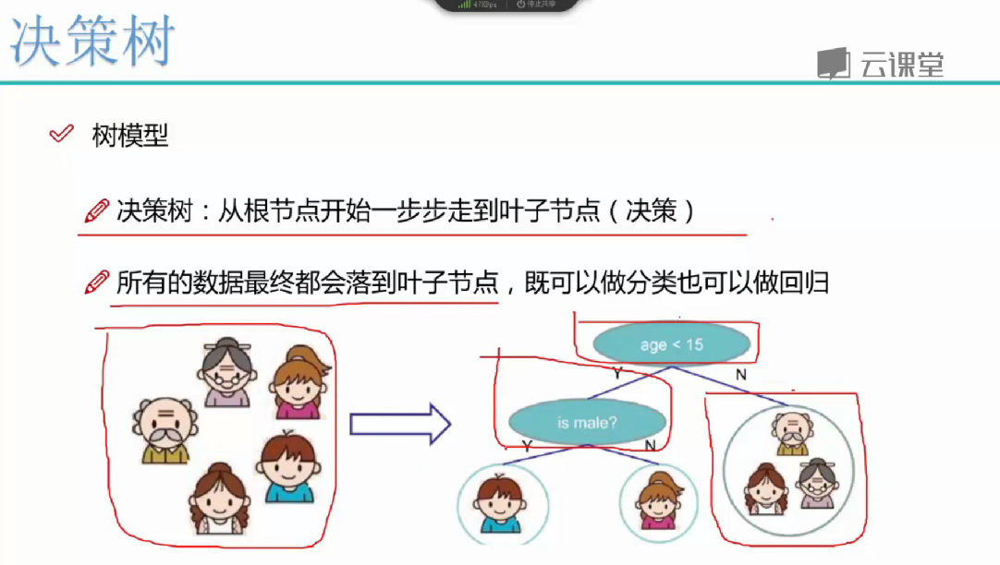
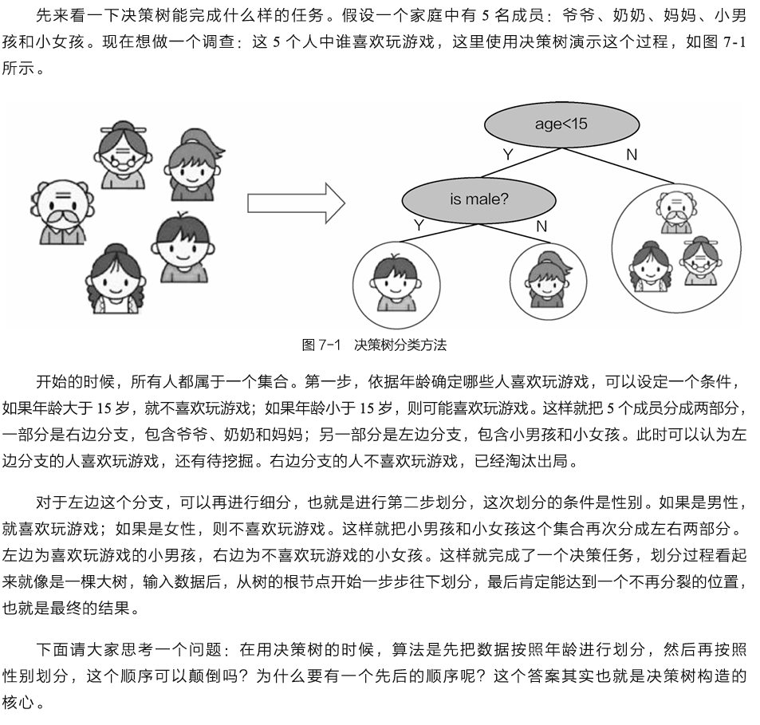
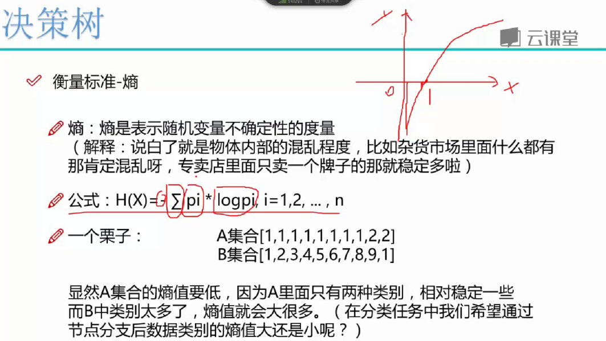
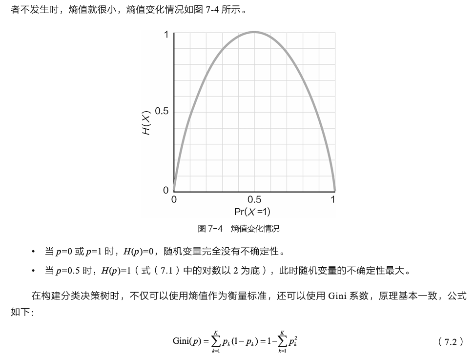
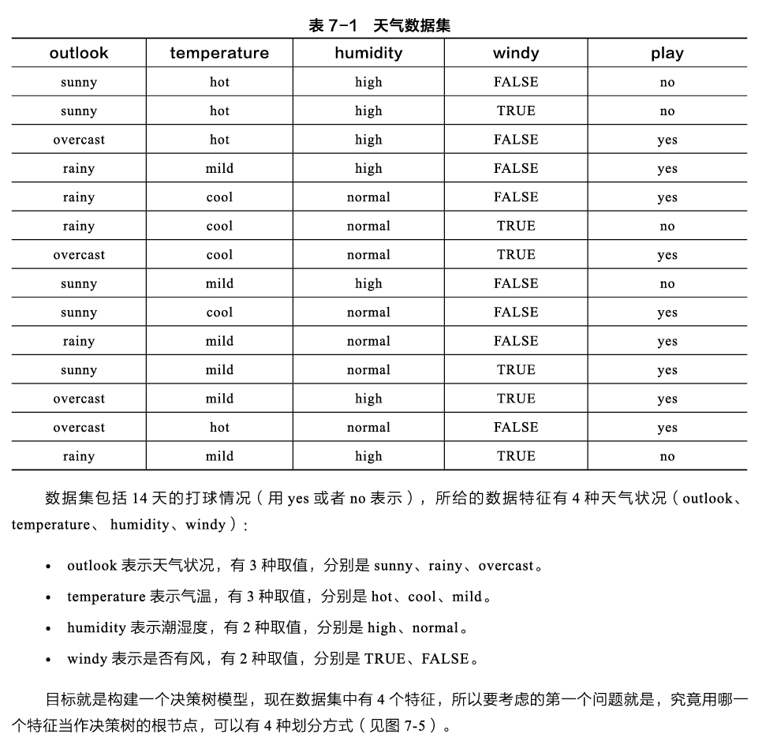
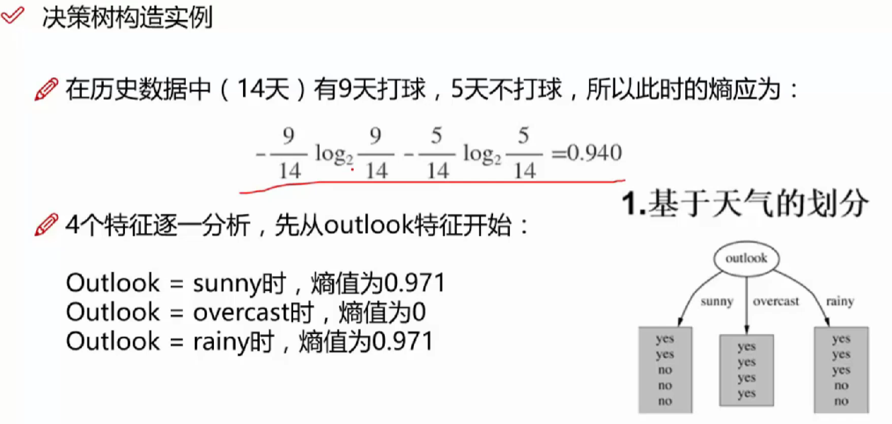
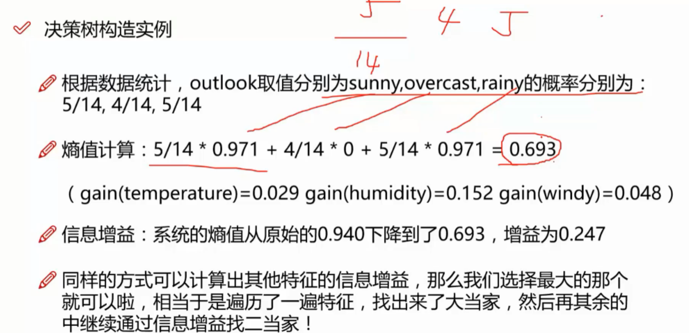
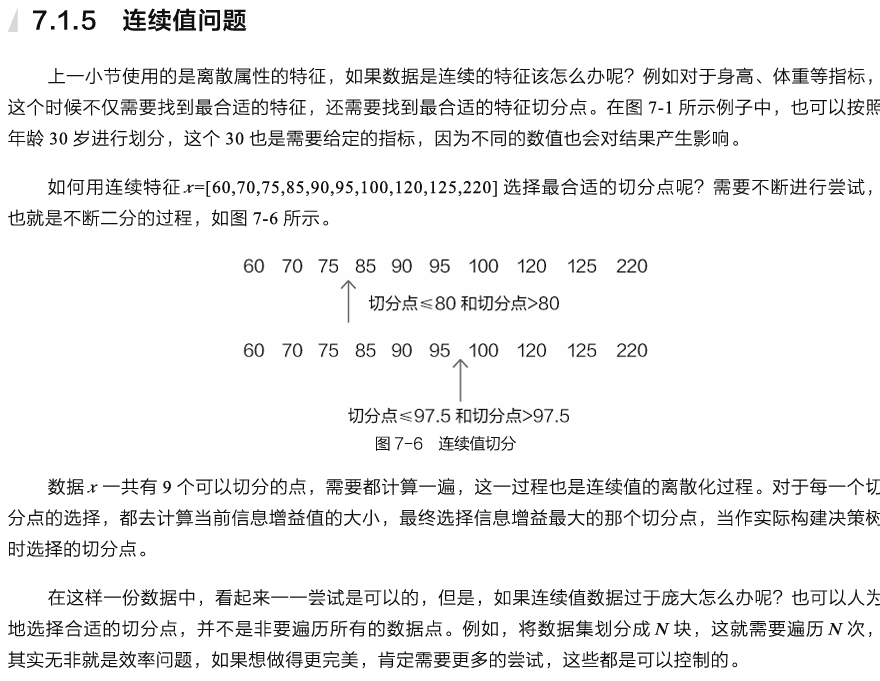
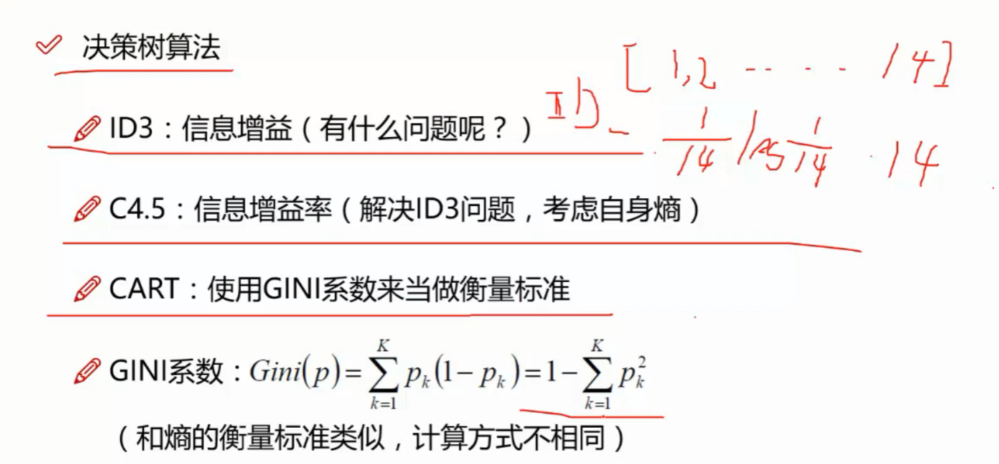
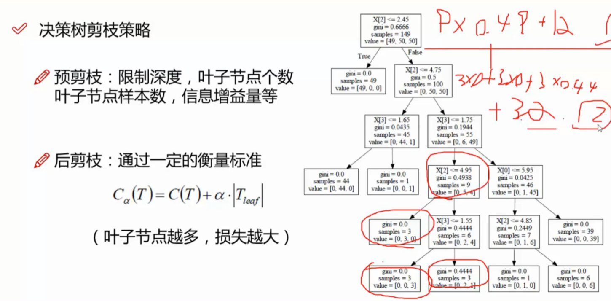

## 熵
　总结上面所提到的问题，归根到底就是什么特征能够把数据集划分得更好，也就是哪个特征最好用，就把它放到最前面，因为它的效果最好，当然应该先把最厉害的拿出来。就像是参加比赛，肯定先上最厉害的队员（决策树中可没有田忌赛马的故事）。那么数据中有那么多特征，怎么分辨其能力呢？这就需要给出一个合理的判断标准，对每个特征进行评估，得到一个合适的能力值。

　　熵指物体内部的混乱程度，怎么理解混乱程度呢？可以分别想象两个场景：第一个场景是，当你来到义乌小商品批发市场，市场里有很多商品，看得人眼花缭乱，这么多商品，好像哪个都想买，但是又比较纠结买哪个，因为可以选择的商品实在太多。

　　根据熵的定义，熵值越高，混乱程度越高。这个杂货市场够混乱吧，那么在这个场景中熵值就较高。但是，模型是希望同一类别的数据放在一起，不同类别的数据分开。那么，如果各种类别数据都混在一起，划分效果肯定就不好，所以熵值高意味着数据没有分开，还是混杂在一起，这可不是模型想要的。

　　第二个场景是当你来到一个苹果手机专卖店，这一进去，好像没得选，只能买苹果手机。这个时候熵值就很低，因为这里没有三星、华为等，选择的不确定性就很低，混乱程度也很低。

　　如果数据划分后也能像苹果专卖店一样，同一类别的都聚集在一起，就达到了分类的目的，解释过后，来看一下熵的公式：

　再来说一说抛硬币的事，把硬币扔向天空后落地的时候，结果基本就是对半开，正反各占50%，这也是一个二分类任务最不确定的时候，由于无法确定结果，其熵值必然最大。但是，如果非常确定一件事发生或者不发生时，熵值就很小，熵值变化情况如图7-4所示。







举个例子用id分割的话每个集合都是一个个体，此时信息增益最大，但是没有意义，所以引进信息增益率将信息增益再除以自身熵值，比如len(id)=n  就是再除以abs(log(1/n))：
　在决策树算法中，经常会看到一些有意思的编号，例如ID3、C4.5，相当于对决策树算法进行了升级。基于信息增益的构建方法就是ID3，那么还有哪些问题需要改进呢？可以想象这样一种特征，样本编号为ID，由于每一个样本的编号都是唯一的，如果用该特征来计算信息增益，可能得到的结果就是它能把所有样本都分开，因为每一个节点里面只有一个样本，此时信息增益最大。但是类似ID这样的特征却没有任何实际价值，所以需要对信息增益的计算方法进行改进，使其能够更好地应对属性值比较分散的类似ID特征。

　　为了避免这个不足，科学家们提出了升级版算法，俗称C4.5，使用信息增益比率（gain ratio）作为选择分支的准则去解决属性值比较分散的特征。“率”这个词一看就是要做除法，再来看看ID这样的特征，由于取值可能性太多，自身熵值已经足够大，如果将此项作为分母，将信息增益作为分子，此时即便信息增益比较大，但由于其自身熵值更大，那么整体的信息增益率就会变得很小。


### 连续问题
上一小节使用的是离散属性的特征，如果数据是连续的特征该怎么办呢？例如对于身高、体重等指标，这个时候不仅需要找到最合适的特征，还需要找到最合适的特征切分点。在图7-1所示例子中，也可以按照年龄30岁进行划分，这个30也是需要给定的指标，因为不同的数值也会对结果产生影响。

　　如何用连续特征x=[60,70,75,85,90,95,100,120,125,220]选择最合适的切分点呢？需要不断进行尝试，也就是不断二分的过程，这里不是经典算法里二分而是不断找分割点进行测试
数据x一共有9个可以切分的点，需要都计算一遍，这一过程也是连续值的离散化过程。对于每一个切分点的选择，都去计算当前信息增益值的大小，最终选择信息增益最大的那个切分点，当作实际构建决策树时选择的切分点。

　　在这样一份数据中，看起来一一尝试是可以的，但是，如果连续值数据过于庞大怎么办呢？也可以人为地选择合适的切分点，并不是非要遍历所有的数据点。例如，将数据集划分成N块，这就需要遍历N次，其实无非就是效率问题，如果想做得更完美，肯定需要更多的尝试，这些都是可以控制的。

### 回归任务
 　　熵值可以用来评估分类问题，那么决策树是不是只能做分类任务呢？当然不止如此，回归任务照样能解决，只需要将衡量标准转换成其他方法即可。

在划分数据集时，回归任务跟分类任务的目标相同，肯定还是希望类似的数值划分在一起，例如，有一批游戏玩家的充值数据\[100,150,130,120,90,15000,16000,14500,13800\]，有的玩家充得多，有的玩家充得少。决策树在划分时肯定希望区别对待这两类玩家，用来衡量不同样本之间差异最好的方法就是方差。在选择根节点时，分类任务要使得熵值下降最多，回归任务只需找方差最小的即可。

　　最终的预测结果也是类似，分类任务中，某一叶子节点取众数（哪种类别多，该叶子节点的最终预测类别就是多数类别的）；回归任务中，只需取平均值当作最后的预测结果即可。

　　分类任务关注的是类别，可以用熵值表示划分后的混乱程度；回归任务关注的则是具体的数值，划分后的集合方差越小，把同类归纳在一起的可能性越大。

 　　讨论了如何建立决策树，下面再来考虑另一个问题：如果不限制树的规模，决策树是不是可以无限地分裂下去，直到每个叶子节点只有一个样本才停止？在理想情况下，这样做能够把训练集中所有样本完全分开。此时每个样本各自占领一个叶子节点，但是这样的决策树是没有意义的，因为完全过拟合，在实际测试集中效果会很差。

所以，需要额外注意限制树模型的规模，不能让它无限制地分裂下去，这就需要对决策树剪枝。试想，小区中的树木是不是经常修剪才能更美观？决策树算法也是一样，目的是为了建模预测的效果更好，那么如何进行剪枝呢？还是需要一些策略。
 　　通常情况下，剪枝方案有两种，分别是预剪枝（Pre-Pruning）和后剪枝（Post-Pruning）。虽然这两种剪枝方案的目标相同，但在做法上还是有区别。预剪枝是在决策树建立的过程中进行，一边构建决策树一边限制其规模。后剪枝是在决策树生成之后才开始，先一口气把决策树构建完成，然后再慢慢收拾它。

　　（1）预剪枝。在构造决策树的同时进行剪枝，目的是限制决策树的复杂程度，常用的停止条件有树的层数、叶子节点的个数、信息增益阈值等指标，这些都是决策树算法的输入参数，当决策树的构建达到停止条件后就会自动停止。

　　（2）后剪枝。决策树构建完成之后，通过一定的标准对其中的节点进行判断，可以自己定义标准，例如常见的衡量标准：

　　式（7.4）与正则化惩罚相似，只不过这里惩罚的是树模型中叶子节点的个数。式中，C(T)为当前的熵值；Tleaf为叶子节点个数，要综合考虑熵值与叶子节点个数。分裂的次数越多，树模型越复杂，叶子节点也就越多，熵值也会越小；分裂的次数越少，树模型越简单，叶子节点个数也就越少，但是熵值就会偏高。最终的平衡点还在于系数（它的作用与正则化惩罚中的系数相同），其值的大小决定了模型的趋势倾向于哪一边。对于任何一个节点，都可以通过比较其经过剪枝后值与未剪枝前值的大小，以决定是否进行剪枝操作。

后剪枝做起来较麻烦，因为首先需要构建出完整的决策树模型，然后再一点一点比对。相对而言，预剪枝就方便多了，直接用各种指标限制决策树的生长，也是当下最流行的一种决策树剪枝方法。

　　现阶段在建立决策树时，预剪枝操作都是必不可少的，其中涉及的参数也较多，需要大量的实验来选择一组最合适的参数，对于后剪枝操作来说，简单了解即可。


接下来实战
转到另一个文件夹

## GridSearchCV
　GridSearchCV的名字其实可以拆分为两部分，GridSearch和CV，即网格搜索和交叉验证。网格搜索，搜索的是参数，即在指定的参数范围内，按步长依次调整参数，利用调整的参数训练学习器，从所有的参数中找到在验证集上精度最高的参数，这其实是一个训练和比较的过程。k折交叉验证将所有数据集分成k份，不重复地每次取其中一份做测试集，用其余k-1份做训练集训练模型，之后计算该模型在测试集上的得分,将k次的得分取平均得到最后的得分。

　　GridSearchCV可以保证在指定的参数范围内找到精度最高的参数，但是这也是网格搜索的缺陷所在，他要求遍历所有可能参数的组合，在面对大数据集和多参数的情况下，非常耗时。

GridSearchCV，它存在的意义就是自动调参，只要把参数输进去，就能给出最优化结果和参数。但是这个方法适合于小数据集，一旦数据的量级上去了，很难得到结果。

      网格搜索可能是最简单，应用最广泛的超参数搜索算法，他通过查找搜索范围内的所有的点来确定最优值。如果采用较大的搜索范围及较小的步长，网格搜索很大概率找到全局最优值。然而这种搜索方案十分消耗计算资源和时间，特别是需要调优的超参数比较多的时候。因此在实际应用过程中，网格搜索法一般会先使用较广的搜索范围和较大的步长，来找到全局最优值可能的位置；然后再缩小搜索范围和步长，来寻找更精确的最优值。这种操作方案可以降低所需的时间和计算量，但由于目标函数一般是非凸的，所以很可能会错过全局最优值。

```py
sklearn.model_selection.GridSearchCV(estimator, param_grid, *, scoring=None, n_jobs=None, iid='deprecated', refit=True, cv=None, verbose=0, pre_dispatch='2*n_jobs', error_score=nan, return_train_score=False)
```
_class sklearn.model\_selection.GridSearchCV(estimator, param\_grid, scoring=None, fit\_params=None, n\_jobs=1, iid=True, refit=True, cv=None, verbose=0, pre\_dispatch=‘2\*n\_jobs’, error\_score=’raise’, return\_train\_score=’warn’)_

**（1）_estimator_**

选择使用的分类器，并且传入除需要确定最佳的参数之外的其他参数。每一个分类器都需要一个scoring参数，或者score方法：estimator=RandomForestClassifier(min\_samples\_split=100,min\_samples\_leaf=20,max\_depth=8,max\_features='sqrt',random\_state=10),

**（2）_param\_grid_**

需要最优化的参数的取值，值为字典或者列表，例如：param\_grid =param\_test1，param\_test1 = {'n\_estimators':range(10,71,10)}。

**（3）_scoring=None_**

模型评价标准，默认None,这时需要使用score函数；或者如scoring='roc\_auc'，根据所选模型不同，评价准则不同。字符串（函数名），或是可调用对象，需要其函数签名形如：scorer(estimator, X, y)；如果是None，则使用estimator的误差估计函数。具体值的选取看本篇第三节内容。

**（4）_fit\_params=None_**

**（5） _n\_jobs=1_**

n\_jobs: 并行数，int：个数,-1：跟CPU核数一致, 1:默认值

**（6） _iid=True_**

**iid**:默认True,为True时，默认为各个样本fold概率分布一致，误差估计为所有样本之和，而非各个fold的平均。

**（7） _refit=True_**

默认为True,程序将会以交叉验证训练集得到的最佳参数，重新对所有可用的训练集与开发集进行，作为最终用于性能评估的最佳模型参数。即在搜索参数结束后，用最佳参数结果再次fit一遍全部数据集。

**（8）_cv=None_**

交叉验证参数，默认None，使用三折交叉验证。指定fold数量，默认为3，也可以是yield训练/测试数据的生成器。

**（9）_verbose=0_, _scoring=None_**

**verbose**：日志冗长度，int：冗长度，0：不输出训练过程，1：偶尔输出，>1：对每个子模型都输出。

**（10）_pre\_dispatch=‘2\*n\_jobs’_**

指定总共分发的并行任务数。当n\_jobs大于1时，数据将在每个运行点进行复制，这可能导致OOM，而设置pre\_dispatch参数，则可以预先划分总共的job数量，使数据最多被复制pre\_dispatch次

**（11）_error\_score=’raise’_**

**（12）_return\_train\_score=’warn’_**

如果“False”，cv\_results\_属性将不包括训练分数

回到sklearn里面的GridSearchCV，GridSearchCV用于系统地遍历多种参数组合，通过交叉验证确定最佳效果参数。


**（1）cv\_results\_ : dict of numpy (masked) ndarrays**

具有键作为列标题和值作为列的dict，可以导入到DataFrame中。注意，“params”键用于存储所有参数候选项的参数设置列表。

**（2）best\_estimator\_ : estimator**

通过搜索选择的估计器，即在左侧数据上给出最高分数（或指定的最小损失）的估计器。 如果_refit = False_，则不可用。

**（3）best\_score\_ : float** best\_estimator的分数

**（4）best\_params\_ : dict** 在保存数据上给出最佳结果的参数设置

**（5）best\_index\_ : int** 对应于最佳候选参数设置的索引（cv\_results\_数组）。  
search.cv\_results \_ \['params'\] \[search.best\_index\_\]中的dict给出了最佳模型的参数设置，给出了最高的平均分数（search.best\_score\_）。

**（6）scorer\_ : function**

Scorer function used on the held out data to choose the best parameters for the model.

**（7）n\_splits\_ : int**

The number of cross-validation splits (folds/iterations).

**（8）grid\_scores\_：**给出不同参数情况下的评价结果