**第8章集成算法**

 　　集成学习（ensemble learning）是目前非常流行的机器学习策略，基本上所有问题都可以借用其思想来得到效果上的提升。基本出发点就是把算法和各种策略集中在一起，说白了就是一个搞不定大家一起上！集成学习既可以用于分类问题，也可以用于回归问题，在机器学习领域会经常看到它的身影，本章就来探讨一下几种经典的集成策略，并结合其应用进行通俗解读。

**8.1Bagging算法**

 　　集成算法有3个核心的思想：**bagging**、**boosting**和**stacking**，这几种集成策略还是非常好理解的，下面向大家逐一介绍。

**8.1.1并行的集成**

 　　Bagging即boostrap aggregating，其中boostrap是一种有放回的抽样方法，抽样策略是简单的随机抽样。其原理很直接，把多个基础模型放到一起，最后再求平均值即可，这里可以把决策书当作基础模型，其实基本上所有集成策略都是以树模型为基础的，公式如下：
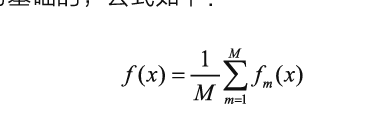

　　首先对数据集进行随机采样，分别训练多个树模型，最终将其结果整合在一起即可，思想还是非常容易理解的，其中最具代表性的算法就是随机森林。

**8.1.2随机森林**

 　　随机森林是机器学习中十分常用的算法，也是bagging集成策略中最实用的算法之一。那么随机和森林分别是什么意思呢？森林应该比较好理解，分别建立了多个决策树，把它们放到一起不就是森林吗？这些决策树都是为了解决同一任务建立的，最终的目标也都是一致的，最后将其结果来平均即可，  

　　想要得到多个决策树模型并不难，只需要多次建模就可以。但是，需要考虑一个问题，如果每一个树模型都相同，那么最终平均的结果也相同。为了使得最终的结果能够更好，通常希望每一个树模型都是有个性的，整个森林才能呈现出多样性，这样再求它们的平均，结果应当更稳定有效。

　　如何才能保证多样性呢？如果输入的数据是固定的，模型的参数也是固定的，那么，得到的结果就是唯一的，如何解决这个问题呢？此时就需要随机森林中的另一部分—随机。下面分别进行介绍。

　　首先是数据采样的随机，**训练数据取自整个数据集中的一部分，如果每一个树模型的输入数据都是不同的，例如随机抽取80%的数据样本当作第一棵树的输入数据，再随机抽取80%的样本数据当作第二棵树的输入数据，并且还是有放回的采样，这就保证两棵树的输入是不同的**，既然输入数据不同，得到的结果必然也会有所差异，这是第一重随机。

　　如果只在数据层面上做文章，那么多样性肯定不够，还需考虑一下特征，**如果对不同的树模型选择不同的特征，结果的差异就会更大。例如，对第一棵树随机选择所有特征中的60%来建模，第二棵再随机选择其中60%的特征来建模，这样就把差异放大了，**这就是第二重随机。

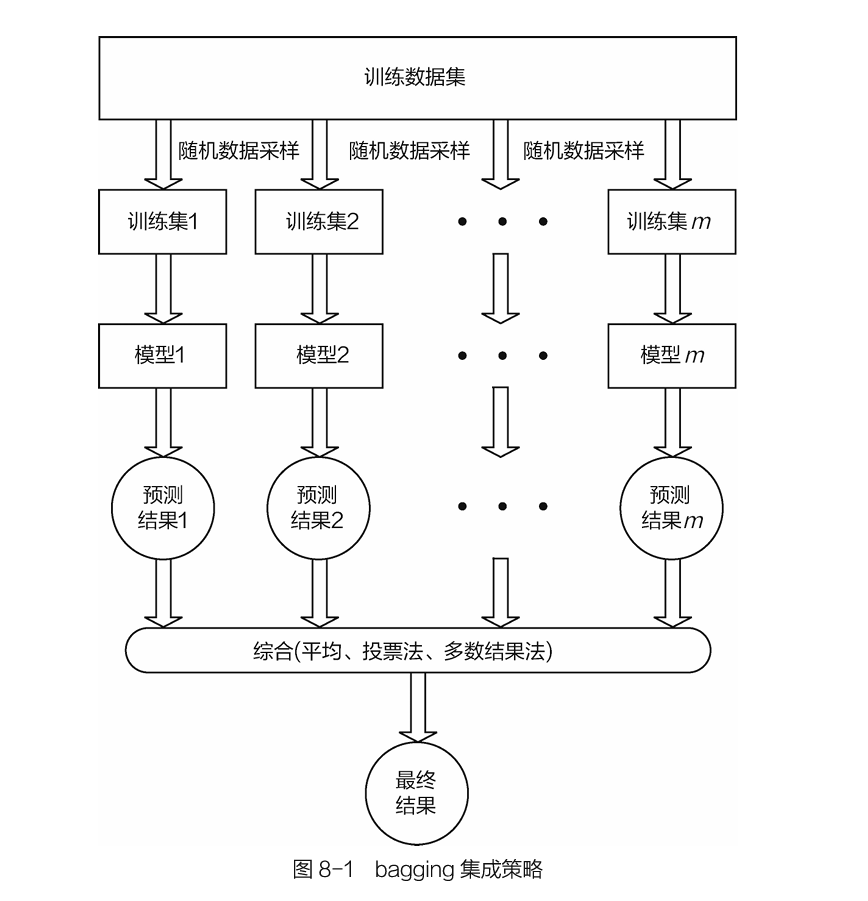

　　图8-1 bagging集成策略

　　如图8-2所示，由于二重随机性使得创建出来的多个树模型各不相同，即便是同样的任务目标，在各自的结果上也会出现一定的差异，随机森林的目的就是要通过大量的基础树模型找到最稳定可靠的结果，如图8-3所示，最终的预测结果由全部树模型共同决定。
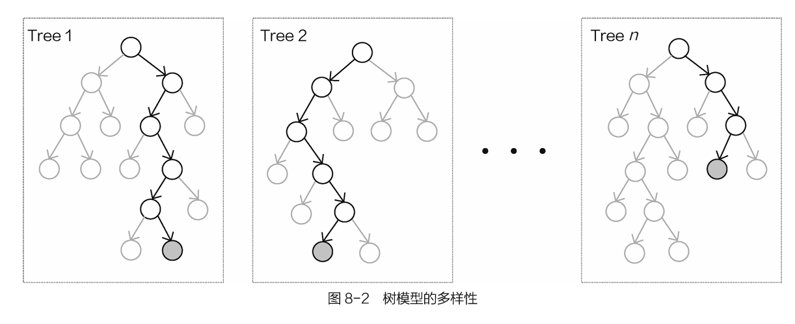
　　▲图8-2 树模型的多样性

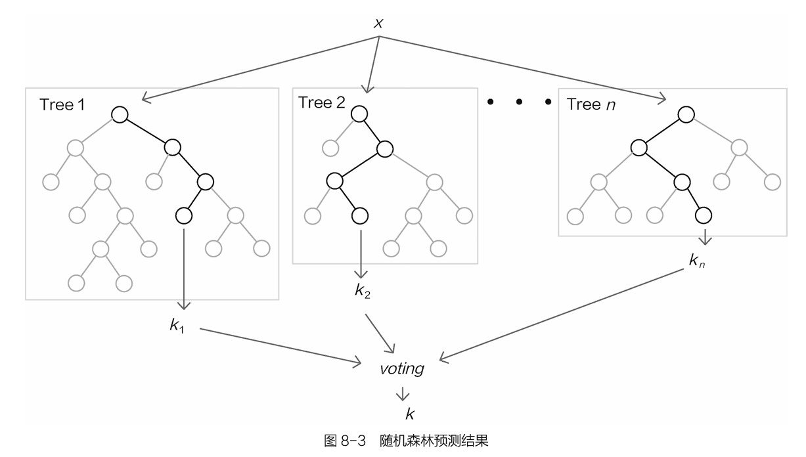
　　▲图8-3 随机森林预测结果

　　解释随机森林的概念之后，再把它们组合起来总结如下：

-   1.随机森林首先是一种并联的思想，同时创建多个树模型，它们之间是不会有任何影响的，使用相同参数，只是输入不同。
-   2.为了满足多样性的要求，需要对数据集进行随机采样，其中包括样本随机采样与特征随机采样，目的是让每一棵树都有个性。
-   3.将所有的树模型组合在一起。在分类任务中，求众数就是最终的分类结果；在回归任务中，直接求平均值即可。

　　对随机森林来说，还需讨论一些细节问题，例如树的个数是越多越好吗？树越多代表整体的能力越强，但是，如果建立太多的树模型，会导致整体效率有所下降，还需考虑时间成本。在实际问题中，树模型的个数一般取100～200个，继续增加下去，效果也不会发生明显改变。图8-4是随机森林中树模型个数对结果的影响，可以发现，随着树模型个数的增加，在初始阶段，准确率上升很明显，但是随着树模型个数的继续增加，准确率逐渐趋于稳定，并开始上下浮动。这都是正常现象，因为在构建决策树的时候，它们都是相互独立的，很难保证把每一棵树都加起来之后会比原来的整体更好。当树模型个数达到一定数值后，整体效果趋于稳定，所以树模型个数也不用特别多，够用即可。

　　在集成算法中，还有一个很实用的参数——特征重要性，如图8-5所示。先不用管每一个特征是什么，特征重要性就是在数据中每一个特征的重要程度，也就是在树模型中，哪些特征被利用得更多，因为树模型会优先选择最优价值的特征。在集成算法中，会综合考虑所有树模型，如果一个特征在大部分基础树模型中都被使用并且靠近根节点，它自然比较重要。

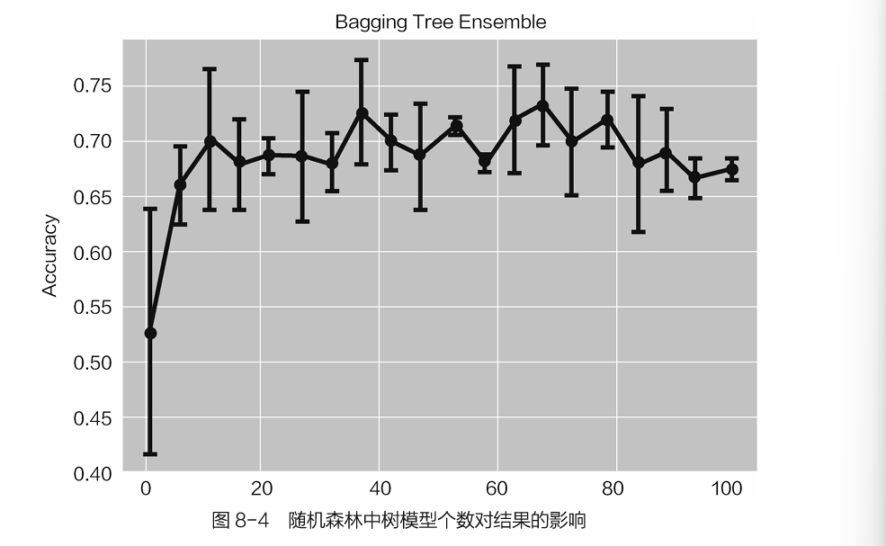

▲图8-4 随机森林中树模型个数对结果的影响

▲图8-5 特征重要性

当使用树模型时，可以非常清晰地得到整个分裂过程，方便进行可视化分析，如图8-6所示，这也是其他算法望尘莫及的，在下一章的实战任务中将展示绘制树模型的可视化结果的过程。
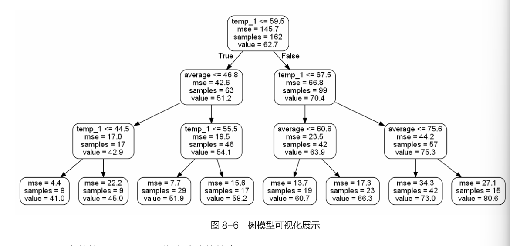

　　图8-6 树模型可视化展示

　　最后再来总结一下bagging集成策略的特点：

　　　　1.**并联形式**，可以快速地得到各个基础模型，**它们之间不会相互干扰**，但是其中也存在问题，不能确保加进来的每一个基础树模型都对结果产生促进作用，可能有个别树模型反而拉后腿。

　　　　2.可以进行**可视化展示**，树模型本身就具有这个优势，每一个树模型都具有实际意义。

　　　　3.相当于**半自动进行特征选择**，总是会先用最好的特征，这在特征工程中一定程度上省时省力，适用于较高维度的数据，并且还可以进行特征重要性评估。

**8.2Boosting算法**

 　　上一节介绍的bagging思想是，先并行训练一堆基础树模型，然后求平均。这就出现了一个问题：如果每一个树模型都比较弱，整体平均完还是很弱，那么怎样才能使模型的整体战斗力更强呢？这回轮到boosting算法登场了，boosting算法可以说是目前比较厉害的一种策略。

**8.2.1串行的集成**

 　　Boosting算法的核心思想就在于要使得整体的效果越来越好，整体队伍是非常优秀的，一般效果的树模型想加入进来是不行的，只要最强的树模型。怎么才能做到呢？先来看一下boosting算法的基本公式：
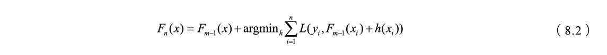

　　通俗的解释就是把Fm−1(x)当作前一轮得到的整体，这个整体中可能已经包含多个树模型，当再往这个整体中加入一个树模型的时候，需要满足一个条件——新加入的h(xi)与前一轮的整体组合完之后，效果要比之前好。怎么评估这个好坏呢？就是看整体模型的损失是不是有所下降。

　　Boosting算法是一种串联方式，如图8-7所示，先有第一个树模型，然后不断往里加入一个个新的树模型，但是有一个前提，就是新加入的树模型要使得其与之前的整体组合完之后效果更好，说明要求更严格。最终的结果与bagging也有明显的区别，这里不需要再取平均值，而是直接把所有树模型的结果加在一起。那么，为什么这么做呢？

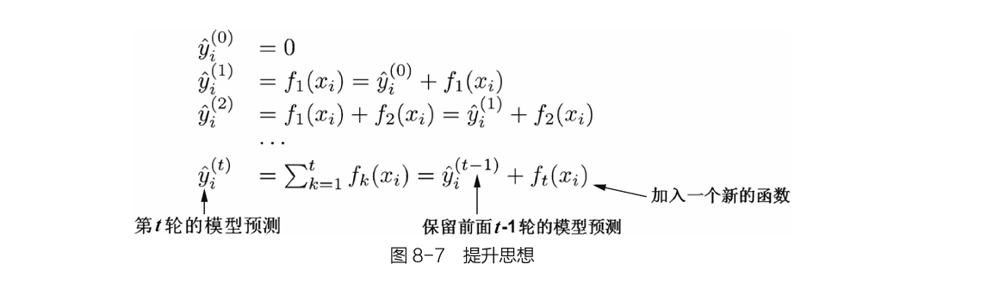

　　图8-7 提升思想

　　回到银行贷款的任务中，假设数据的真实值等于1000，首先对树A进行预测，得到值950，看起来还不错。接下来树B登场了，这时出现一个关键点，就是它在预测的时候，并不是要继续预测银行可能贷款多少，而是想办法弥补树A还有多少没做好，也就是1000−950=50，可以把50当作残差，这就是树B要预测的结果，假设得到30。现在需要把树A和树B组合成为一个整体，它们一起预测得950+30=980。接下来树C要完成的就是剩下的残差（也就是20），那么最终的结果就是树A、B、C各自的结果加在一起得950+30+18=998，如图8-8所示。说到这里，相信大家已经有点感觉了，boosting算法好像开挂了，为了达到目标不择手段！没错，这就是boosting算法的基本出发点。
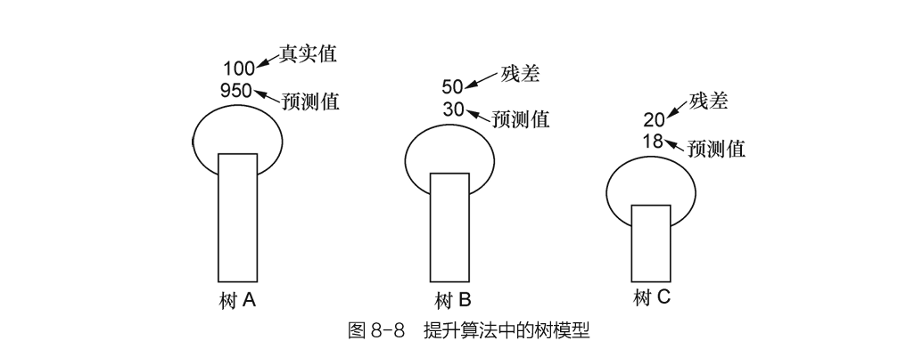
　　图8-8 提升算法中的树模型

**8.2.2Adaboost算法**

 　　下面再来介绍一下boosting算法中的一个典型代表——Adaboost算法。简单来说，Adaboost算法还是按照boosting算法的思想，要建立多个基础模型，一个个地串联在一起。

　　图8-9是Adaboost算法的建模流程。当得到第一个基础树模型之后，在数据集上有些样本分得正确，有些样本分得错误。此时需要考虑这样一个问题，为什么会分错呢？是不是因为这些样本比较难以判断吗？那么更应当注重这些难度较大的，也就是需要给样本不同的权重，做对的样本，权重相对较低，因为已经做得很好，不需要太多额外的关注；做错的样本权重就要增大，让模型能更重视它。以此类推，每一次划分数据集时，都会出现不同的错误样本，继续重新调整权重，以对数据集不断进行划分即可。每一次划分都相当于得到一个基础的树模型，它们要的目标就是优先解决之前还没有划分正确的样本。
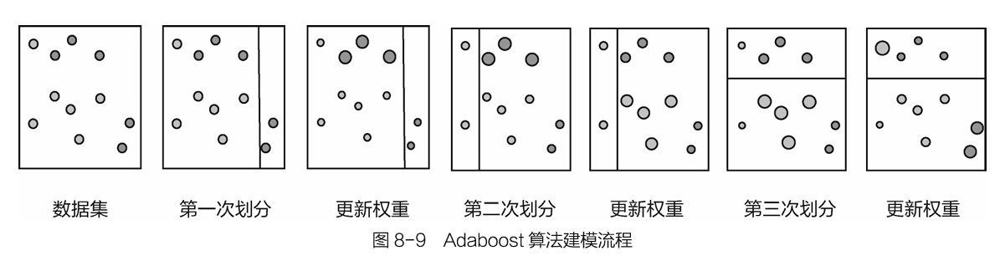

　　图8-9 Adaboost算法建模流程

　　图8-10是Adaboost算法需要把之前的基础模型都串在一起得到最终结果，但是这里引入了系数，相当于每一个基础模型的重要程度，因为不同的基础模型都会得到其各自的评估结果，例如准确率，在把它们串在一起的时候，也不能同等对待，效果好的让它多发挥作用，效果一般的，让它参与一下即可，这就是系数的作用。
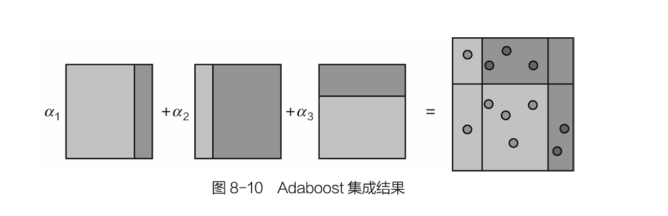

　　图8-10 Adaboost集成结果

　　Adaboost算法整体计算流程如图8-11所示，在训练每一个基础树模型时，需要调整数据集中每个样本的权重分布，由于每次的训练数据都会发生改变，这就使得每次训练的结果也会有所不同，最终再把所有的结果累加在一起。
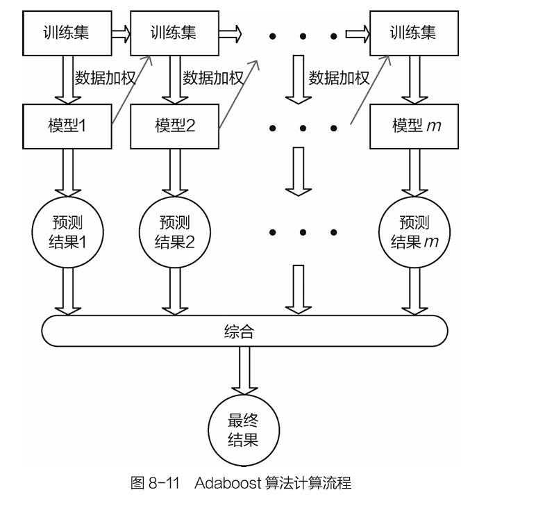

　　图8-11 Adaboost算法计算流程

**8.3Stacking模型**

 　　前面讨论了bagging和boosting算法，它们都是用相同的基础模型进行不同方式的组合，而stacking模型与它们不同，它可以使用多个不同算法模型一起完成一个任务，先来看看它的整体流程，如图8-12所示。

　　首先选择m个不同分类器分别对数据进行建模，这些分类器可以是各种机器学习算法，例如树模型、逻辑回归、支持向量机、神经网络等，各种算法分别得到各自的结果，这可以当作第一阶段。再把各算法的结果（例如得到了4种算法的分类结果，二分类中就是0/1值）当作数据特征传入第二阶段的总分类器中，此处只需选择一个分类器即可，得到最终结果。

其实就是把无论多少维的特征数据传入各种算法模型中，例如有4个算法模型，得到的结果组合在一起就可以当作一个4维结果，再将其传入到第二阶段中得到最终的结果。
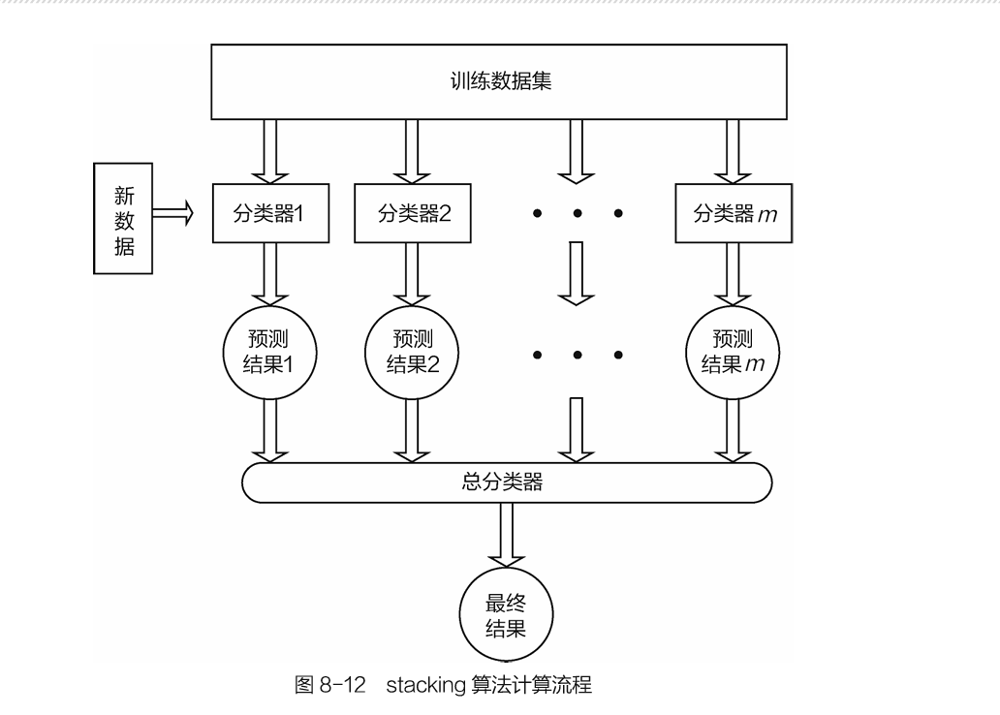

　　图8-12 stacking算法计算流程

　　图8-13是stacking策略的计算细节，其中Model1可以当作是第一阶段中的一个算法，它与交叉验证原理相似，先将数据分成多份，然后各自得到一个预测结果。那么为什么这么做呢？直接拿原始数据进行训练不可以吗？其实在机器学习中，一直都遵循一个原则，就是不希望训练集对接下来任何测试过程产生影响。在第二阶段中，需要把上一步得到的结果当作特征再进行建模，以得到最终结果，如果在第一阶段中直接使用全部训练集结果，相当于第二阶段中再训练的时候，已经有一个先验知识，最终结果可能出现过拟合的风险。

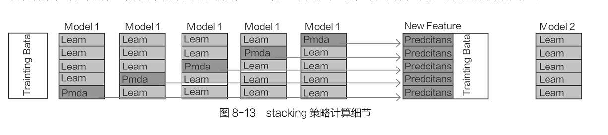
　　图8-13 stacking策略计算细节

　　借助于交叉验证的思想，在第一阶段中，恰好可以避免重复使用训练集的问题，这个时候得到的结果特征就是不带有训练集信息的结果。第二阶段就用Model2指代，只需简单完成一次建模任务即可。

**本章小结：**本章介绍了机器学习中非常实用的策略——集成算法，分别讲解了其中三大核心模块：bagging、boosting和stacking。虽然都是集成策略，但不同算法的侧重点还是有所差异，在实际应用中，算法本身并没有高低之分，还需根据不同任务选择最合适的方法。

