# **聚类算法**

 　　分类和回归算法在推导过程中都需要数据标签，也就是有监督问题。那么，如果数据本身没有标签，如何把它们按堆进行划分呢？这时候聚类算法就派上用场了，本章选择聚类算法K-means与DBSCAN进行原理讲解与实例演示。
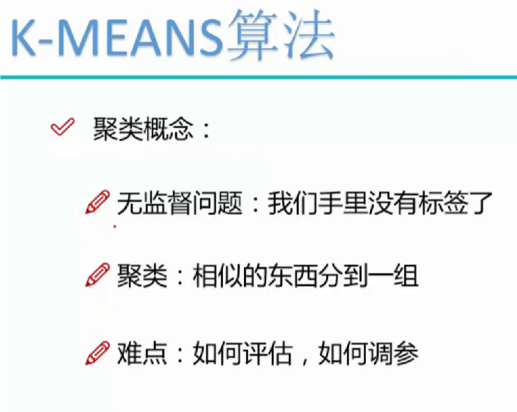
## **16.1K-means算法**

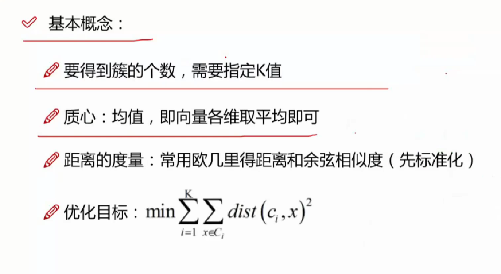
### **16.1.1聚类的基本特性**

 　　对于一份没有标签的数据，有监督算法就会无从下手，聚类算法能够将数据进行大致的划分，最终让每一个数据点都有一个固定的类别。

　　无监督数据集样本点分布如图16-1所示，这些数据样本点大概能分成3堆，使用聚类算法的目的就是把数据按堆进行划分，看起来不难，但实际中数据维度通常较高，这种样本点只能当作讲解时的理想情况，所以聚类算法通常解决问题的效果远不如有监督算法。

 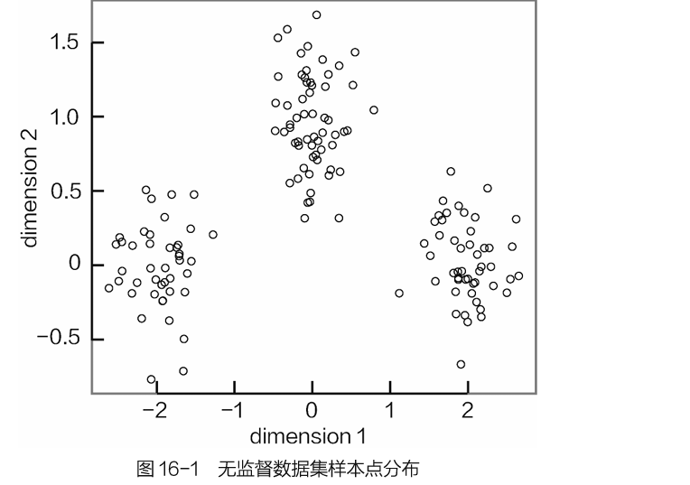
　　图16-1 无监督数据集样本点分布

　　聚类的最终结果如图16-2所示，即给每一个样本数据打上一个标签，明确指明它是属于什么类别（这里用颜色深浅来表示）。

　　不同的聚类算法得到的结果差异会比较大，即便同一种算法，使用不同参数时的结果也是完全不同。由于本身的无监督性，使得结果评估也成为一个难题，最终可以得到每个样本点各自的划分，但是效果怎么样却很难解释，所以聚类还存在如何自圆其说的一个问题。

　　一般情况下，当有数据标签的时候，还是老老实实地用有监督算法，实在没办法再选聚类。

　　图16-2 聚类算法结果

　　先提出一些聚类算法存在的问题，这些都是实际中必然会遇到的。但并不是所有数据都能漂漂亮亮带着标签呈现在大家面前，无监督算法还是机器学习中一个非常重要的分支，算法本身并没有优劣之分，还是依据实际任务进行选择。

### **16.1.2K-means算法原理**

 　　对K-means算法最直截了当的讲解方式，就是看它划分数据集的工作流程。

-   第①步：拿到数据集后，可能不知道每个数据样本都属于什么类别，此时需要指定一个K值，明确想要将数据划分成几堆。例如，图所示数据点分成两堆，这时K值就是2，但是，如果数据集比较复杂，K值就难以确定，需要通过实验进行对比。本例假设给定K值等于2，意味着想把数据点划分成两堆。
-   第②步：既然想划分成两堆，需要找两个能够代表每个堆的中心的点（也称质心，就是数据各个维度的均值坐标点），但是划分前并不知道每个堆的中心点在哪个位置，所以需要随机初始化两个坐标点，如图所示。
-   第③步：选择两个中心点后，就要在所有数据样本中进行遍历，看看每个数据样本应当属于哪个堆。对每个数据点分别计算其到两个中心点之间的距离，离哪个中心点近，它就属于哪一堆，如图所示。距离值可以自己定义，一般情况下使用欧氏距离。
-   第④步：第②步找的中心点是随机选择的，经过第③步，每一个数据都有各自的归属，由于中心点是每个堆的代表，所以此时需要更新两个堆各自的中心点。做法很简单，分别对不同归属的样本数据计算其中心位置，计算结果变成新的中心点，如图所示。
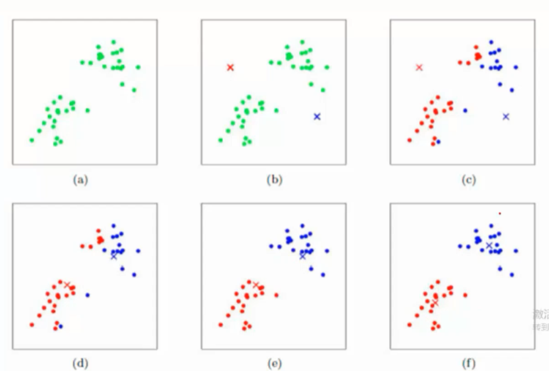

-   第⑤步：数据点究竟属于哪一堆？其衡量标准是看这些数据点离哪个中心点更近，第④步已经更新了中心点的位置，每个数据的所属也会发生变化，此时需要重新计算各个数据点的归属，计算距离方式相同，如图16-7所示。
-   第⑥步：至此，样本点归属再次发生变化，所以需要重新计算中心点，总之，只要数据所属发生变化，每一堆的中心点也会发生改变，如图所示。

-   第⑦步：接下来就是重复性工作，反复进行迭代，不断求新的中心点位置，然后更新每一个数据点所属，最终，当中心点位置不变，也就是数据点所属类别固定下来时，就完成了K-means算法，也就得到每一个样本点的最终所属类别。

> 就是每次分完之后再重新确定不同分组的中心，再进行分组
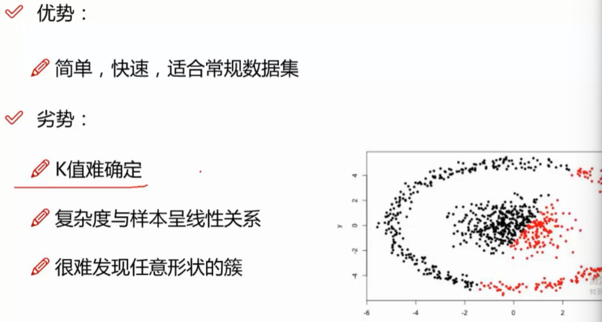

### **16.1.3K-means涉及参数**
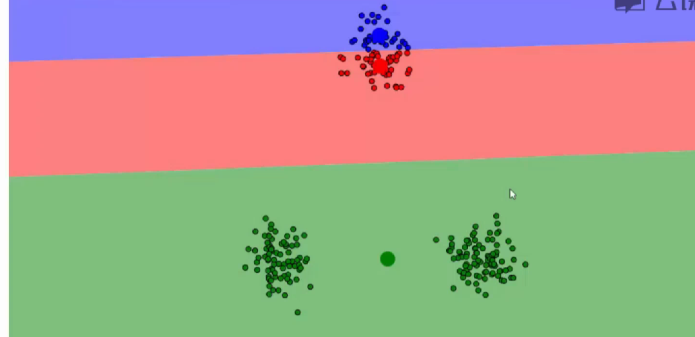初值选择很重要

 　　（1）K值的确定。K值决定了待分析的数据会被划分成几个簇。当K=3时，数据就会分成3个簇；K=4时，数据就会被划分成4个簇（相当于在开始阶段随机初始化多少个中心点）。对于一份数据来说，需要明确 地告诉算法，想要把数据分成多少份，即选择不同的K值，得到的结果是完全不同的。

　　图展示了分别选择K值等于3和4时的结果，这也说明K-means算法中最核心的目的就是要将数据划分成几个堆，对于简单的数据可以直接给出合适的K值，但实际中的数据样本量和特征个数通常规模较大，很难确定具体的划分标准。所以如何选择K值始终是K-means算法中最难解决的一个问题。

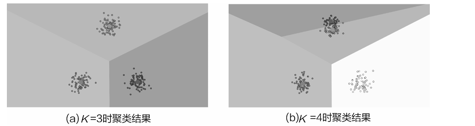

（2）质心的选择。选择适当的初始质心是K-means算法的关键步骤，通常都是随机给出，那么如果初始时选择的质心不同，会对结果产生影响吗？或者说每一次执行K-means后的结果都相同吗？
　　由于初始位置会对结果产生影响，所以，只做一次实验是不够的。

　　（3）距离的度量。常用的距离度量方法包括欧氏距离和余弦相似度等。距离的选择也可以当作是K-means的一种参数，不同度量方式会对结果产生不同的影响。

　　（4）评估方法。聚类算法由于本身的无监督性，没法用交叉验证来评估结果，只能大致观察结果的分布情况。轮廓系数（Silhouette Coefficient）是聚类效果好坏的一种评价方式，也是最常用的评估方法，计算方法如下。

-   1.计算样本i到同簇其他样本的平均距离a(i)。a(i)越小，说明样本i越应该被聚类到该簇。将a(i)称为样本i的簇内不相似度。
-   2.计算样本i到其他某簇Cj的所有样本的平均距离bij，称为样本i与簇Cj的不相似度。定义为样本i的簇间不相似度：b(i)=min{bi1,bi2,…,bik}。
-   3.根据样本i的簇内不相似度a(i)和簇间不相似度b(i)，定义样本i的轮廓系数。
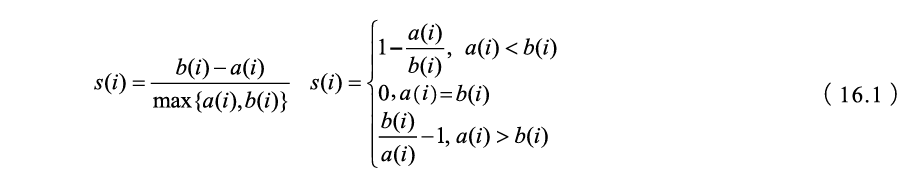

　　如果s(i)接近1，则说明样本i聚类合理；s(i)接近-1，则说明样本i更应该分类到另外的簇；若s(i)近似为0，则说明样本i在两个簇的边界上。所有样本的s(i)的均值称为聚类结果的轮廓系数，它是该聚类是否合理、有效的度量。

**16.1.4K-means聚类效果与优缺点**

 　　K-means算法对较为规则的数据集划分的效果还是不错的，

　　但如果数据集是非规则形状，做起来就比较困难，例如，笑脸和环绕形数据集用K-means很难划分正确

　　K-means算法虽然简单，但并不适用所有数据集，在无监督算法中想要发现问题十分困难，因为没有实际标签，使得评估任务很难进行，所以只能依靠实际情况具体分析。

最后，总结一下K-means算法的优缺点。

　　**优点：**

　　　　1.快速、简单，概括来说就是很通用的算法。

　　　　2.聚类效果通常还是不错的，可以自己指定划分的类别数。

　　　　3.可解释性较强，每一步做了什么都在掌控之中。

　　**缺点：**

　　　　1.在K-means算法中，K是事先给定的，这个K值是非常难以估计的。很多时候，事先并不知道给定的数据集应该分成多少个类别才合适。

　　　　2.初始质心点的选择有待改进，可能会出现不同的结果。

　　　　3.在球形簇上表现效果非常好，但是其他类型簇中效果一般。

## **16.2DBSCAN聚类算法**

 　　在K-means算法中，需要自己指定K值，也就是确定最终要得到多少个类别，那么，能不能让算法自动决定数据集划分成多少个类别呢？那些不规则的簇该怎么解决呢？下面介绍的DBSCAN算法就能在一定程度上解决这些问题。

**16.2.1DBSCAN算法概述**
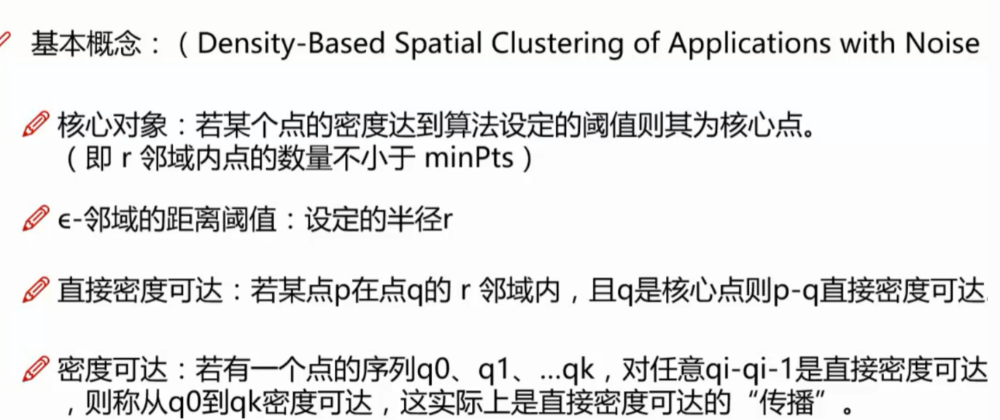
 　　DBSCAN（Density-Based Spatial Clustering of Applications with Noise）**算法常用于异常检测，它的注意力放在离群点上，所以，当大家在无监督问题中遇到检测任务的时候，它肯定是首选**

　　在介绍建模流程之前，需要了解它的一些基本概念，略微比K-means算法复杂。

-   （1）ϵ-邻域：给定对象半径r内的邻域。K-means算法是基于距离计算的，但是在DBSCAN中，最核心的参数是半径，会对结果产生较大影响。
-   （2）核心点：如果对象的ϵ-邻域至少包含一定数目的数据点，则称该数据点为核心对象，说明这个数据点周围比较密集。
-   （3）边界点：边界点不是核心点，但落在某个核心点的邻域内，也就是在数据集中的边界位置。
-   （4）离群点（噪音点）：既不是核心点，也不是边界点的其他数据点，也就是数据点落单了。

　　直接从概念上理解这些点可能有些抽象，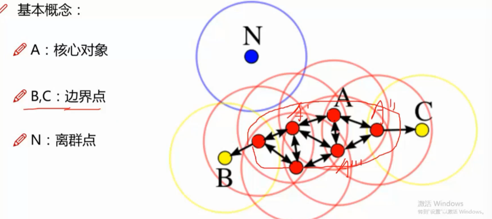

　　已知每个圆的半径r相同。黑色点表示核心对象，周围比较密集，从每一个核心点发展出发都能将其他一部分数据点发展成为其营销对象（也就是其半径r邻域内圈到的数据点）。空心点表示边界点，这些点成为核心点的销售对象之后，不能再继续发展其他销售对象，所以到它们这里就结束了，成为边界。点N在另一边热火朝天地干着营销方案，附近啥动静都没有，没有数据点来发展它，它也不能发展其他数据点，就是离群点。

　　密度可达和直接密度可达是DBSCAN算法中经常用到的两个概念。对于一个数据点来说，它直接的销售对象就是直接密度可达，通过它的已销售下属间接发展的就是密度可达。大家在理解DBSCAN的时候，从营销的角度去看这些数据点就容易多了。
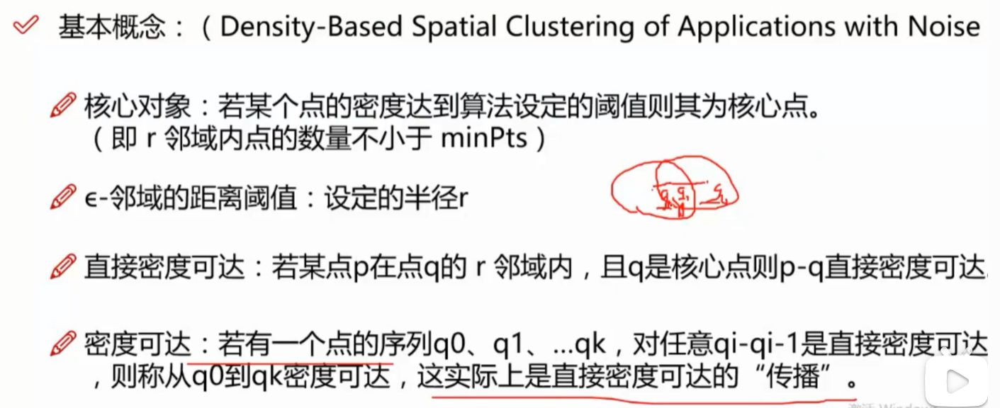
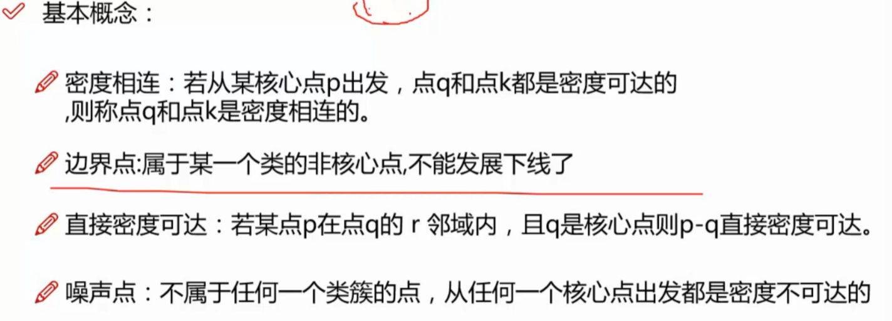

**16.2.2DBSCAN工作流程**

 　　DBSCAN算法的工作流程跟营销的模式类似，先来看看它的建模流程，如图所示。
~~（BFS）~~！
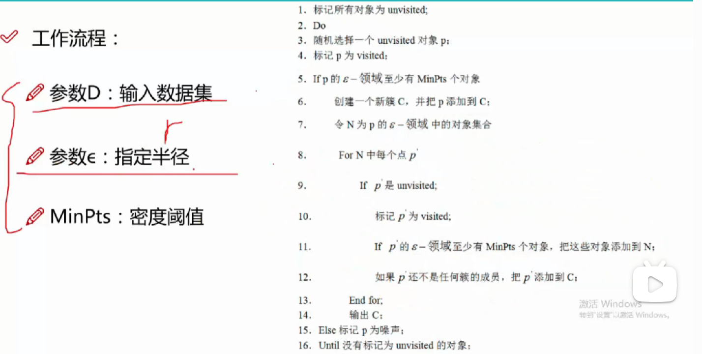
　　算法首先会选择一个销售初始点，例如图中黑色部分的一个数据点，然后以r为半径开始画圆，凡是能被它及其下属圈到的数据点都是属于同一类别，如图所示。

　　随着销售组织的壮大，越来越多的数据点被其同化成同一类别，不仅初始的数据点要发展销售对象，凡是被它发展的数据样本也要继续发展其他数据点。当这个地方被全部发展完之后，相当于这个组织已经成型，接下来算法会寻找下一个销售地点。

　　此时算法在新的位置上建立另一片销售地点，由于此处并不是由之前的组织发展过来的，所以它们不属于一个类别，新发展的这一片就是当前数据集中第二个类别，如图1所示。跟之前的做法一致，当这片销售地点全部发展完之后，还会寻找下一个地点。

　　此时正在进行的就是第3个类别，大家也应该发现，事前并没有给出最终想划分成多少个类别，而是由算法在数据集上实际执行的过程来决定，如图16-18所示。最终当所有数据点都被遍历一遍之后整个DBSCAN聚类算法就完成了。
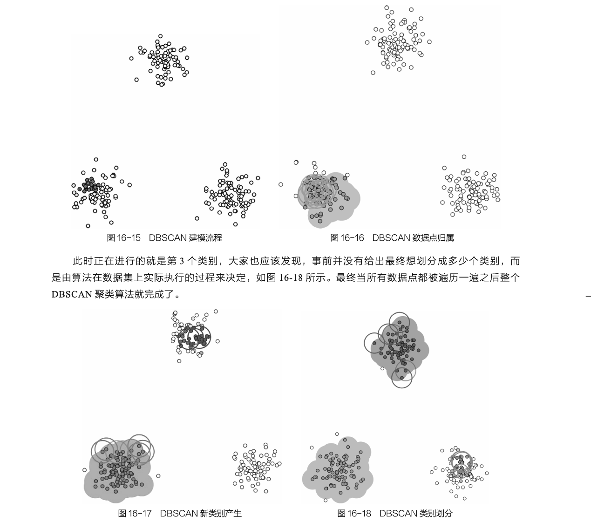

　　最后当所有能发展的基地与数据点都完成任务后，剩下的就是离群点了，这里用圆圈标注起来了，如图16-19所示。由于DBSCAN算法本身的代表就是检测任务，这些离群点就是任何组织都发展不了它们，它们也不会发展其他数据点。

　　下面总结一下DBSCAN算法的建模流程，如图16-20所示。
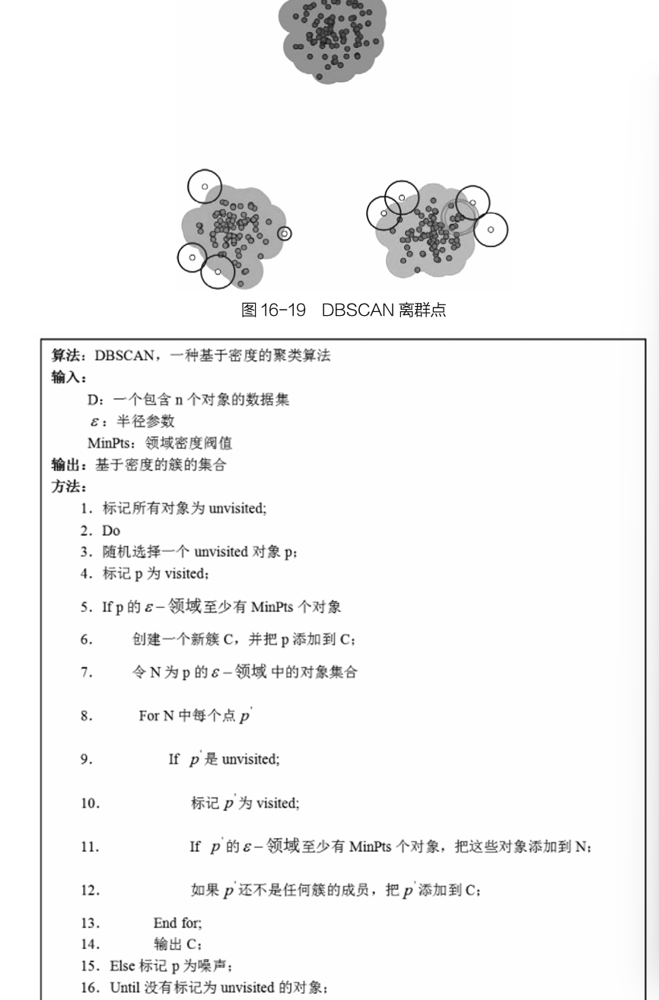

**16.2.3半径对结果的影响**

 　　在建模流程中，需要指定半径的大小r，r也是算法中对结果影响很大的参数，先来看看在使用不同半径时的差异，如图16-21所示。

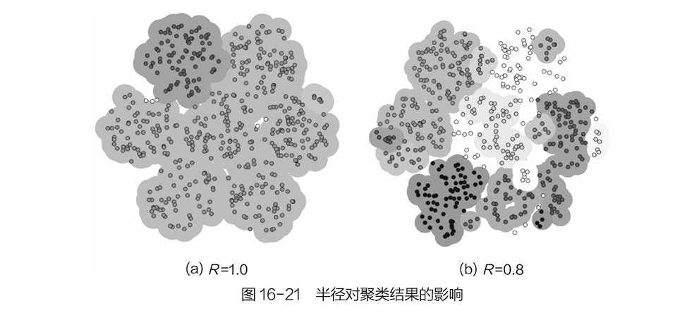

　　图16-21 半径对聚类结果的影响

　　不同半径意味着发展销售对象时画圆的大小发生了变化，通常情况下，半径越大，能够发展的对象越多，整体的类别偏少，离群点也会偏少；而半径较小的时候，由于发展能力变弱，出现的类别就会偏多，离群点也会偏多。

　　可以明显看到，半径不同得到的结果相差非常大，尤其是在类别上，所以半径是影响DBSCAN算法建模效果的最直接因素。但是问题依旧是无监督所导致的，没办法用交叉验证来选择最合适的参数，只能依靠一些类似经验值的方法。

　　之前用K-means算法尝试划分了一个笑脸，得到的效果并不好，下面用DBSCAN算法试一试。

　　DBSCA聚类结果如图16-22所示，看起来划分效果非常好，由于其原理是基于密度的营销方式，所以可以轻松解决这种环绕形数据，不仅如此，DBSCAN还适用于任意形状的簇，无论多么特别，只要数据点能按密度扎堆就能搞定，如图16-23所示。

　　DBSCAN聚类算法的主要优点如下：

　　　　1.可以对任意形状的稠密数据集进行聚类，而K-means之类的聚类算法一般只适用于球状数据集；

　　　　2.非常适合检测任务，寻找离群点；

　　　　3.不需要手动指定聚类的堆数，实际中也很难知道大致的堆数。

　　DBSCAN的主要缺点如下：

　　　　1.如果样本集的密度不均匀、聚类间距差相差很大时，聚类效果较差；

　　　　2.半径的选择比较难，不同半径的结果差异非常大。

　　DBSCAN算法总体来说还是非常实用的，也是笔者很喜欢的聚类算法，首先不需要人为指定最终的结果，而且可以用来分析离群点，是检测任务的首选算法。笔者在很多实际问题中对比过不同的聚类算法，得出的结论基本都是DBSCAN算法要略好一些，所以当大家遇到无监督问题的时候，一定要来试试DBSCAN算法的效果。
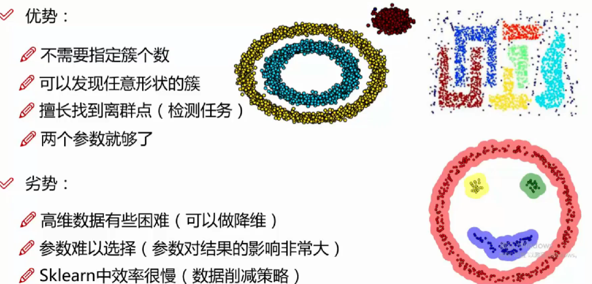
**16.3聚类实例**

 见另外文件夹inpnb文件
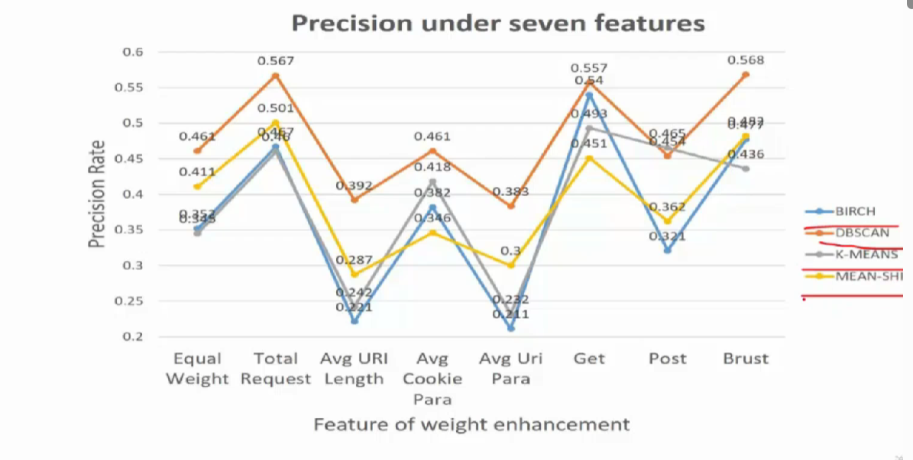
birch最快
可以特征增强（01->0 10）
