# **支持向量机**

**12.1支持向量机工作原理**

**12.1.1支持向量机要解决的问题**

　　现在由一个小例子来引入支持向量机，图12-1中有两类数据点，目标就是找到一个最好的决策方程将它们区分开。
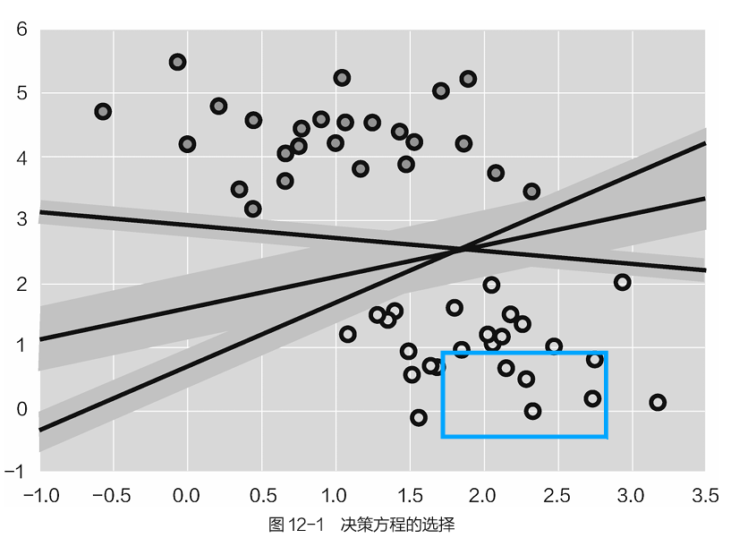

选择更宽的决策边界更佳，因为这样才能离这些雷更远，中间部分可以看作隔离带，这样容忍错误能力更强，效果自然要比窄的好。

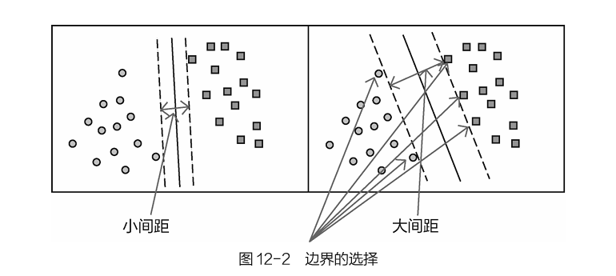
**12.1.2距离与标签定义**

 　　上一小节一直强调一定要避开危险的左右雷区，在数学上首先要明确指出离“雷区”的距离，也就是一个点（雷）到决策面的距离，然后才能继续优化目标。还是举一个例子，假设平面方程为wTx+b=0，平面上有x’和x”两个点，W为平面的法向量，要求x点到平面h的距离，如图12-3所示。既然x’和x”都在平面上，因此满足：

　　**wTx’+b=0，wTx”+b=0 （12.1）**

　　直接计算x点到平面的距离看起来有点难，可以转换一下，如果得到x到x’的距离后，再投影到平面的法向量方向上，就容易求解了，距离定义如下：
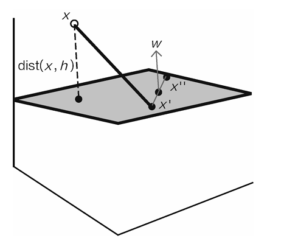

　　其中，WT  /||W||为平面法向量的方向，也就是要投影的方向，由于只是投影而已，所以只需得到投影方向的单位方向向量即可；(x-x’)为间接地通过x和x’计算距离；又由于x’在平面上，wTx’就等于−b。这样就有了距离的计算方法。

　　接下来开始定义数据集：(X1,Y1)(X2,Y2)...(Xn,Yn)，其中，Xn为数据的特征，Yn为样本的标签。当Xn为正例时候，Yn\=+1；当Xn为负例时候，Yn\=−1。这样定义是为了之后的化简做准备，前面提到过，逻辑回归中定义的类别编号0和1也是为了化简。

　　最终的决策方程如下：

　　这个方程看起来很熟悉，其中x和y是已知的（数据中给出，有监督问题），目标就是要求解其中的参数，但是x怎么有点特别呢？其中φ(x)表示对数据进行了某种变换，这里可以先不管它，依旧把它当作数据即可。
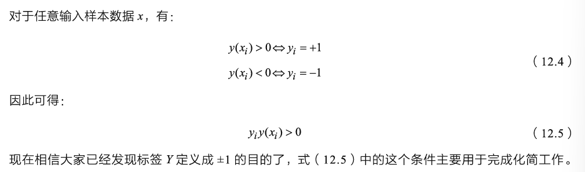
**12.1.3目标函数**

 　　再来明确一下已知的信息和要完成的任务，根据前面介绍可知，目标就是找到一个最好的决策方程（也就是w和b的值），并且已知数据点到决策边界的距离计算方法。下面就要给出目标函数，大家都知道，机器学习的思想都是由一个实际的任务出发，将之转换成数学表达，再得到目标函数，最后去优化求解。

　　这里要优化的目标就是使得离决策方程最近的点（雷）能够越远越好，这句话看似简单，其实只要理解了以下两点，支持向量机已经弄懂一半了，再来解释一下。

　　　　1.为什么要选择离决策方程最近的点呢？可以这么想，如果你踩到了最近的“雷”，还需要验证更远的“雷”吗？也就是危险是由最近的“雷”带来的，只要避开它，其他的构不成威胁。

　　　　2.为什么越宽越好呢？因为在选择决策方程的时候，肯定是要找最宽的边界，越远离边界才能越安全。

　　目标函数非常重要，所有机器学习问题都可以归结为通过目标函数选择合适的方法并进行优化。

式（12.2）中已经给出了点到边界距离的定义，只不过是带有绝对值的，用起来好像有点麻烦，需要再对它进行简化。通过定义数据标签已经有结论，即yiy(xi)>0。其中的y(xi)就是wTx+b，由于标签值只能是±1，所以乘以它不会改变结果，但可以直接把绝对值去掉，用起来就方便多了，新的距离公式如下：

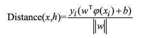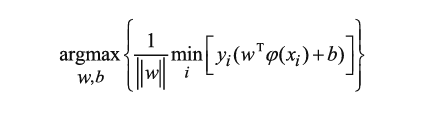

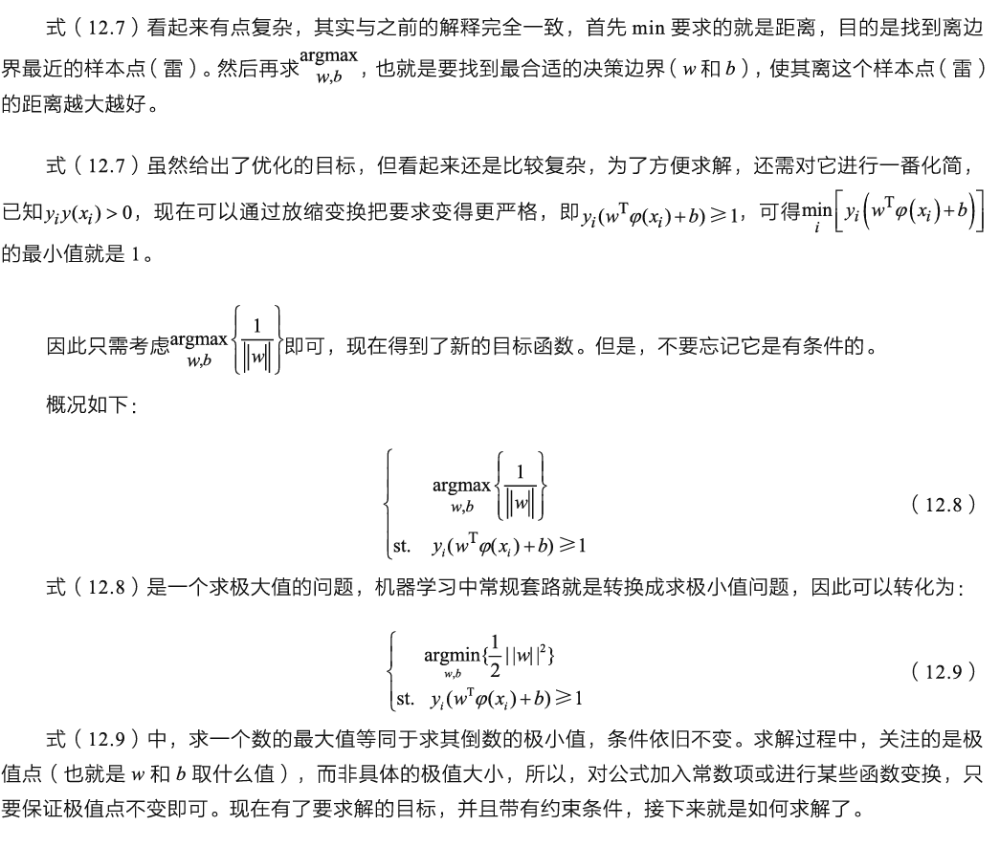
**12.1.4拉格朗日乘子法**

　　拉格朗日乘子法用于计算有约束条件下函数的极值优化问题，计算式如下：

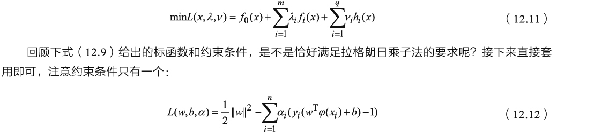

　　式（12.12）中引入了一个乘子α，概述起来就像是原始要求解的w和b参数在约束条件下比较难解，能不能把问题转换一下呢？如果可以找到w和b分别与α的关系，接下来得到每一个合适的α值，自然也就可以求出最终w和b的值。

　　此处还有其中一个细节就是KKT条件，3个科学家做了对偶性质的证明，此处先不建议大家深入KKT细节
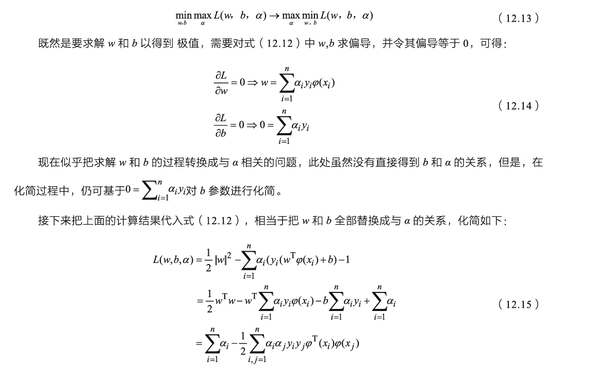
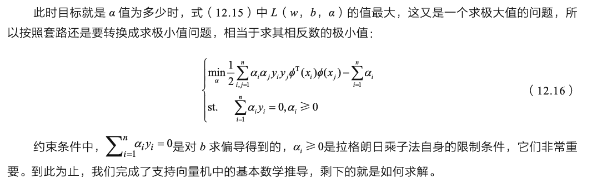

**12.2支持向量的作用**

**12.2.1支持向量机求解**

 　　式（12.16）中已经给出了要求解的目标，为了更直白地理解支持向量的含义，下述实例中，只取3个样本数据点，便于计算和化简。
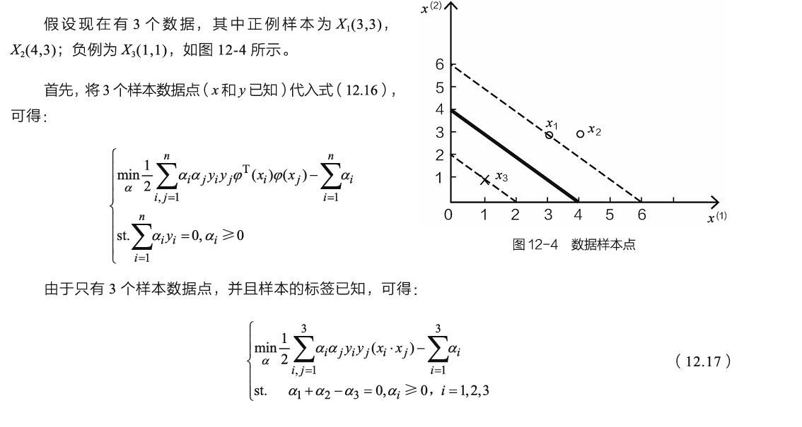

　　暂且认为φ(x)=x，其中(xi,xj)是求内积的意思，将3个样本数据点和条件α1+α2\-α3\=0代入式（12.17）可得：
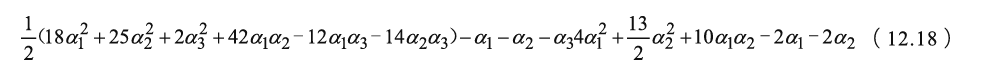

　　既然要求极小值，对式（12.18）中分别计算偏导，并令偏导等于零，可得：两个结果并不满足给定的约束条件αi≥0。因此需要考虑边界上的情况，α1\=0或α2\=0。分别将这两个值代入上式，可得：

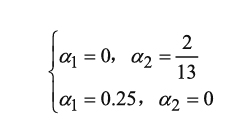

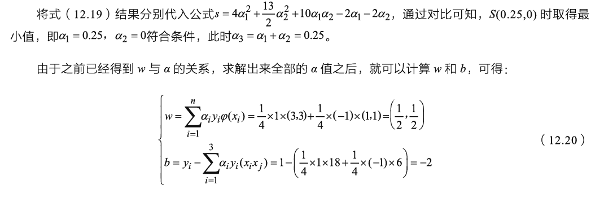
　　求解b参数的时候，选择用其中一个样本点数据计算其结果，但是，该样本的选择必须为支持向量。

　　计算出所有参数之后，只需代入决策方程即可，最终的结果为：

> 0.5x_1+0.5x_2-2=0

　　这也是图12-4中所画直线，这个例子中α值可以直接求解，这是由于只选了3个样本数据点，但是，如果数据点继续增多，就很难直接求解，现阶段主要依靠SMO算法及其升级版本进行求解，其基本思想就是对α参数两两代入求解，感兴趣的读者可以找一份SMO求解代码，自己一行一行debug观察求解方法。

**12.2.2支持向量的作用**

 　　在上述求解过程中，可以发现权重参数w的结果由α，x，y决定，其中x，y分别是数据和标签，这些都是固定不变的。如果求解出αi\=0，意味着当前这个数据点不会对结果产生影响，因为它和x，y相乘后的值还为0。只有αi≠0时，对应的数据点才会对结果产生作用。

　　由图12-5可知，最终只有x1和X3参与到计算中，x2并没有起到任何作用。细心的读者可能还会发现x1和X3都是边界上的数据点，而x2与x1相比，就是非边界上的数据点。这些边界上的点，就是最开始的时候解释的离决策方程最近的“雷”，只有它们会对结果产生影响，而非边界上的点只是凑热闹罢了。

　　到此揭开了支持向量机名字的含义，对于边界上的数据点，例如x1和X3就叫作支持向量，它们把整个框架支撑起来。对于非边界上的点，自然就是非支持向量，它们不会对结果产生任何影响。

　　图12-6展示了支撑向量对结果的影响。图12-6（a）选择60个数据点，其中圈起来的就是支持向量。图12-6（b）选择120个数据点，但仍然保持支持向量不变，使用同样的算法和参数来建模，得到的结果完全相同。这与刚刚得到的结论一致，只要不改变支持向量，增加部分数据对结果没有任何影响。
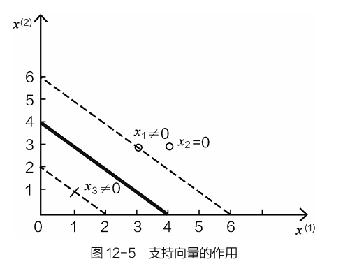

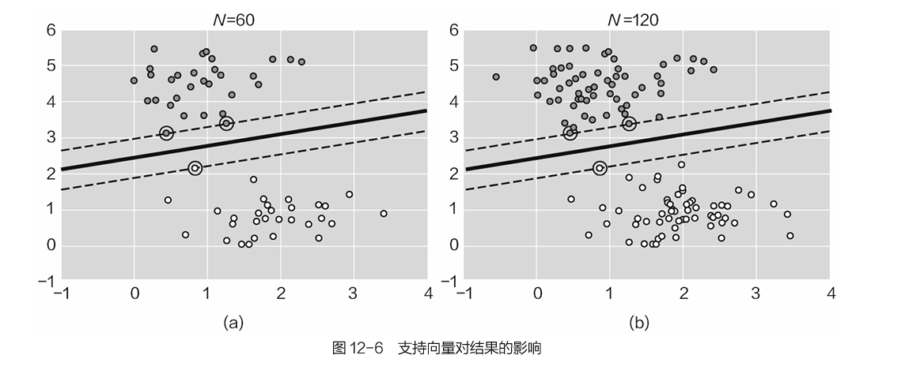

**12.3支持向量机涉及参数**

**12.3.1软间隔参数的选择**
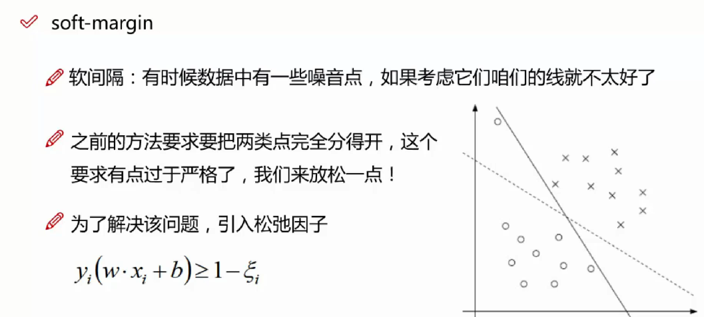

　　在机器学习任务中，经常会遇到过拟合问题，之前在定义目标函数的时候给出了非常严格的标准，就是要在满足能把两类数据点完全分得开的情况下，再考虑让决策边界越宽越好，但是，这么做一定能得到最好的结果吗？

　　假设有两类数据点分别为○和×，如果没有左上角的○，看起来这条虚线做得很不错，但是，如果把这个可能是异常或者离群的数据点考虑进去，结果就会发生较大变化，此时为了满足一个点的要求，只能用实线进行区分，决策边界一下子窄了好多，如图12-7所示。

　　总而言之，模型为了能够满足个别数据点做出了较大的牺牲，而这些数据点很可能是离群点、异常点等。如果还要严格要求模型必须做到完全分类正确，结果可能会适得其反。

　　如果在一定程度上放低对模型的要求，可以解决过拟合问题，先来看看定义方法：
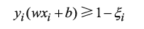

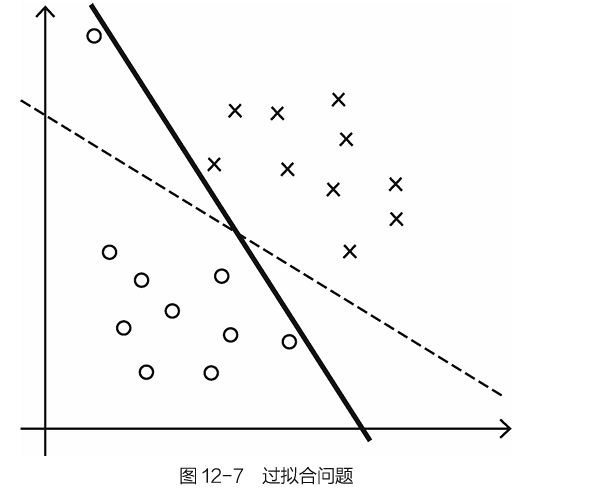
　　观察发现，原来的约束条件中，要求yi(w(xi)+b)≥1，现在加入一个松弛因子，就相当于放低要求了。

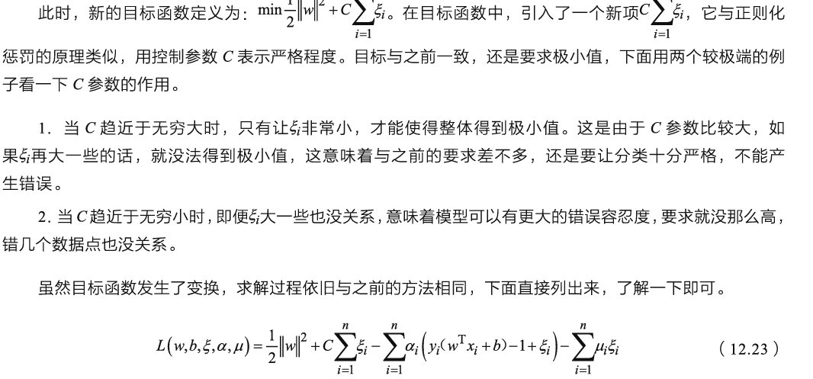
约束定义为：
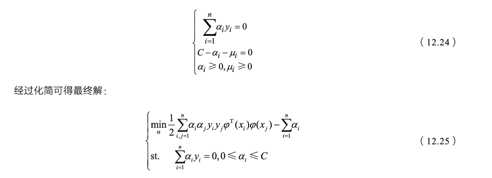
　　支持向量机中的松弛因子比较重要，过拟合的模型通常没什么用，后续实验过程，就能看到它的强大了。

**12.3.2核函数的作用**

　　还记得式（12.3）中的φ(x)吗？它就是核函数。下面就来研究一下它对数据做了什么。大家知道可以对高维数据降维来提取主要信息，降维的目的就是找到更好的代表特征。那么数据能不能升维呢？低维的数据信息有点少，能不能用高维的数据信息来解决低维中不好解决的问题呢？这就是核函数要完成的任务。

　　假设有两类数据点，在低维空间中进行分类任务有些麻烦，但是，如果能找到一种变换方法，将低维空间的数据映射到高维空间中，这个问题看起来很容易解决，如图12-8所示。
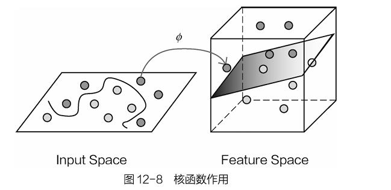
　　如何进行升维呢？先来看一个小例子，了解一下核函数的变换过程。需要大家考虑的另外一个问题是，如果数据维度大幅提升，对计算的要求自然更苛刻，在之前的求解的过程中可以发现，计算时需要考虑所有样本，因此计算内积十分麻烦，这是否大大增加求解难度呢？

　　假设有两个数据点：x=(x1,x2,x3)，y=(x1,x2,x3)，注意它们都是数据。假设在三维空间中已经不能对它们进行线性划分，既然提到高维的概念，那就使用一种函数变换，将这些数据映射到更高维的空间，例如映射到九维空间，假设映射函数如下：

　　**F(x)=(x1x1,x2x2,x1x3,x2x1,x2x2,x2x3,x3x1,x3x2,x3x3)（12.26）**

　　已知数据点x=(1,2,3)，y=(4,5,6)，代入式（12.26）可得F(x)=(1,2,3,2,4,5,3,6,9,)，F(y)=(16,40,24,20,25,36,24,30,36)。求解过程中主要计算量就在内积运算上，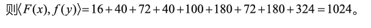

　　这个计算看着很简单，但是，当数据样本很多并且数据维度也很大的时候，就会非常麻烦，因为要考虑所有数据样本点两两之间的内积。那么，能不能巧妙点解决这个问题呢？我们试着先在低维空间中进行内积计算，再把结果映射到高维当中，得到的数值竟然和在高维中进行内积计算的结果相同，其计算式为：
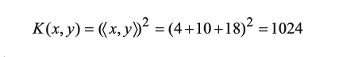
　　由此可得：K(x,y)=(<x,y>)2\=<F(x),F(y)> 。

　　但是，K(x,y)的运算却比<F(x)，F(y)>简单得多。也就是说，只需在低维空间进行计算，再把结果映射到高维空间中即可。虽然通过核函数变换得到了更多的特征信息，但是计算复杂度却没有发生本质的改变。这一巧合也成全了支持向量机，使得其可以处理绝大多数问题，而不受计算复杂度的限制。

　　通常说将数据投影到高维空间中，在高维上解决低维不可分问题实际只是做了一个假设，真正的计算依旧在低维当中，只需要把结果映射到高维即可。

　　在实际应用支持向量机的过程中，经常使用的核函数是高斯核函数，公式如下：
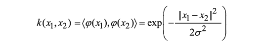

　　对于高斯核函数，其本身的数学内容比较复杂，直白些的理解是拿到原始数据后，先计算其两两样本之间的相似程度，然后用距离的度量表示数据的特征。如果数据很相似，那结果就是1。如果数据相差很大，结果就是0，表示不相似。如果对其进行泰勒展开，可以发现理论上高斯核函数可以把数据映射到无限多维。

　　还有一些核函数也能完成高维数据映射，但现阶段通用的还是高斯核函数，大家在应用过程中选择它即可。

　　如果做了核函数变换，能对结果产生什么影响呢？构建了一个线性不可分的数据集，如图12-9（a）所示。如果使用线性核函数（相当于不对数据做任何变换，直接用原始数据来建模），得到的结果并不尽如人意，实际效果很差。如果保持其他参数不变，加入高斯核函数进行数据变换，得到的结果如图12-9（b）所示，效果发生明显变化，原本很复杂的数据集就被完美地分开。

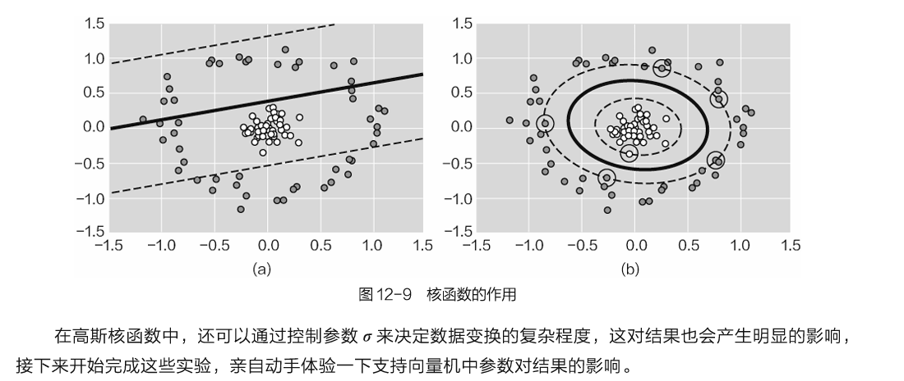

**12.4案例：参数对结果的影响**

　看另一个文件夹