**第15章降维算法**

将原始高维空间中的数据点映射到低维度的空间中，本章将从原理和实践的角度介绍两种经典的降维算法——线性判别分析和主成分分析。

 **15.1线性判别分析**

 　　线性判别式分析（Linear Discriminant Analysis,LDA），也叫作Fisher线性判别（Fisher Linear Discriminant,FLD），最开始用于处理机器学习中的分类任务，但是由于其对数据特征进行了降维投影，使其成为一种经典的降维方法。

**15.1.1降维原理概述**

 　　线性判别分析属于有监督学习算法，也就是数据中必须要有明确的类别标签，它不仅能用来降维，还可以处理分类任务
　　

　　从投影结果上观察，图15-2（a）中的数据点经过投影后依旧有一部分混在一起，区别效果有待提高。图15-2（b）中的数据点经过投影后，没有混合，区别效果比图15-2（a）更好一些。因此，我们当然会选择图15-2（b）所示的降维方法，由此可见，降维不仅要压缩数据的特征，还需要寻找最合适的方向，使得压缩后的数据更有利用价值。

　　由图15-2可知，线性判别分析的原理可以这样理解：任务目标就是要找到最合适的投影方向，这个方向可以是多维的。

　　为了把降维任务做得更圆满，提出了两个目标。

　　　　1.对于不同类别的数据点，希望其经过投影后能离得越远越好，也就是两类数据点区别得越明显越好，不要混在一起。

　　　　2.对于同类别的数据点，希望它们能更集中，离组织的中心越近越好。

　　接下来的任务就是完成这两个目标，这也是线性判别分析的核心优化目标，降维任务就是找到能同时满足这两个目标的投影方向。

**15.1.2优化的目标**

 　　投影就是通过矩阵变换的方式把数据映射到最适合做分类的方向上：

　　由式（15.3）可以得到投影后的中心点计算方法，按照之前制定的目标，对于一个二分类任务来说，应当使得这两类数据点的中心离得越远越好，这样才能更好地区分它们：

　　现在可以把当作目标函数，目标是希望其值能够越大越好，但是只让不同类别投影后的中心点越远可以达到我们期望的结果吗？

　　对于图15-3所示的样本数据，假设只能在x1和x2两方向进行投影，如果按照之前定义的J(w)，显然x1方向更合适，但是投影后两类数据点依旧有很多重合在一起，而x2方向上的投影结果是两类数据点重合较少；因此，x2方向更好。

　　这个问题就涉及要优化的另一个目标，不仅要考虑不同类别之间要区分开，还要考虑同类样本点应当尽可能聚集在一起。显然在图15-3中，x1方向不满足这个条件，因为在x1方向上，同类样本变得更分散，不够集中。

　　

　　我们还可以使用另一个度量指标——散列值（scatter），表示同类数据样本点的离散程度，定义如下：

　　其中，y表示经过投影后的数据点，从式（15.5）中可以看出，散列值表示样本点的密集程度，其值越大，表示越分散；反之，则越集中。定义好要优化的两个目标后，接下来就是求解了。

**15.1.3线性判别分析求解**

 　　上一小节已经介绍了降维后想要得到的目标，现在把它们综合在一起，但是优化的目标有两个，那么如何才能整合它们呢？

　　既然要最大化不同类别之间的距离，那就把它当作分子；最小化同类样本之间的离散程度，那就把它当作分母，最终整体的J(W)依旧求其极大值即可。

　　在公式推导过程中，牢记最终的要求依旧是寻找最合适的投影方向，先把散列值公式展开：

　　观察一下式（15.15），它与线性代数中的特征向量有点像，如果把**S**w-1当作一个整体，那么w就是其特征向量，问题到此迎刃而解。在线性判别分析中，其实只需要得到类内和类间散布矩阵，然后求其特征向量，就可以得到投影方向，然后，只需要对数据执行相应的矩阵变换，就完成全部降维操作。

**15.1.4Python实现线性判别分析降维**
见其他文件夹

**15.2主成分分析**

 　　主成分分析（Principal Component Analysis，PCA）是在降维中使用特别广泛的算法。在使用主成分分析降维的时候没有束缚，不像线性判别分析，必须要有数据标签，**只要拿到数据，没有标签也可以用主成分分析进行降维。所以应该先有一个直观的认识，主成分分析本质上属于无监督算法**，这也是它流行的主要原因。

物理意义会变
**15.2.1PCA降维基本知识点**

 　　既然不需要标签，就很难去分析类间与类内距离因素，那么该怎么办呢？PCA的基本思想就是方差，可以想象一下哪些特征更有价值？应当是那些区别能力更强的特征。例如我们想比较两个游戏玩家的战斗力水平。第一个特征是其所在帮派等级：A玩家，5级帮派；B玩家，4级帮派，A、B玩家的帮派等级看起来差别不大。第二个特征是其充值金额：A玩家，10000；B玩家，100。A、B玩家的充值金额的差距好像有些大。通过这两个特征就可以预估一下哪个玩家战斗力更强，答案肯定是A玩家。

　　现在再来观察一下这两个特征，帮派等级似乎相差不大，不能拉开差距，但是充值金额的差异却很大。我们希望得到充值金额这种能把不同玩家区分开的特征。在数学上可以用方差来描述这种数据的离散程度，所以在主成分析中主要依靠方差。

　　为了让大家更好地理解主成分分析，下面介绍一些基本概念。
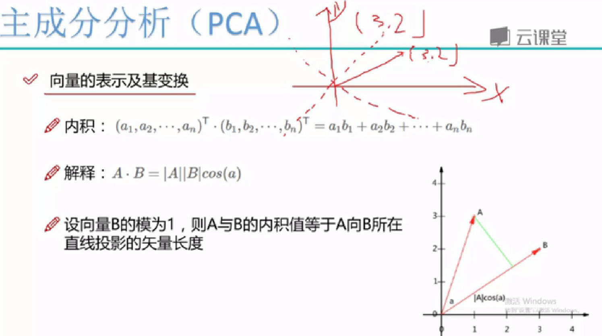

　　（1）向量的表示。假设有向量（3，2），如图15-7所示。为什么向量可以表示为（3，2），这是在直角坐标系中的表示，如果坐标系变了，向量的表示形式也要发生变换。

　　　实际上该向量可以表示成线性组合3·(1，0)T+2·(0，1)T，其中（1，0）和（0，1）就称为二维空间中的一组基。

　　（3）基变换。大家常见的坐标系都是正交的，即内积为0，两两相互垂直，并且线性无关。为什么基都是这样的呢？如果不垂直，那么肯定线性相关，能用一个表示另一个，此时基就会失去意义，所以基的出发点就是要正交。

　　图15-7 向量的组成

　　基也可以进行变换，将一个向量从一组基变换到另一组基中。例如新的坐标系的两个基分别是
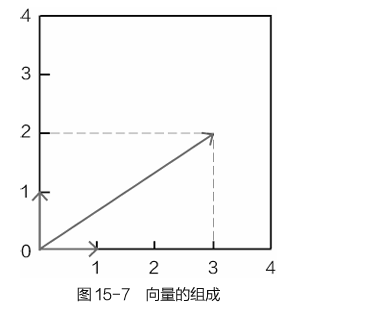
因此向量（3，2）映射到这个新的坐标系中，可以通过下面变换实现：
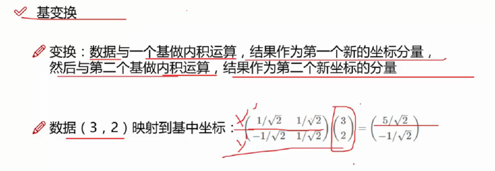
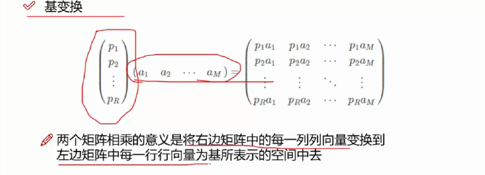

　　（3）方差和协方差。方差（variance）相当于特征辨识度，其值越大越好。协方差（covariance）就是不同特征之间的相关程度，协方差的计算式式为：

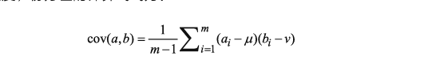

如果两个变量的变化趋势相同，例如随着身高的增长，体重也增长，此时它们的协方差值就会比较大，表示正相关。而方差又描述了各自的辨识能力，接下来就要把这些知识点穿插在一起。

**15.2.2PCA优化目标求解**

 　　对于降维任务，无非就是将原始数据特征投影到一个更合适的空间，结合基的概念，这就相当于由一组基变换到另一组基，变换的过程要求特征变得更有价值，也就是方差能够更大。所以现在已经明确基本目标了：找到一组基，使得变换后的特征方差越大越好。

　　假设找到了第一个合适的投影方向，这个方向能够使得方差最大，对于降维任务来说，一般情况下并不是降到一维，接下来肯定要找方差第二大的方向。方差第二大的方向理论上应该与第一方向非常接近，甚至重合，这样才能保证方差最大，如图15-8所示。

　　在这种情况下，看似可以得到无数多个方差非常大的方向，但是想一想它们能组成想要的基吗？不能，因为没有满足基的最基本要求——线性无关，也就是相互垂直正交。所以在寻找方差最大的方向的同时，还要使得各个投影方向能够正交，即协方差应当等于0，表示完全独立无关。所以在选择基的时候，一方面要尽可能地找方差的最大方向，另一方面要在其正交方向上继续寻找方差第二大的方向，以此类推。
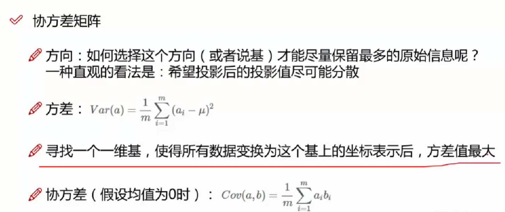
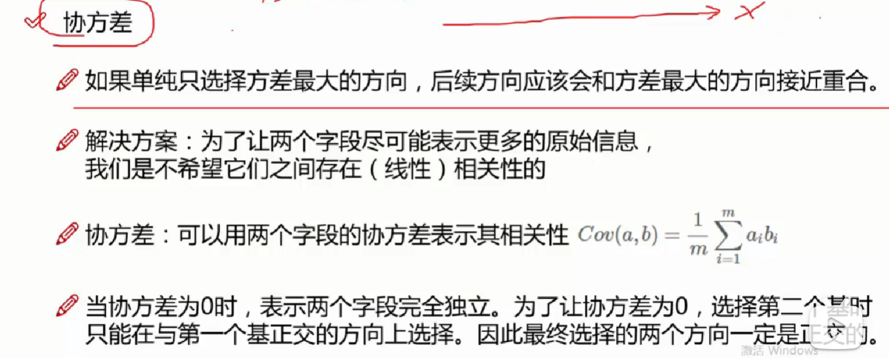

　　解释PCA中要求解的目标后，接下来就是在数学上将它表达出来。先来看一下协方差矩阵，为了简便，可以把数据中各个特征的均值默认为0，也可以认为数据已经进行过标准化处理。其计算式如下：
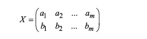
　　其中，X为实际的数据。包含2个特征a和b，一共有m个样本。

　　此时协方差矩阵为：
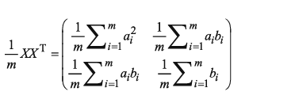
　　先观察一下协方差矩阵结果，其主对角线上的元素就是各个特征的方差（均值为0时），而非主对角线的上元素恰好是特征之间的协方差。按照目标函数的要求，首先应当使得方差越大越好，并且确保协方差为0，这就需要对协方差矩阵做对角化。
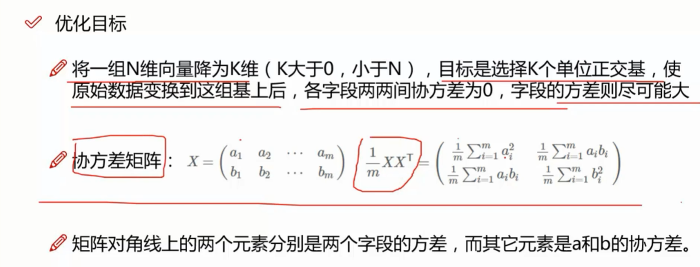
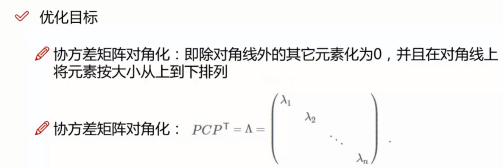
　　从一个n行n列的实对称矩阵中一定可以找到n个单位正交特征向量E=(e1,e2 ,… ,en)，以完成对角化的操作：
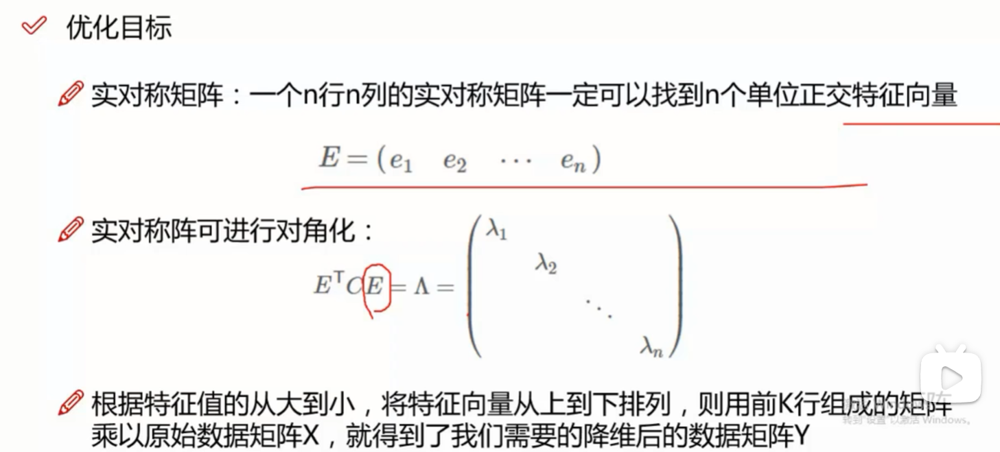

　　式（15.21）中的协方差矩阵恰好满足上述要求。假设需要将一组N维向量降为K维（K大于0，小于N），目标是选择K个单位正交基，使原始数据变换到这组基上后，各字段两两间协方差为0，各字段本身的方差尽可能大。当得到其协方差矩阵后，对其进行对角化操作，即可使得除主对角线上元素之外都为0。

　　其中对角线上的元素就是矩阵的特征值，这与线性判别分析很像，还是先把特征值按从大到小的顺序进行排列，找到前K个最大特征值对应的特征向量，接下来就是进行投影变换。

　　按照给定PCA优化目标，基本流程如下。

-   第①步：数据预处理，只有数值数据才可以进行PCA降维。
-   第②步：计算样本数据的协方差矩阵。
-   第③步：求解协方差矩阵的特征值和特征向量。
-   第④步：将特征值按照从大到小的顺序排列，选择其中较大的K个，然后将其对应的K个特征向量组成投影矩阵。
-   第⑤步：将样本点投影计算，完成PCA降维任务。

我们先来看它的定义，定义本身很简单，假设我们有一个n阶的矩阵A以及一个实数λ，使得我们可以找到一个非零向量x，满足：

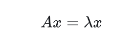

如果能够找到的话，我们就称λ是矩阵A的特征值，非零向量x是矩阵A的特征向量。
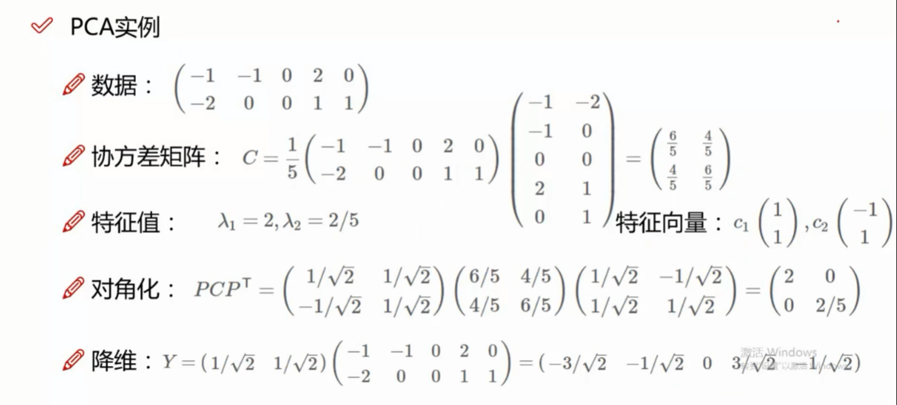
[特征值与特征向量](https://zhuanlan.zhihu.com/p/104980382)

**15.2.3Python实现PCA降维**
见另一个文件夹