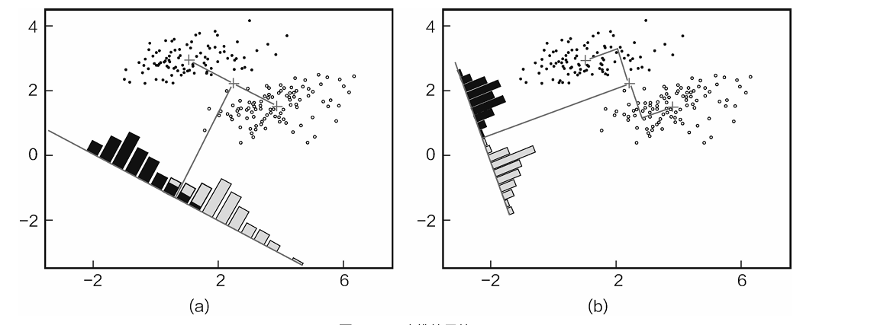
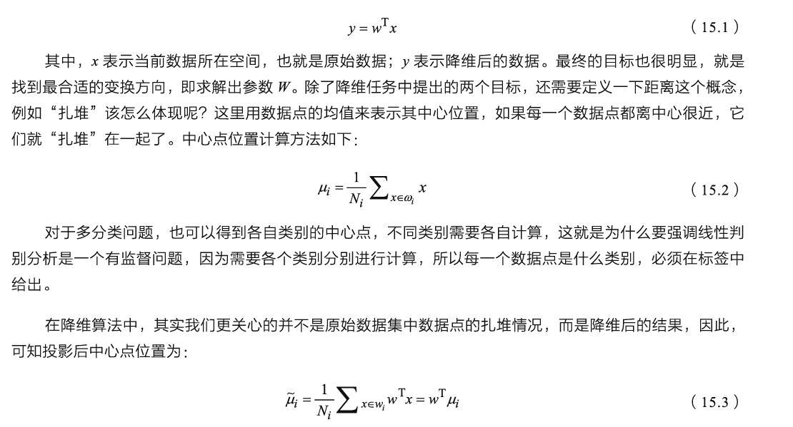
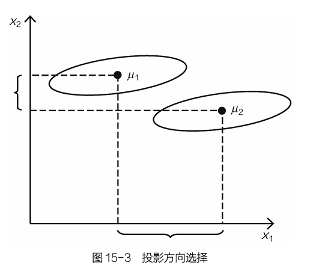
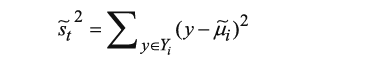
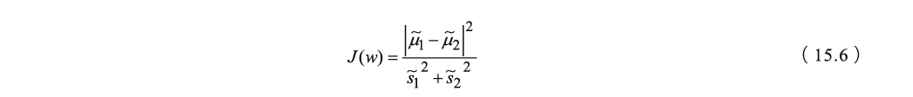
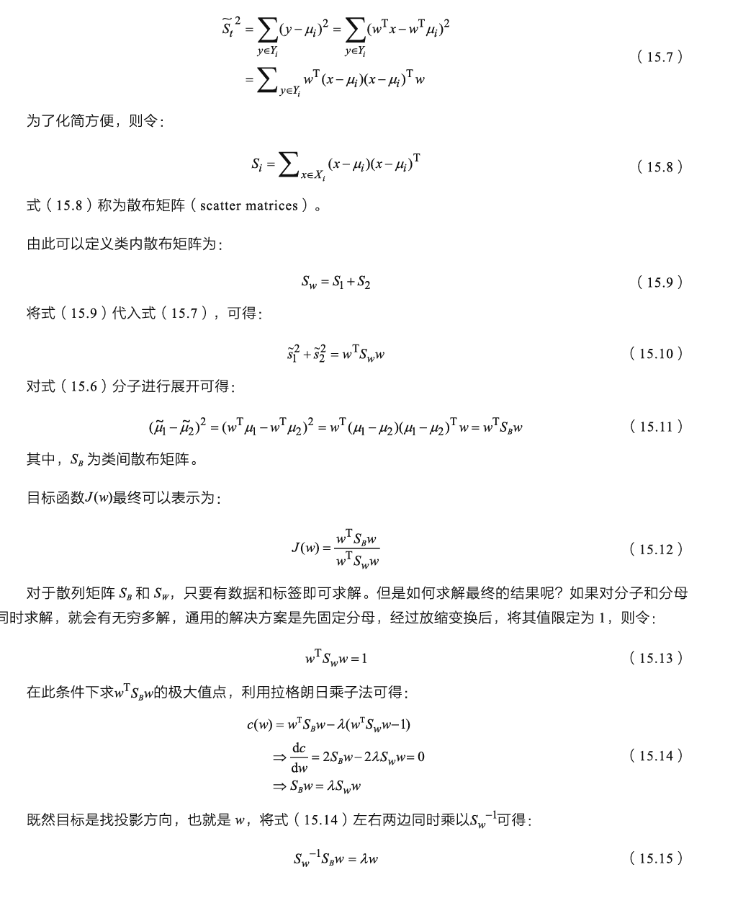

**第15章降维算法**

将原始高维空间中的数据点映射到低维度的空间中，本章将从原理和实践的角度介绍两种经典的降维算法——线性判别分析和主成分分析。

 **15.1线性判别分析**

 　　线性判别式分析（Linear Discriminant Analysis,LDA），也叫作Fisher线性判别（Fisher Linear Discriminant,FLD），最开始用于处理机器学习中的分类任务，但是由于其对数据特征进行了降维投影，使其成为一种经典的降维方法。

**15.1.1降维原理概述**

 　　线性判别分析属于有监督学习算法，也就是数据中必须要有明确的类别标签，它不仅能用来降维，还可以处理分类任务
　　

　　从投影结果上观察，图15-2（a）中的数据点经过投影后依旧有一部分混在一起，区别效果有待提高。图15-2（b）中的数据点经过投影后，没有混合，区别效果比图15-2（a）更好一些。因此，我们当然会选择图15-2（b）所示的降维方法，由此可见，降维不仅要压缩数据的特征，还需要寻找最合适的方向，使得压缩后的数据更有利用价值。

　　由图15-2可知，线性判别分析的原理可以这样理解：任务目标就是要找到最合适的投影方向，这个方向可以是多维的。

　　为了把降维任务做得更圆满，提出了两个目标。

　　　　1.对于不同类别的数据点，希望其经过投影后能离得越远越好，也就是两类数据点区别得越明显越好，不要混在一起。

　　　　2.对于同类别的数据点，希望它们能更集中，离组织的中心越近越好。

　　接下来的任务就是完成这两个目标，这也是线性判别分析的核心优化目标，降维任务就是找到能同时满足这两个目标的投影方向。

**15.1.2优化的目标**

 　　投影就是通过矩阵变换的方式把数据映射到最适合做分类的方向上：


　　由式（15.3）可以得到投影后的中心点计算方法，按照之前制定的目标，对于一个二分类任务来说，应当使得这两类数据点的中心离得越远越好，这样才能更好地区分它们：

　　现在可以把当作目标函数，目标是希望其值能够越大越好，但是只让不同类别投影后的中心点越远可以达到我们期望的结果吗？

　　对于图15-3所示的样本数据，假设只能在x<sub>1</sub>和x<sub>2</sub>两方向进行投影，如果按照之前定义的J<sub>(w)</sub>，显然x<sub>1</sub>方向更合适，但是投影后两类数据点依旧有很多重合在一起，而x<sub>2</sub>方向上的投影结果是两类数据点重合较少；因此，x<sub>2</sub>方向更好。

　　这个问题就涉及要优化的另一个目标，不仅要考虑不同类别之间要区分开，还要考虑同类样本点应当尽可能聚集在一起。显然在图15-3中，x<sub>1</sub>方向不满足这个条件，因为在x<sub>1</sub>方向上，同类样本变得更分散，不够集中。


　　

　　我们还可以使用另一个度量指标——散列值（scatter），表示同类数据样本点的离散程度，定义如下：

　　其中，y表示经过投影后的数据点，从式（15.5）中可以看出，散列值表示样本点的密集程度，其值越大，表示越分散；反之，则越集中。定义好要优化的两个目标后，接下来就是求解了。

**15.1.3线性判别分析求解**

 　　上一小节已经介绍了降维后想要得到的目标，现在把它们综合在一起，但是优化的目标有两个，那么如何才能整合它们呢？

　　既然要最大化不同类别之间的距离，那就把它当作分子；最小化同类样本之间的离散程度，那就把它当作分母，最终整体的J(W)依旧求其极大值即可。

　　在公式推导过程中，牢记最终的要求依旧是寻找最合适的投影方向，先把散列值公式展开：

　　观察一下式（15.15），它与线性代数中的特征向量有点像，如果把**S**<sub>w</sub><sup>-1</sup>当作一个整体，那么w就是其特征向量，问题到此迎刃而解。在线性判别分析中，其实只需要得到类内和类间散布矩阵，然后求其特征向量，就可以得到投影方向，然后，只需要对数据执行相应的矩阵变换，就完成全部降维操作。

**15.1.4Python实现线性判别分析降维**
见其他文件夹

**15.2主成分分析**

 　　主成分分析（Principal Component Analysis，PCA）是在降维中使用特别广泛的算法。在使用主成分分析降维的时候没有束缚，不像线性判别分析，必须要有数据标签，只要拿到数据，没有标签也可以用主成分分析进行降维。所以应该先有一个直观的认识，主成分分析本质上属于无监督算法，这也是它流行的主要原因。

**15.2.1PCA降维基本知识点**

 　　既然不需要标签，就很难去分析类间与类内距离因素，那么该怎么办呢？PCA的基本思想就是方差，可以想象一下哪些特征更有价值？应当是那些区别能力更强的特征。例如我们想比较两个游戏玩家的战斗力水平。第一个特征是其所在帮派等级：A玩家，5级帮派；B玩家，4级帮派，A、B玩家的帮派等级看起来差别不大。第二个特征是其充值金额：A玩家，10000；B玩家，100。A、B玩家的充值金额的差距好像有些大。通过这两个特征就可以预估一下哪个玩家战斗力更强，答案肯定是A玩家。

　　现在再来观察一下这两个特征，帮派等级似乎相差不大，不能拉开差距，但是充值金额的差异却很大。我们希望得到充值金额这种能把不同玩家区分开的特征。在数学上可以用方差来描述这种数据的离散程度，所以在主成分析中主要依靠方差。

　　为了让大家更好地理解主成分分析，下面介绍一些基本概念。

　　（1）向量的表示。假设有向量（3，2），如图15-7所示。为什么向量可以表示为（3，2），这是在直角坐标系中的表示，如果坐标系变了，向量的表示形式也要发生变换。

　　　实际上该向量可以表示成线性组合3·(1，0)T+2·(0，1)T，其中（1，0）和（0，1）就称为二维空间中的一组基。

　　（3）基变换。大家常见的坐标系都是正交的，即内积为0，两两相互垂直，并且线性无关。为什么基都是这样的呢？如果不垂直，那么肯定线性相关，能用一个表示另一个，此时基就会失去意义，所以基的出发点就是要正交。

 

　　图15-7 向量的组成

　　基也可以进行变换，将一个向量从一组基变换到另一组基中。例如新的坐标系的两个基分别是()，因此向量（3，2）映射到这个新的坐标系中，可以通过下面变换实现：

 

　　（3）方差和协方差。方差（variance）相当于特征辨识度，其值越大越好。协方差（covariance）就是不同特征之间的相关程度，协方差的计算式式为：

 

如果两个变量的变化趋势相同，例如随着身高的增长，体重也增长，此时它们的协方差值就会比较大，表示正相关。而方差又描述了各自的辨识能力，接下来就要把这些知识点穿插在一起。

**15.2.2PCA优化目标求解**

 　　对于降维任务，无非就是将原始数据特征投影到一个更合适的空间，结合基的概念，这就相当于由一组基变换到另一组基，变换的过程要求特征变得更有价值，也就是方差能够更大。所以现在已经明确基本目标了：找到一组基，使得变换后的特征方差越大越好。

　　假设找到了第一个合适的投影方向，这个方向能够使得方差最大，对于降维任务来说，一般情况下并不是降到一维，接下来肯定要找方差第二大的方向。方差第二大的方向理论上应该与第一方向非常接近，甚至重合，这样才能保证方差最大，如图15-8所示。

　　在这种情况下，看似可以得到无数多个方差非常大的方向，但是想一想它们能组成想要的基吗？不能，因为没有满足基的最基本要求——线性无关，也就是相互垂直正交。所以在寻找方差最大的方向的同时，还要使得各个投影方向能够正交，即协方差应当等于0，表示完全独立无关。所以在选择基的时候，一方面要尽可能地找方差的最大方向，另一方面要在其正交方向上继续寻找方差第二大的方向，以此类推。

 

　　图15-8 方差方向选择

　　解释PCA中要求解的目标后，接下来就是在数学上将它表达出来。先来看一下协方差矩阵，为了简便，可以把数据中各个特征的均值默认为0，也可以认为数据已经进行过标准化处理。其计算式如下：

 

　　其中，X为实际的数据。包含2个特征a和b，一共有m个样本。

　　此时协方差矩阵为：

 

　　先观察一下协方差矩阵结果，其主对角线上的元素就是各个特征的方差（均值为0时），而非主对角线的上元素恰好是特征之间的协方差。按照目标函数的要求，首先应当使得方差越大越好，并且确保协方差为0，这就需要对协方差矩阵做对角化。

　　从一个n行n列的实对称矩阵中一定可以找到n个单位正交特征向量E=(e1,e2 ,… ,en)，以完成对角化的操作：

 

　　式（15.21）中的协方差矩阵恰好满足上述要求。假设需要将一组N维向量降为K维（K大于0，小于N），目标是选择K个单位正交基，使原始数据变换到这组基上后，各字段两两间协方差为0，各字段本身的方差尽可能大。当得到其协方差矩阵后，对其进行对角化操作，即可使得除主对角线上元素之外都为0。

　　其中对角线上的元素就是矩阵的特征值，这与线性判别分析很像，还是先把特征值按从大到小的顺序进行排列，找到前K个最大特征值对应的特征向量，接下来就是进行投影变换。

　　按照给定PCA优化目标，基本流程如下。

-   第①步：数据预处理，只有数值数据才可以进行PCA降维。
-   第②步：计算样本数据的协方差矩阵。
-   第③步：求解协方差矩阵的特征值和特征向量。
-   第④步：将特征值按照从大到小的顺序排列，选择其中较大的K个，然后将其对应的K个特征向量组成投影矩阵。
-   第⑤步：将样本点投影计算，完成PCA降维任务。

**15.2.3Python实现PCA降维**

 　　接下来通过一个实例介绍如何使用PCA处理实际问题，同样使用鸢尾花数据集，目的依旧是完成降维任务，下面就来看一下PCA是怎么实现的。

　　第①步：导入数据。


```
<span>1</span> <span>import</span><span> numpy as np
</span><span>2</span> <span>import</span><span> pandas as pd
</span><span>3</span> 
<span>4</span> <span>#</span><span> 读取数据集</span>
<span>5</span> df = pd.read_csv(<span>'</span><span>iris.data</span><span>'</span><span>)
</span><span>6</span> <span>#</span><span> 原始数据没有给定列名的时候需要我们自己加上</span>
<span>7</span> df.columns=[<span>'</span><span>sepal_len</span><span>'</span>, <span>'</span><span>sepal_wid</span><span>'</span>, <span>'</span><span>petal_len</span><span>'</span>, <span>'</span><span>petal_wid</span><span>'</span>, <span>'</span><span>class</span><span>'</span><span>]
</span><span>8</span> df.head()
```


```
    sepal_len     sepal_wid     petal_len     petal_wid     <span>class</span><span>
0     </span>4.9         3.0         1.4         0.2     Iris-<span>setosa
</span>1     4.7         3.2         1.3         0.2     Iris-<span>setosa
</span>2     4.6         3.1         1.5         0.2     Iris-<span>setosa
</span>3     5.0         3.6         1.4         0.2     Iris-<span>setosa
</span>4     5.4         3.9         1.7         0.4     Iris-setosa
```


　　第②步：展示数据特征。


```
<span> 1</span> <span>#</span><span> 把数据分成特征和标签</span>
<span> 2</span> 
<span> 3</span> X = df.iloc[:,0:4<span>].values
</span><span> 4</span> y = df.iloc[:,4<span>].values
</span><span> 5</span> 
<span> 6</span> <span>from</span> matplotlib <span>import</span><span> pyplot as plt
</span><span> 7</span> 
<span> 8</span> <span>#</span><span> 展示我们标签用的</span>
<span> 9</span> label_dict = {1: <span>'</span><span>Iris-Setosa</span><span>'</span><span>,
</span><span>10</span>               2: <span>'</span><span>Iris-Versicolor</span><span>'</span><span>,
</span><span>11</span>               3: <span>'</span><span>Iris-Virgnica</span><span>'</span><span>}
</span><span>12</span> 
<span>13</span> <span>#</span><span> 展示特征用的</span>
<span>14</span> feature_dict = {0: <span>'</span><span>sepal length [cm]</span><span>'</span><span>,
</span><span>15</span>                 1: <span>'</span><span>sepal width [cm]</span><span>'</span><span>,
</span><span>16</span>                 2: <span>'</span><span>petal length [cm]</span><span>'</span><span>,
</span><span>17</span>                 3: <span>'</span><span>petal width [cm]</span><span>'</span><span>}
</span><span>18</span> 
<span>19</span> <span>#</span><span> 指定绘图区域大小</span>
<span>20</span> plt.figure(figsize=(8, 6<span>))
</span><span>21</span> <span>for</span> cnt <span>in</span> range(4<span>):
</span><span>22</span>     <span>#</span><span> 这里用子图来呈现4个特征</span>
<span>23</span>     plt.subplot(2, 2, cnt+1<span>)
</span><span>24</span>     <span>for</span> lab <span>in</span> (<span>'</span><span>Iris-setosa</span><span>'</span>, <span>'</span><span>Iris-versicolor</span><span>'</span>, <span>'</span><span>Iris-virginica</span><span>'</span><span>):
</span><span>25</span>         plt.hist(X[y==<span>lab, cnt],
</span><span>26</span>                      label=<span>lab,
</span><span>27</span>                      bins=10<span>,
</span><span>28</span>                      alpha=0.3<span>,)
</span><span>29</span> <span>    plt.xlabel(feature_dict[cnt])
</span><span>30</span>     plt.legend(loc=<span>'</span><span>upper right</span><span>'</span>, fancybox=True, fontsize=8<span>)
</span><span>31</span> 
<span>32</span> <span>plt.tight_layout()
</span><span>33</span> plt.show()
```


　　上述代码可以生成图15-9的输出。可以看出，有些特征区别能力较强，能把3种花各自呈现出来；有些特征区别能力较弱，部分特征数据样本混杂在一起。

　　第③步：数据的标准化。一般情况下，在进行训练前，数据经常需要进行标准化处理，可以使用sklearn库中的StandardScaler方法进行标准化处理，代码如下：


　　图15-9 鸢尾花数据集特征

```
<span>1 <span>from sklearn.preprocessing <span>import<span> StandardScaler
<span>2 X_std = StandardScaler().fit_transform(X)</span></span></span></span></span>
```

　　第④步：计算协方差矩阵。按照式（15.19）定义的协方差矩阵公式计算：

```
<span>1</span> mean_vec = np.mean(X_std, axis=<span>0)
</span><span>2</span> cov_mat = (X_std - mean_vec).T.dot((X_std - mean_vec)) / (X_std.shape[0]-1<span>)
</span><span>3</span> <span>print</span>(<span>'</span><span>协方差矩阵 \n%s</span><span>'</span> %cov_mat)
```

```
<span>协方差矩阵 
[[ </span>1.00675676 -0.10448539  0.87716999  0.82249094<span>]
 [</span>-0.10448539  1.00675676 -0.41802325 -0.35310295<span>]
 [ </span>0.87716999 -0.41802325  1.00675676  0.96881642<span>]
 [ </span>0.82249094 -0.35310295  0.96881642  1.00675676]]
```

　　或者可以直接使用Numpy工具包来计算协方差，结果是一样的：

```
<span>1</span> <span>print</span>(<span>'</span><span>NumPy 计算协方差矩阵: \n%s</span><span>'</span> %np.cov(X_std.T))
```

```
<span>NumPy 计算协方差矩阵: 
[[ </span>1.00675676 -0.10448539  0.87716999  0.82249094<span>]
 [</span>-0.10448539  1.00675676 -0.41802325 -0.35310295<span>]
 [ </span>0.87716999 -0.41802325  1.00675676  0.96881642<span>]
 [ </span>0.82249094 -0.35310295  0.96881642  1.00675676]]
```

　　第⑤步：求特征值与特征向量。


```
<span>1</span> cov_mat =<span> np.cov(X_std.T)
</span><span>2</span> 
<span>3</span> eig_vals, eig_vecs =<span> np.linalg.eig(cov_mat)
</span><span>4</span> 
<span>5</span> <span>print</span>(<span>'</span><span>特征向量 \n%s</span><span>'</span> %<span>eig_vecs)
</span><span>6</span> <span>print</span>(<span>'</span><span>\n特征值 \n%s</span><span>'</span> %eig_vals)
```


```
<span>特征向量 
[[ </span>0.52308496 -0.36956962 -0.72154279  0.26301409<span>]
 [</span>-0.25956935 -0.92681168  0.2411952  -0.12437342<span>]
 [ </span>0.58184289 -0.01912775  0.13962963 -0.80099722<span>]
 [ </span>0.56609604 -0.06381646  0.63380158  0.52321917<span>]]

特征值 
[</span>2.92442837 0.93215233 0.14946373 0.02098259]
```


　　第⑥步：按照特征值大小进行排序。


```
<span> 1</span> <span>#</span><span> 把特征值和特征向量对应起来</span>
<span> 2</span> eig_pairs = [(np.abs(eig_vals[i]), eig_vecs[:,i]) <span>for</span> i <span>in</span><span> range(len(eig_vals))]
</span><span> 3</span> <span>print</span><span> (eig_pairs)
</span><span> 4</span> <span>print</span> (<span>'</span><span>----------</span><span>'</span><span>)
</span><span> 5</span> <span>#</span><span> 把它们按照特征值大小进行排序</span>
<span> 6</span> eig_pairs.sort(key=<span>lambda</span> x: x[0], reverse=<span>True)
</span><span> 7</span> 
<span> 8</span> <span>#</span><span> 打印排序结果</span>
<span> 9</span> <span>print</span>(<span>'</span><span>特征值又大到小排序结果:</span><span>'</span><span>)
</span><span>10</span> <span>for</span> i <span>in</span><span> eig_pairs:
</span><span>11</span>     <span>print</span>(i[0])
```


```
[(2.9244283691111135, array([ 0.52308496, -0.25956935,  0.58184289,  0.56609604])), <br>(0.9321523302535066, array([-0.36956962, -0.92681168, -0.01912775, -0.06381646])), <br>(0.1494637348981336, array([-0.72154279,  0.2411952 ,  0.13962963,  0.63380158])), <br>(0.02098259276427038, array([ 0.26301409, -0.12437342, -0.80099722,  0.52321917<span>]))]
</span>----------<span>
特征值又大到小排序结果:
</span>2.9244283691111135
0.9321523302535066
0.1494637348981336
0.02098259276427038
```


　　第⑦步：计算累加贡献率。同样可以用累加的方法，将特征向量累加起来，当其超过一定百分比时，就选择其为降维后的维度大小：


```
<span>1</span> <span>#</span><span> 计算累加结果</span>
<span>2</span> tot =<span> sum(eig_vals)
</span><span>3</span> var_exp = [(i / tot)*100 <span>for</span> i <span>in</span> sorted(eig_vals, reverse=<span>True)]
</span><span>4</span> <span>print</span><span> (var_exp)
</span><span>5</span> cum_var_exp =<span> np.cumsum(var_exp)
</span><span>6</span> cum_var_exp
```


```
[72.6200333269203, 23.14740685864414, 3.7115155645845284, 0.5210442498510098<span>]

array([ </span>72.62003333,  95.76744019,  99.47895575, 100.        ])
```

　　可以发现，使用前两个特征值时，其对应的累计贡献率已经超过95%，所以选择降到二维。也可以通过画图的形式，这样更直接：


```
<span> 1</span> a = np.array([1,2,3,4<span>])
</span><span> 2</span> <span>print</span><span> (a)
</span><span> 3</span> <span>print</span> (<span>'</span><span>-----------</span><span>'</span><span>)
</span><span> 4</span> <span>print</span><span> (np.cumsum(a))
</span><span> 5</span> 
<span> 6</span> plt.figure(figsize=(6, 4<span>))
</span><span> 7</span> 
<span> 8</span> plt.bar(range(4), var_exp, alpha=0.5, align=<span>'</span><span>center</span><span>'</span><span>,
</span><span> 9</span>             label=<span>'</span><span>individual explained variance</span><span>'</span><span>)
</span><span>10</span> plt.step(range(4), cum_var_exp, where=<span>'</span><span>mid</span><span>'</span><span>,
</span><span>11</span>              label=<span>'</span><span>cumulative explained variance</span><span>'</span><span>)
</span><span>12</span> plt.ylabel(<span>'</span><span>Explained variance ratio</span><span>'</span><span>)
</span><span>13</span> plt.xlabel(<span>'</span><span>Principal components</span><span>'</span><span>)
</span><span>14</span> plt.legend(loc=<span>'</span><span>best</span><span>'</span><span>)
</span><span>15</span> <span>plt.tight_layout()
</span><span>16</span> plt.show()
```


　　上述代码可以生成图15-10的输出。

 

　　图15-10 累加特征值

　　第⑧步：完成PCA降维。接下来把特征向量组合起来完成降维工作：

```
<span>1</span> matrix_w = np.hstack((eig_pairs[0][1].reshape(4,1<span>),
</span><span>2</span>                       eig_pairs[1][1].reshape(4,1<span>)))
</span><span>3</span> 
<span>4</span> <span>print</span>(<span>'</span><span>Matrix W:\n</span><span>'</span>, matrix_w)
```

```
<span>Matrix W:
 [[ </span>0.52308496 -0.36956962<span>]
 [</span>-0.25956935 -0.92681168<span>]
 [ </span>0.58184289 -0.01912775<span>]
 [ </span>0.56609604 -0.06381646]]
```

```
<span>1</span> Y =<span> X_std.dot(matrix_w)
</span><span>2</span> Y
```

 View Code

　　输出结果显示，使用PCA降维算法把原数据矩阵从150×4降到150×2。

　　第⑨步：可视化对比降维前后数据的分布。由于数据具有4个特征，无法在平面图中显示，因此只使用两维特征显示数据，代码如下：


```
<span> 1</span> plt.figure(figsize=(6, 4<span>))
</span><span> 2</span> <span>for</span> lab, col <span>in</span> zip((<span>'</span><span>Iris-setosa</span><span>'</span>, <span>'</span><span>Iris-versicolor</span><span>'</span>, <span>'</span><span>Iris-virginica</span><span>'</span><span>),
</span><span> 3</span>                         (<span>'</span><span>blue</span><span>'</span>, <span>'</span><span>red</span><span>'</span>, <span>'</span><span>green</span><span>'</span><span>)):
</span><span> 4</span>      plt.scatter(X[y==<span>lab, 0],
</span><span> 5</span>                 X[y==lab, 1<span>],
</span><span> 6</span>                 label=<span>lab,
</span><span> 7</span>                 c=<span>col)
</span><span> 8</span> plt.xlabel(<span>'</span><span>sepal_len</span><span>'</span><span>)
</span><span> 9</span> plt.ylabel(<span>'</span><span>sepal_wid</span><span>'</span><span>)
</span><span>10</span> plt.legend(loc=<span>'</span><span>best</span><span>'</span><span>)
</span><span>11</span> <span>plt.tight_layout()
</span><span>12</span> plt.show()
```


　　上面代码只使用前两个特征显示3类数据，如图15-11所示，看起来3类鸢尾花相互交叠在一起，不容易区分开。

 

　　图15-11 原始数据集数据样本分布

　　下面看看使用PCA降维后的情况，代码如下：


```
<span> 1</span> plt.figure(figsize=(6, 4<span>))
</span><span> 2</span> <span>for</span> lab, col <span>in</span> zip((<span>'</span><span>Iris-setosa</span><span>'</span>, <span>'</span><span>Iris-versicolor</span><span>'</span>, <span>'</span><span>Iris-virginica</span><span>'</span><span>),
</span><span> 3</span>                         (<span>'</span><span>blue</span><span>'</span>, <span>'</span><span>red</span><span>'</span>, <span>'</span><span>green</span><span>'</span><span>)):
</span><span> 4</span>      plt.scatter(Y[y==<span>lab, 0],
</span><span> 5</span>                 Y[y==lab, 1<span>],
</span><span> 6</span>                 label=<span>lab,
</span><span> 7</span>                 c=<span>col)
</span><span> 8</span> plt.xlabel(<span>'</span><span>Principal Component 1</span><span>'</span><span>)
</span><span> 9</span> plt.ylabel(<span>'</span><span>Principal Component 2</span><span>'</span><span>)
</span><span>10</span> plt.legend(loc=<span>'</span><span>lower center</span><span>'</span><span>)
</span><span>11</span> <span>plt.tight_layout()
</span><span>12</span> plt.show()
```


　　上述代码使用降维以后的二维特征作为x,y轴，显示如图15-12所示，对比这两个结果，可以看出经过PCA降维后的结果更容易区别。

 

　　图15-12 PCA降维结果

**本章小结：**

　　本章介绍了两种非常实用的降维方法：线性判别分析和主成分分析。其中线性判别分析是有监督算法，需要有标签才能计算；而主成分析是无监督算法，无须标签，直接就可以对数据进行分析。那么，在实际建模任务中，到底用哪种降维方法呢？没有固定的模式，需要大家通过实验对比确定，例如，取得一份数据后可以分多步走，以对比不同策略的结果。

　　降维可以大大减少算法的计算量，加快程序执行的速度，遇到特征非常多的数据时就可以大显身手。但是降维算法本身最大的问题就是降维后得到结果的物理含义很难解释，只能说这就是计算机看来最好的降维特征，而不能具体化其含义。此时如果想进一步对结果进行分析就有些麻烦，因为其中每一个特征指标的含义都只是数值，而没有具体指代。

　　Python案例中使用非常简单的鸢尾花数据集，按照原理推导的流程一步步完成了整个任务，大家在练习的时候也可以选用稍微复杂一点的数据集来复现算法。

第15章完。

[python数据分析个人学习读书笔记-目录索引](https://www.cnblogs.com/downmoon/p/12448602.html)

该书资源下载，请至异步社区：[https://www.epubit.com](https://www.epubit.com/)