# 贝叶斯算法项目实战——新闻分类

所谓的贝叶斯定理源于他生前为解决一个“逆概”问题而写的一篇文章。先通过一个小例子来理解一下什么是正向和逆向概率。假设你的口袋里面有N个白球、M个黑球，你伸手进去随便拿一个球，问拿出黑球的概率是多大？

　　这个问题可以轻松地解决，但是，如果把这个问题反过来还那么容易吗？如果事先并不知道袋子里面黑白球的比例，而是闭着眼睛摸出一个（或好几个）球，观察这些取出来的球的颜色之后，要对袋子里面的黑白球的比例作推测。好像有一点绕，这就是逆向概率问题。接下来就由一个小例子带大家走进贝叶斯算法。
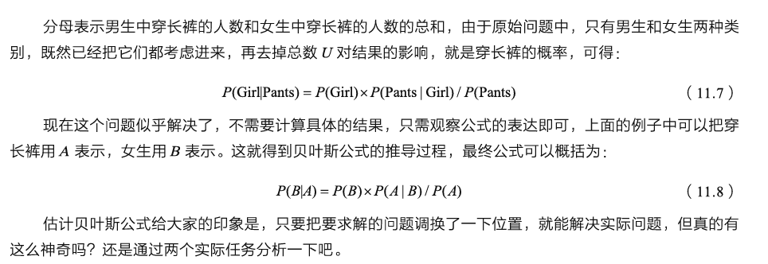
下面再来分析一下要求解的问题：迎面走来一个穿长裤的学生，你只看得见他（她）穿的是长裤，而无法确定他（她）的性别，你能够推断出他（她）是女生的概率是多大吗？这个问题概括起来就是，首先是一个穿长裤的学生，这是第一个限定条件，接下来这个人还得是女生，也就是第二个条件。总结起来就是：穿长裤的人里面有多少是女生。
## 拼写纠错
例如，用户本来想输入“the”，但是由于打字错误，输成“tha”，那么程序能否猜出他到底想输入哪个单词呢？可以用下式表示：

　　P（猜测他想输入的单词|他实际输入的单词）（11.9）

　　例如，用户实际输入的单词记为D（D代表一个具体的输入，即观测数据），那么可以有很多种猜测：猜测1，P(h1|D)；猜测2，P(h2|D)；猜测3，P(h3|D)等。例如h1可能是the，h2可能是than，h3可能是then，到底是哪一个呢？也就是要比较它们各自的概率值大小，哪个可能性最高就是哪个。

　　先把上面的猜想统一为P(h|D)，然后进行分析。直接求解这个公式好像难度有些大，有点无从下手，但是刚刚不是得到贝叶斯公式吗？转换一下能否好解一些呢？先来试试看：
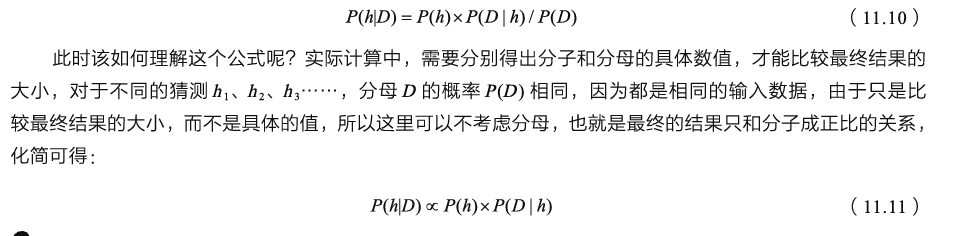
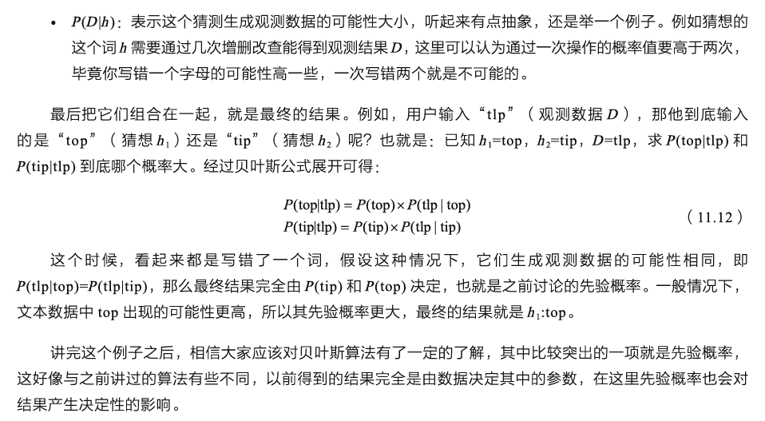

## 垃圾邮箱分类

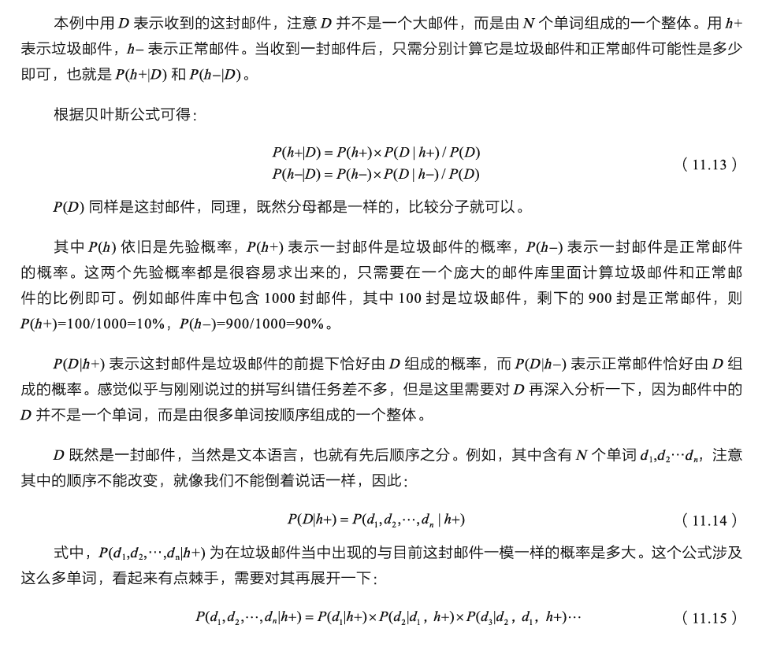

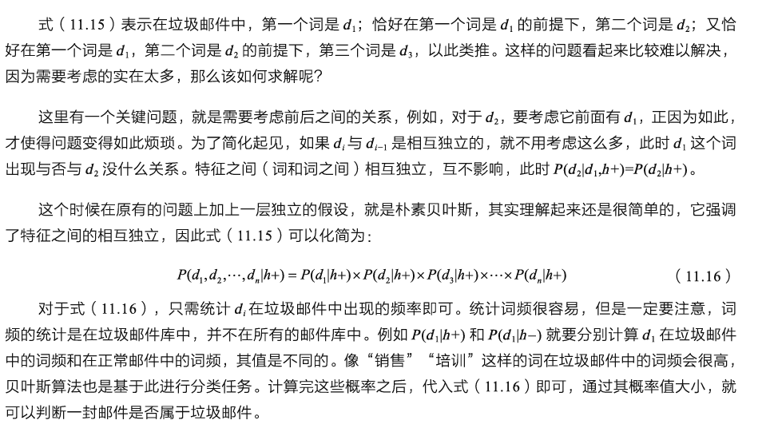

## 新闻分类任务
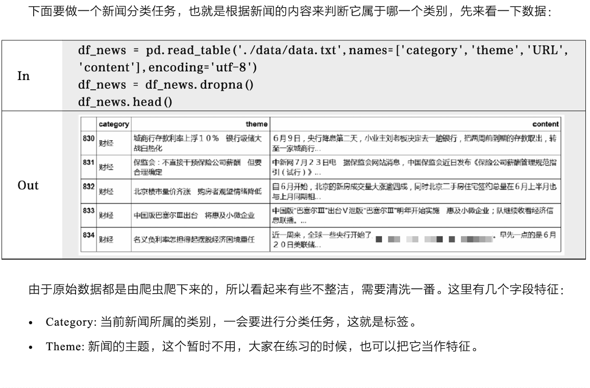
　　由于原始数据都是由爬虫爬下来的，所以看起来有些不整洁，需要清洗一番。这里有几个字段特征：

-   Category:当前新闻所属的类别，一会要进行分类任务，这就是标签。
-   Theme:新闻的主题，这个暂时不用，大家在练习的时候，也可以把它当作特征。
-   Content:新闻的内容，也就是一篇文章，内容很丰富。、、

代码在D:\桌面\文件夹别忘了

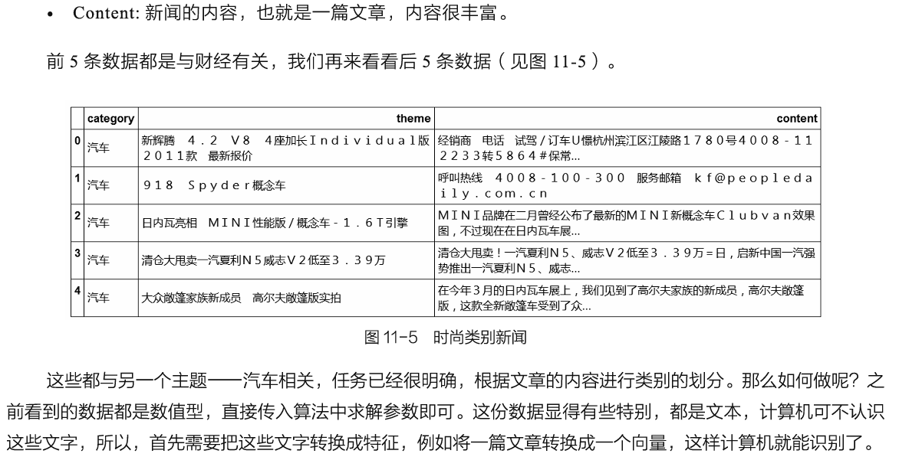

### 数据清洗

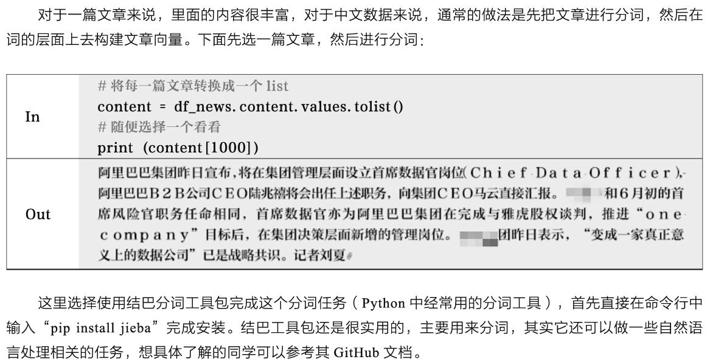
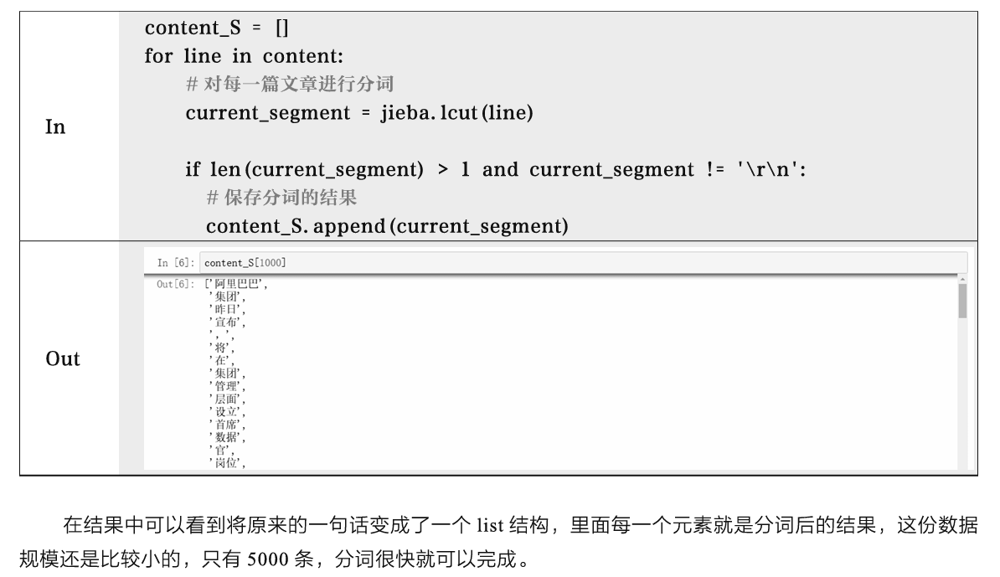

```py
content_S = []
for line in content:
    current_segment = jieba.lcut(line) #对每一篇文章进行分词
    if len(current_segment) > 1 and current_segment != '\r\n': #换行符
        content_S.append(current_segment) #保存分词的结果
```
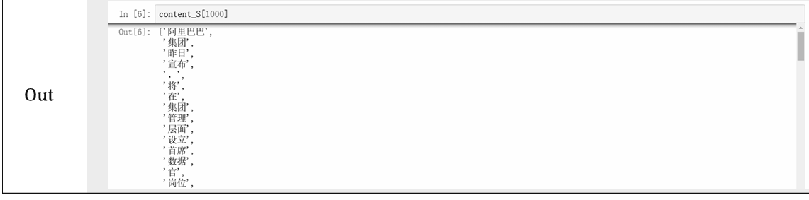
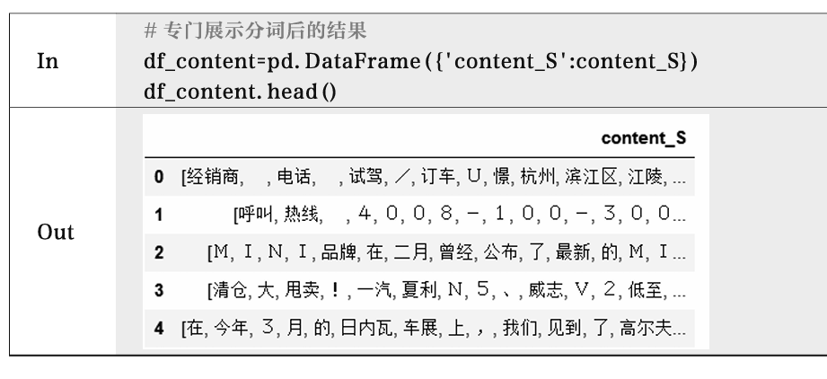

完成分词任务之后，要处理的对象就是其中每一个词，我们知道一篇文章的主题应该由其内容中的一些关键词决定，例如“订车”“一汽”“车展”等，一看就知道与汽车相关。但是另一类词，例如“今年”“在”“3月”等，似乎既可以在汽车相关的文章中使用，也可以在其他文章中使用，它们称作停用词，也就是要过滤的目标。

　　首先需要选择一个合适的停用词库，网上有很多现成的，但是都没有那么完整，所以，当大家进行数据清洗任务的时候，还需要自己添加一些，停用词如图11-6所示。


　图11-6中只截取停用词表中的一部分，都是一些没有实际主题色彩的词，如果想把清洗的任务做得更完善，还是需要往停用词表中加入更多待过滤的词语，数据清洗干净，才能用得舒服。如果添加停用词的任务量实在太大，一个简单的办法就是基于词频进行统计，普遍情况下高频词都是停用词。

　　对于文本任务来说，数据清洗非常重要，因为其中每一个词都会对结果产生影响，在开始阶段，还是希望尽可能多地去掉这些停用词。

　　过滤掉停用词的方法很简单，只需要遍历数据集，剔除掉那些出现在停用词表中的词即可，下面看一下对比结果。

```py
df_content=pd.DataFrame({'content_S':content_S}) #专门展示分词后的结果
df_content.head()

stopwords=pd.read_csv("stopwords.txt",index_col=False,sep="\t",quoting=3,names=['stopword'], encoding='utf-8')
stopwords.head(20)

def drop_stopwords(contents,stopwords):
    contents_clean = []
    all_words = []
    for line in contents:
        line_clean = []
        for word in line:
            if word in stopwords:
                continue
            line_clean.append(word)
            all_words.append(str(word))
        contents_clean.append(line_clean)
    return contents_clean,all_words

contents = df_content.content_S.values.tolist()
stopwords = stopwords.stopword.values.tolist()
contents_clean,all_words = drop_stopwords(contents,stopwords)

#df_content.content_S.isin(stopwords.stopword)
#df_content=df_content[~df_content.content_S.isin(stopwords.stopword)]
#df_content.head()

df_content=pd.DataFrame({'contents_clean':contents_clean})
df_content.head()
#8万9千条新闻，运行了半小时，后改为1000条新闻，邀月注
```
　　显然，这份停用词表做得并不十分完善，但是可以基本完成清洗的任务，大家可以酌情完善这份词表，根据实际数据情况，可以选择停用词的指定方法。

　　中间来一个小插曲，在文本分析中，现在经常会看到各种各样的词云，用起来还是比较有意思的。在Python中可以用wordcloud工具包来做，可以先参考其github文档。
>  pip install wordcloud


```py
df_all_words=pd.DataFrame({'all_words':all_words})
df_all_words.head()

import numpy as np
# words_count=df_all_words.groupby(by=['all_words'])['all_words'].agg({"count":np.size})
# SpecificationError: nested renamer is not supported
# print(df_all_words.head(10)
# df_words=df_all_words(['all_words'])

# print(df_all_words.columns)
df_all_words.loc[:, 'count'] = 1 #设置一个整列值

# print(df_all_words.columns)

data_group3 = df_all_words.groupby('all_words').agg({'count':'count'})
data_group3.head(10)

# help(words_count.reset_index)
words_count=data_group3.reset_index().sort_values(by=['count'],ascending=False)
# words_count.drop(31733,axis=0)   #'\ue40c'对应的是31733
# words_count.drop(index=31733,axis=0)   #'\ue40c'对应的是31733

words_count.head(100)
```

```py

from wordcloud import WordCloud
import matplotlib.pyplot as plt
%matplotlib inline
import matplotlib
matplotlib.rcParams['figure.figsize'] = (10.0, 5.0)

wordcloud=WordCloud(font_path="./data/simhei.ttf",background_color="white",max_font_size=80)
word_frequence = {x[0]:x[1] for x in words_count.head(100).values}
wordcloud=wordcloud.fit_words(word_frequence)
plt.imshow(wordcloud)
```
> worldcloud部分可以忽略


## TF-IDF关键词提取

 　　在文本分析中，经常会涉及打标签和特征提取，TF-IDF是经常用到的套路。在一篇文章中，经过清洗之后，剩下的都是稍微有价值的词，但是这些词的重要程度相同吗？如何从一篇文章中找出最有价值的几个词呢？如果只按照词频进行统计，得到的结果并不会太好，因为词频高的可能都是一些套话，并不是主题，这时候TF-IDF就派上用场了。

　　这里借用一个经典的例子——一篇文章《中国的蜜蜂养殖》。

　　当进行词频统计的时候，发现在这篇文章中，“中国”“蜜蜂”“养殖”这3个词出现的次数是一样的，假设都是10次，这个时候如何判断其各自的重要性呢？这篇文章讲述的应该是与蜜蜂和养殖相关的技术，所以“蜜蜂”和“养殖”这两个词应当是重点。而“中国”这个词，既可以说中国的蜜蜂，还可以说中国的篮球、中国的大熊猫，能派上用场的地方简直太多了，并不专门针对某一个主题，所以，在这篇文章的类别划分中，它应当不是那么重要。

　　这样就可以给出一个合理的定义，如果一个词在整个语料库中（可以当作是在所有文章中）出现的次数都很高（这篇文章有它，另一篇还有这个词），那么这个词的重要程度就不高，因为它更像一个通用词。如果另一个词在整体的语料库中的词频很低，但是在这一篇文章中却大量出现，就有理由认为它在这篇文章中很重要。例如，“蜜蜂”这个词，在篮球、大熊猫相关的文章中基本不可能出现，在这篇文章中却大量出现。TF-IDF计算公式如下：
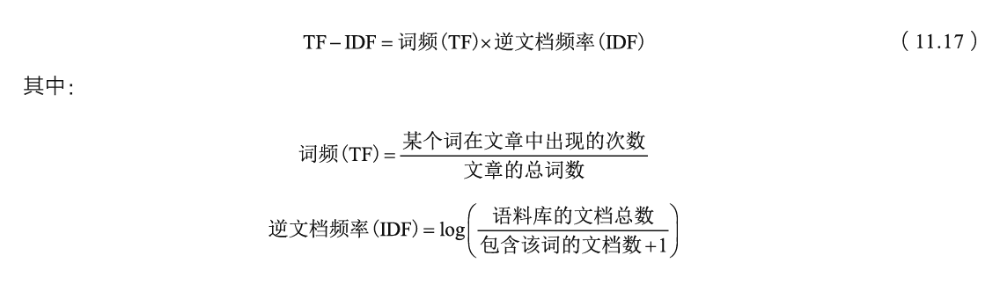
```py
import jieba.analyse #工具包
index = 345 #随便找一篇文章就行
content_S_str = "".join(content_S[index]) #把分词的结果组合在一起，形成一个句子
print (content_S_str) #打印这个句子
print ("  ".join(jieba.analyse.extract_tags(content_S_str, topK=5, withWeight=False)))#选出来5个核心词
```
　　词频这个概念很好理解，逆文档频率就看这个词是不是哪儿都出现，出现得越多，其值就越低。掌握TF-IDF之后，下面以一篇文章试试效果：
　　关键词结果：**伯南克 美国 失业率 经济 财政**

　　简单过一遍文章可以发现，讲的大概就是美国失业率，得到的关键词也与文章的主题差不多。关键词提取方法还是很实用的，想一想大家每天使用各种APP都能看到很多广告，不同的用户收到的广告应该不同。接下来还需将重点放回分类任务中，先来看一下标签都有哪些类别：

```py
# df_news = pd.read_table('./data/data.txt',names=['category','theme','content'],encoding='utf-8',delimiter='^')
# df_news = df_news.dropna()
# df_news.tail()

# print(df_news['category'][1:1000])
# print(df_news['category'][1:1000])
print(len(contents_clean))


# df_train=pd.DataFrame({'contents_clean':contents_clean,'label':df_news['category']})
# ValueError: array length 1000 does not match index length 1001
# ValueError: arrays must all be same length
###***************************************过滤第一行标题*******************************
# d = {'contents_clean':contents_clean, 'label':  df_news['category'][0:1000]}
d = {'contents_clean':contents_clean, 'label':  df_news['category']}
df_train = pd.DataFrame(data=d)
# df_train=pd.DataFrame(data={'contents_clean':contents_clean,'label':df_news['category']})

#数据异常检查，邀月注：
#*************************************************************************************
# 读取数据
# train = pd.read_csv('./data/train.csv/train.csv')

# 检查数据中是否有缺失值
# np.isnan(df_train).any()

# Flase:表示对应特征的特征值中无缺失值
# True：表示有缺失值

# 2、删除有缺失值的行
# df_train.dropna(inplace=True)

# 然后在看数据中是否有缺失值

# 也可以根据需要对缺失值进行填充处理：
# df_train.fillna(0)
print(type(df_train))
# print(np.isnan(df_train['category']).any())
# print(np.isnan(df_train).any())

# from sklearn.impute import SimpleImputer
# imp_mean = SimpleImputer(missing_values=np.nan, strategy='mean')
# imp_mean.fit(df_train)

# np.nan_to_num(df_train, nan=np.nanmean(df_train))

#********************************************************************
# df_train.tail()
# print(df_train.head(1000))
```
去除标题以防报错

```py
df_train.label.unique()
#array(['category', '财经', '女性', '体育', '奥运'], dtype=object)

# label_mapping = {"汽车": 1, "财经": 2, "科技": 3, "健康": 4, "体育":5, "教育": 6,"文化": 7,"军事": 8,"娱乐": 9,"时尚": 0}
label_mapping = {"女性": 1, "财经": 2, "体育":5, "奥运": 6}
df_train['label'] = df_train['label'].map(label_mapping) #构建一个映射方法
df_train.head()
```

```py
from sklearn.model_selection import train_test_split

x_train, x_test, y_train, y_test = train_test_split(df_train['contents_clean'].values, df_train['label'].values, random_state=1)

#x_train = x_train.flatten()
x_train[0][1]

words = []
for line_index in range(len(x_train)):
    try:
        #x_train[line_index][word_index] = str(x_train[line_index][word_index])
        words.append(' '.join(x_train[line_index]))
    except:
        print (line_index,word_index)
words[0]
```

　　　到目前为止，已经处理了标签，切分了数据集，接下来就要提取文本特征了，这里通过一个小例子给大家介绍最简单的词袋模型。

```py
from sklearn.feature_extraction.text import CountVectorizer
texts=["dog cat fish","dog cat cat","fish bird", 'bird'] #为了简单期间，这里4句话我们就当做4篇文章了
cv = CountVectorizer() #词频统计
cv_fit=cv.fit_transform(texts) #转换数据

print(cv.get_feature_names())
print(cv_fit.toarray())


print(cv_fit.toarray().sum(axis=0))
```

　　向sklearn中的feature_extraction.text模块导入CountVectorizer，也就是词袋模型要用的模块，这里还有很丰富的文本处理方法，感兴趣的读者也可以尝试一下其他方法。为了简单起见，构造了4个句子，暂且当作4篇文章就好。观察发现，这4篇文章中总共包含4个不同的词：“bird”“cat”“dog”“fish”。所以词袋模型的向量长度就是4，在结果中打印get_feature_names()可以得到特征中各个位置的含义，例如，从第一个句子“dog cat fish”得到的向量为[0 1 1 1]，它的意思就是首先看第一个位置’bird’在这句话中有没有出现，出现了几次，结果为0；接下来同样看“cat”，发现出现了1次，那么向量的第二个位置就为1；同理“dog”“fish”在这句话中也各出现了1次，最终的结果也就得到了。

　　词袋模型是自然语言处理中最基础的一种特征提取方法，直白地说，它就是看每一个词出现几次，统计词频即可，再把所有出现的词组成特征的名字，依次统计其个数就能够得到文本特征。感觉有点过于简单，只考虑词频，而不考虑词出现的位置以及先后顺序，能不能稍微改进一些呢？还可以通过设置ngram_range来控制特征的复杂度，例如，不仅可以考虑单单一个词，还可以考虑两个词连在一起，甚至更多的词连在一起的组合。

```py
from sklearn.feature_extraction.text import CountVectorizer
texts=["dog cat fish","dog cat cat","fish bird", 'bird']
cv = CountVectorizer(ngram_range=(1,4)) #设置ngram参数，让结果不光包含一个词，还有2个，3个的组合
cv_fit=cv.fit_transform(texts)

print(cv.get_feature_names())
print(cv_fit.toarray())


print(cv_fit.toarray().sum(axis=0))

```
　　这里只加入ngram_range=(1,4)参数，其他保持不变，观察结果中的特征名字可以发现，此时不仅是一个词，还有两两组合或三个组合在一起的情况。例如，“cat cat”表示文本中出现“cat”词后面又跟了一个“cat”词出现的个数。与之前的单个词来对比，这次得到的特征更复杂，特征的长度明显变多。可以考虑上下文的前后关系，在这个简单的小例子中看起来没什么问题。如果实际文本中出现不同词的个数成千上万了呢？那使用ngram_range=(1,4)参数，得到的向量长度就太大了，用起来就很麻烦。所以，通常情况下，ngram参数一般设置为2，如果大于2，计算起来就成累赘了。接下来对所有文本数据构建词袋模型：

```py
from sklearn.feature_extraction.text import CountVectorizer

vec = CountVectorizer(analyzer='word', max_features=4000,  lowercase = False)
feature = vec.fit_transform(words)
feature.shape
#(750, 4000)

```
　　在构建过程中，还额外加入了一个限制条件max_features=4000，表示得到的特征最大长度为4000，这就会自动过滤掉一些词频较小的词语。如果不进行限制，大家也可以去掉这个参数观察，会使得特征长度过大，最终得到的向量长度为85093，而且里面很多都是词频很低的词语，导致特征过于稀疏，这些对建模来说都是不利的，所以，还是非常有必要加上这样一个限制参数，特征确定之后，剩下的任务就交给贝叶斯模型吧：

```py
from sklearn.naive_bayes import MultinomialNB #贝叶斯模型
classifier = MultinomialNB()
classifier.fit(feature, y_train)

test_words = []
for line_index in range(len(x_test)):
    try:
        #
        test_words.append(' '.join(x_test[line_index]))
    except:
         print (line_index,word_index)
test_words[0]

classifier.score(vec.transform(test_words), y_test)
```
　　 结果是0.936

　　贝叶斯模型中导入了MultinomialNB模块，还额外做了一些平滑处理，主要目的是在求解先验概率和条件概率的时候避免其值为0。词袋模型的效果看起来还凑合，能不能改进一些呢？在这份特征中，公平地对待每一个词，也就是看这个词出现的个数，而不管它重要与否，但看起来还是有点问题。因为对于不同主题来说，有些词可能更重要，有些词就没有什么太大价值。还记得老朋友TF-IDF吧，能不能将其应用在特征之中呢？当然是可以的，下面通过一个小例子来看一下吧：
```py

from sklearn.feature_extraction.text import TfidfVectorizer

X_test = ['卡尔 敌法师 蓝胖子 小小','卡尔 敌法师 蓝胖子 痛苦女王']

tfidf=TfidfVectorizer()
weight=tfidf.fit_transform(X_test).toarray()
word=tfidf.get_feature_names()
print (weight)
for i in range(len(weight)):
    print (u"第", i, u"篇文章的tf-idf权重特征")
    for j in range(len(word)):
        print (word[j], weight[i][j])


[[0.44832087 0.63009934 0.44832087 0.         0.44832087]
 [0.44832087 0.         0.44832087 0.63009934 0.44832087]]
第 0 篇文章的tf-idf权重特征
卡尔 0.44832087319911734
小小 0.6300993445179441
敌法师 0.44832087319911734
痛苦女王 0.0
蓝胖子 0.44832087319911734
第 1 篇文章的tf-idf权重特征
卡尔 0.44832087319911734
小小 0.0
敌法师 0.44832087319911734
痛苦女王 0.6300993445179441
蓝胖子 0.44832087319911734
```

　　简单写了两句话，就是要分别构建它们的特征。一共出现5个词，所以特征的长度依旧为5，这和词袋模型是一样的，接下来得到的特征就是每一个词的TF-IDF权重值，把它们组合在一起，就形成了特征矩阵。观察发现，在两篇文章当中，唯一不同的就是“小小”和“痛苦女王”，其他词都是一致的，所以要论重要程度，还是它们更有价值，其权重值自然更大。在结果中分别进行了打印，方便大家观察。

　　TfidfVectorizer()函数中可以加入很多参数来控制特征（见图11-9），比如过滤停用词，最大特征个数、词频最大、最小比例限制等，这些都会对结果产生不同的影响，建议大家使用的时候，还是先参考其API文档，价值还是蛮大的，并且还有示例代码。

　　最后还是用同样的模型对比一下两种特征提取方法的结果差异：(结果是0.916)

```py

from sklearn.feature_extraction.text import TfidfVectorizer

vectorizer = TfidfVectorizer(analyzer='word', max_features=4000,  lowercase = False)
vectorizer.fit(words)

from sklearn.naive_bayes import MultinomialNB
classifier = MultinomialNB()
classifier.fit(vectorizer.transform(words), y_train)

classifier.score(vectorizer.transform(test_words), y_test)
```

　　效果比之前的词袋模型有所提高，这也在预料之中，那么，还有没有其他更好的特征提取方法呢？上一章中曾提到word2vec词向量模型，这里当然也可以使用，只不过难点在于如何将词向量转换成文章向量，传统机器学习算法在处理时间序列相关特征时，效果还是有所欠缺，等弄懂神经网络之后，再向大家展示如何应用词向量特征，感兴趣的同学可以先预习gensim工具包，自然语言处理任务肯定会用上它。

 　　gensim工具包不只有word2vec模块，主题模型，文章向量等都有具体的实现和示例代码，学习价值还是很大的。

 

项目小结：

　　本章首先讲解了贝叶斯算法，通过两个小例子，拼写纠错和垃圾邮件分类任务概述了贝叶斯算法求解实际问题的流程。以新闻文本数据集为例，从分词、数据清洗以及特征提取开始一步步完成文本分类任务。建议大家在学习过程中先弄清楚每一步的流程和目的，然后再完成核心代码操作，机器学习的难点不只在建模中，数据清洗和预处理依旧是一个难题，尤其是在自然语言处理中。